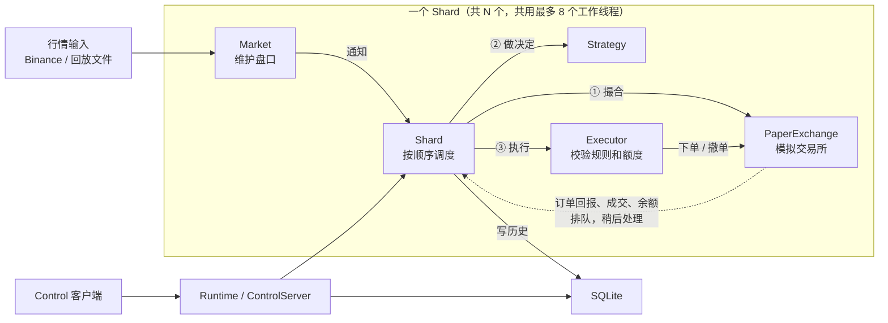

# hquant

用 Binance 公开行情或回放文件驱动的做市模拟系统。每个 Shard 负责一个交易对：维护盘口，在本地模拟交易所里挂买卖单、撮合、记账，把命令、订单回报、成交和余额写入 SQLite。运行中可以通过 Unix socket 查询状态和历史、修改策略参数、停止进程。

只做模拟盘，不发送真实订单。C++20，Bazel 构建，网络和事件循环用 Boost.Asio。

## 运行

在仓库根目录构建：

```sh
bazelisk build //hquant/src:hquant_server
```

### 回放

```sh
bazel-bin/hquant/src/hquant_server \
  --config=hquant/examples/replay.yaml \
  --state_dir=/tmp/hquant-replay
```

回放读完文件后自动撤单、写完历史并退出。查看历史：

```sh
sqlite3 -header -column /tmp/hquant-replay/history.sqlite \
  "SELECT shard_sequence, kind, order_id, price_nanos, quantity_nanos, asset, total_nanos
   FROM history_records ORDER BY id"
```

`kind` 取值：1 下单命令、2 撤单命令、3 订单已接受、4 全部成交、5 已撤销、6 成交明细、7 余额、8 交易所拒单、9 部分成交。金额和数量都是乘以 10^9 后的整数，例如 `99900000000` 表示 99.9。

回放文件格式见 [`hquant/examples/replay_market.json`](hquant/examples/replay_market.json)，多分片示例见同目录的 `replay_market_multi.json`。

### 实时行情

```sh
bazel-bin/hquant/src/hquant_server \
  --config=hquant/examples/binance_public.yaml \
  --state_dir=/tmp/hquant-live
```

连接 Binance 公开数据端点（`data-stream.binance.vision`、`data-api.binance.vision`），只读行情。用 Ctrl-C、`SIGTERM` 或 Control 的 `stop` 结束。

### 运行中控制

Control 在 `STATE_DIR/control.sock` 上接收一行一个 JSON 请求：

```sh
SOCK=/tmp/hquant-live/control.sock
printf '{"op":"status","request_id":1}\n' | nc -U $SOCK
printf '{"op":"history","request_id":2,"limit":100,"cursor":0}\n' | nc -U $SOCK
printf '{"op":"set_strategy","request_id":3,"shard_id":0,"expected_version":1,"patch":{"bid_spread":"0.002","refresh_ms":12000}}\n' | nc -U $SOCK
printf '{"op":"stop","request_id":4}\n' | nc -U $SOCK
```

- `status`：每个 Shard 的盘口状态、活动订单数、余额、最近错误，以及历史写队列的健康状态。
- `history`：按 `cursor` 分页读取历史，`limit` 在 1 到 500 之间。
- `set_strategy`：可修改 `order_amount`、`bid_spread`、`ask_spread`、`refresh_ms`；十进制值写成字符串。`expected_version` 必须等于当前配置版本（初始为 1），成功后加 1，Shard 撤掉旧单并按新参数重新下单。
- `stop`：受理后立即返回，进程撤单、写完历史后退出。

返回中的数额字段都是字符串，避免 JSON 客户端丢失 `uint64` 精度。

### 配置

YAML 配置的完整示例是 [`hquant/examples/replay.yaml`](hquant/examples/replay.yaml)。每个 Shard 包含 `market`（交易对、tick/lot、交易规则）、`strategy`（下单数量、买卖价差、刷新周期）、`executor`（`mode: paper`、账户名、初始余额、资金上限、手续费率）。`executor.mode` 必填，目前只接受 `paper`。

启动时可以覆盖某个 Shard 的策略参数：

```sh
--strategy_shard=0 --order_amount=0.05 --bid_spread=0.002 --ask_spread=0.002 --refresh_ms=10000
```

## 架构



| 组件 | 职责 |
| --- | --- |
| Runtime | 创建工作线程和 Shard，路由回放与 Control 请求，负责启动和停止顺序 |
| Market | 用快照和增量维护盘口，检查序号连续和过期，状态变化时通知 Shard |
| Shard | 收到通知后依次调用模拟撮合、策略决定、执行；把命令和账户事件写入历史 |
| Strategy | 以中间价加减价差，在买卖两侧各挂一张限价单，按刷新周期撤旧挂新 |
| Executor | 按交易规则和资金上限校验订单，派发给交易所 |
| PaperExchange | 模拟交易所：保存挂单和余额，用盘口和公开成交撮合，支持部分成交 |
| SqliteHistory | 后台线程批量写历史，独立线程处理查询 |
| ControlServer | Unix socket 上的 JSON 请求 |

线程模型：Shard 共用最多 8 个 `io_context` 工作线程，同一个 Shard 的所有事件在所属线程上串行处理。行情到达后，Market、Shard、撮合、策略、执行在同一个调用栈里同步完成；模拟交易所产生的账户事件排进同一线程的队列，在这一轮处理结束后再写历史。跨线程的请求只能投递到所属线程。

价格、数量和金额用缩放 10^9 的 `uint64_t` 表示，盘口用整数 ticks/lots，所有运算检查溢出，不经过浮点数。

完整设计，包括状态机和各流程时序图，见 [`docs/DESIGN.md`](docs/DESIGN.md)（[HTML 版](docs/DESIGN.html)）。

## 目录

```text
hquant/
  src/          服务端源码：main、config、runtime、replay_reader、sqlite_history、control_server
    base/       定点数、ID、REST/WebSocket 传输
    shard/      Market、OrderBook、BinanceFeed、Strategy、Executor、PaperExchange、Shard
  test/         黑盒端到端测试
  bench/        压测与行情数据生成工具
  examples/     示例配置和回放文件
docs/           设计、开发约定、测试报告
dev/            sanitizer 冒烟测试与平台验证记录
tools/          compile_commands 生成、重构脚本
op.sh           构建、测试、格式化入口
```

## 测试

```sh
./op.sh test                                                   # 全部测试
bazelisk --batch test --config=release //hquant/test:end_to_end  # 端到端测试
./op.sh asan                                                   # AddressSanitizer + UBSan 冒烟测试
./op.sh tsan                                                   # ThreadSanitizer 冒烟测试
```

端到端测试启动真实的 `hquant_server` 进程，从外部检查退出码、SQLite 历史和 Control 响应，共 7 个用例：

| 用例 | 检查内容 |
| --- | --- |
| 回放快照重新定价 | 第二个完整快照到达后，刷新时按新中间价挂单 |
| 双 Shard 综合场景 | 两个交易对同时运行：公开成交撮合、部分成交、断线换代、定时刷新；各 Shard 历史序号连续、最终余额准确 |
| 交易所拒单与派发分离 | 本地校验通过但交易所余额不足时，命令记为已派发，订单记为被拒，不产生成交 |
| 背压下历史完整 | 回放写队列满时等待而不丢记录，历史条数和序号完整 |
| 本地 Binance 协议到 Control | 用模拟的 Binance REST/WebSocket 服务驱动实时模式，经 Control 完成 status、set_strategy（含版本冲突）、history、stop |
| 乱序回放 | 时间倒退的回放文件干净地失败退出 |
| 精度超限 | 超过 9 位小数的配置在启动前被拒绝，不写任何历史 |

### 性能

2026-10-06 的压测结果（[完整报告](docs/TEST_REPORT_2026-10-06.html)，[原始数据](docs/TEST_REPORT_DATA_2026-10-06.json)）：

| 目标速率 | 计时消息 | 完成 QPS | 端到端 p50 / p99 | 服务端处理 p50 / p99 | 核对 |
| --- | ---: | ---: | ---: | ---: | --- |
| 10,000 条/s | 299,000 | 9,967 | 45 / 130 µs | 6 / 21 µs | 通过 |
| 20,000 条/s | 599,000 | 19,968 | 47 / 98 µs | 5 / 11 µs | 通过 |
| 40,000 条/s | 1,199,000 | 39,967 | 48 / 224 µs | 5 / 22 µs | 通过 |

- 测试条件：Apple M2 MacBook Air（8 核、24 GB），macOS 26.1，Release 构建，本机 loopback，无 TLS，PaperExchange。
- 数据：1000 只股票的确定性合成行情，每组发送 30 秒；盘口消息含买卖各 10 档。不是录制的交易所数据。
- 端到端：测试器发出行情到收到压测专用的 UDP 完成通知；服务端处理：收齐 WebSocket 帧到同步处理完成，包括 JSON 解析、盘口更新、撮合、策略和执行，不含 SQLite 提交。
- 核对：逐条核对消息，并检查最终十档盘口、成交、订单、余额、手续费和历史记录。
- 40k/s 是一轮有效结果，不代表最大稳定容量。20k/s 使用的是 Python 测试器，与另外两组的端到端延迟不能直接比较。
- 历史写入是异步的：40k/s 时从入队到提交的 p99 为 50.45 ms，不计入上面的处理延迟。

## 开发

```sh
./op.sh build            # 构建全部目标
./op.sh release          # Release 构建
./op.sh fmt-check        # 检查格式
./op.sh compdb           # 生成 compile_commands.json
./op.sh doctor           # 查看选用的 Bazel、Python、clang-format
```

开发约定、依赖和验证流程见 [`docs/DEVELOPMENT.md`](docs/DEVELOPMENT.md)。
