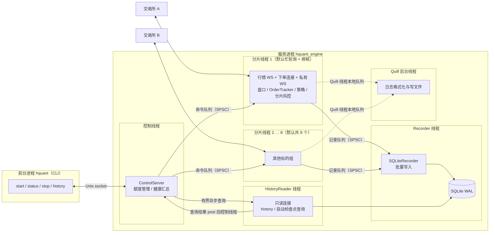
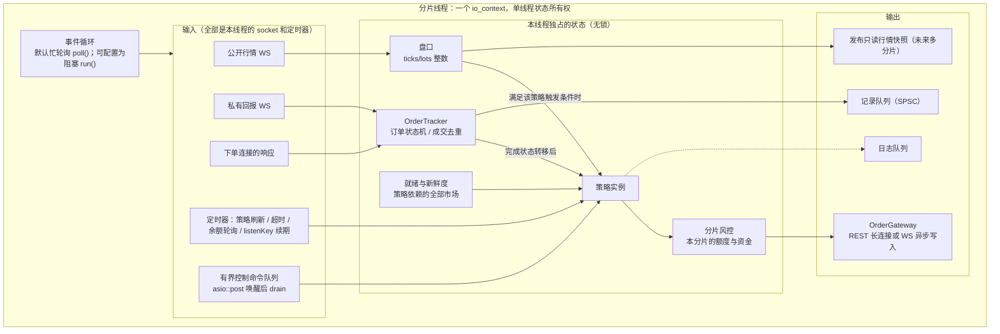
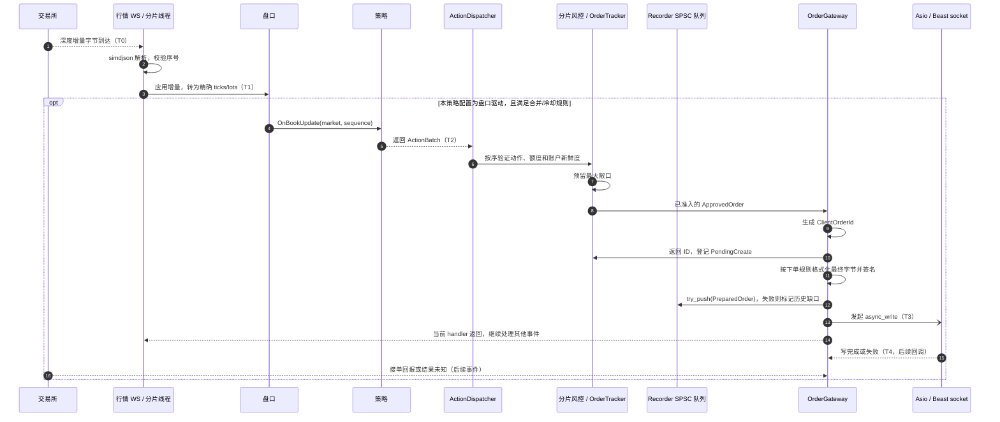
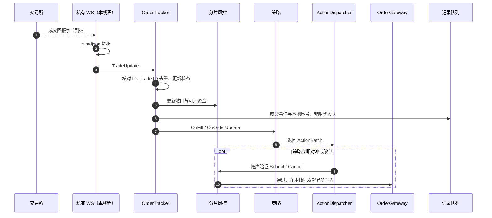
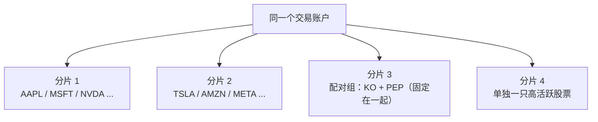
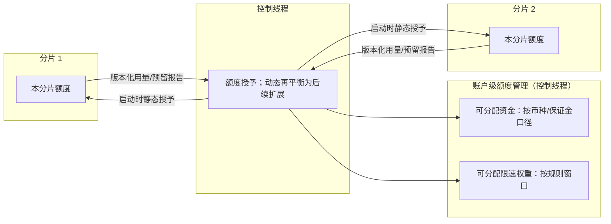
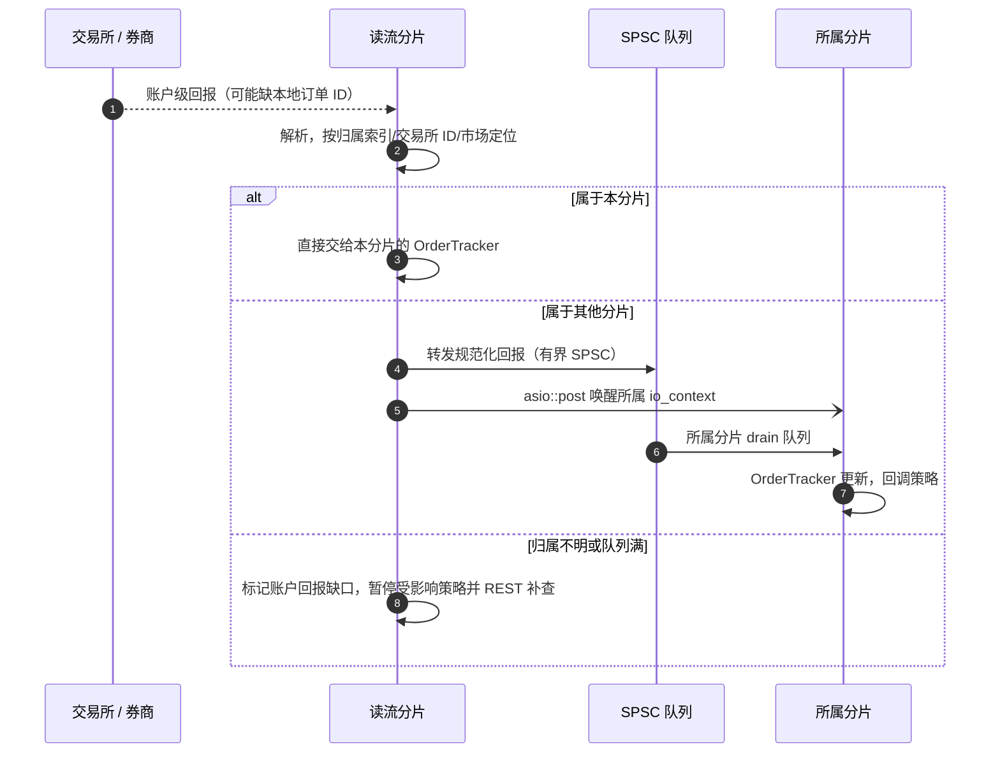
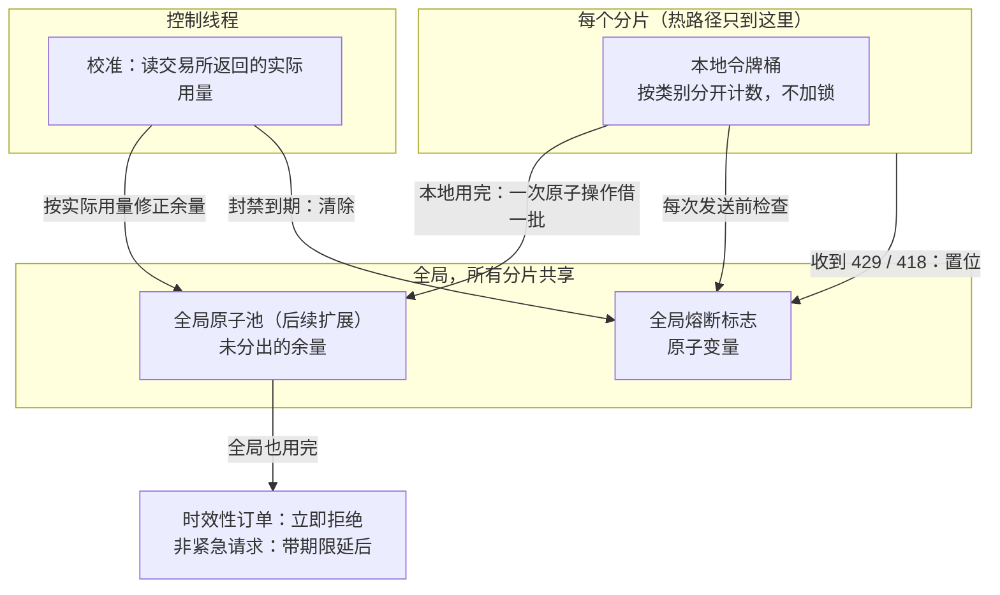
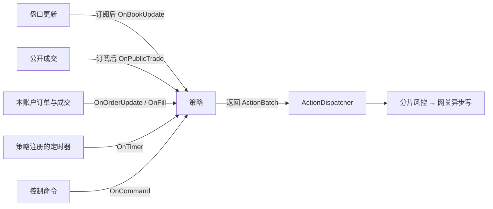
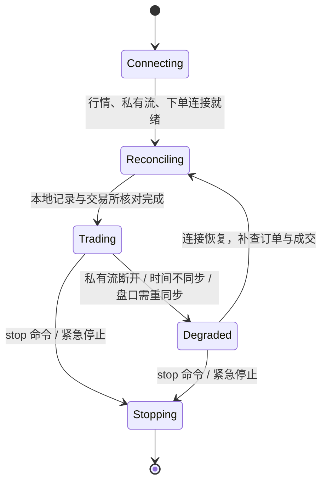

# 运行时架构：分片线程与事件驱动

状态：设计基线，G0–G4 的本地实现已按本文落地；性能数字待 G3/G4 实测。线程、发单、风险和恢复语义以本文为准。Python 对照基线见 [`../../hummingbot/docs/ARCHITECTURE.md`](../../hummingbot/docs/ARCHITECTURE.md)。

相关文档：交付关口见 [ROADMAP.md](ROADMAP.md)，开发与排程见 [DEVELOPMENT.md](DEVELOPMENT.md)，目录和数据契约见 [STRUCTURE_AND_TYPES.md](STRUCTURE_AND_TYPES.md)，订单簿见 [ORDER_BOOK.md](ORDER_BOOK.md)，交易所通道见 [CONNECTIONS.md](CONNECTIONS.md)。

核心原则：**一个分片独占其策略需要的行情、订单和资金状态。消息在该分片线程内解析、更新状态、执行符合触发条件的策略、检查风控，并发起非阻塞网络写入；热路径不跨交易线程。** 真正的 socket 写完成、交易所接单和成交是后续异步事件，不能承诺都发生在收到行情的同一调用栈内。是否等定时器由策略自己的触发策略决定；记录和日志只做非阻塞入队。

## 1. 进程与线程总览

| 线程 | 数量 | 延迟要求 | 做什么 |
| --- | --- | --- | --- |
| 分片线程 | 默认 8，可配置 | 最高 | 独占策略依赖的连接、账户风险状态、订单和盘口；处理行情、回报、决策与异步写入发起 |
| 控制线程 | 1 | `stop`/紧急停止需及时 | CLI 请求、健康汇总、额度再分配；只通过命令队列影响分片 |
| Recorder 线程 | 1 | 无 | 从各分片的记录队列取事件，攒批写 SQLite |
| HistoryReader 线程 | 1 | 无 | 独立只读连接处理分页 `history` 与启动恢复查询，结果异步返回控制线程 |
| Quill 线程 | 1 | 无 | 日志格式化与写文件 |
| 计算工作线程 | 0..M，按需 | 非热路径 | 耗时的 Controller 指标/历史特征计算；只处理不可变快照，结果回分片复核 |

默认 8 个分片线程，加上控制、Recorder、HistoryReader、Quill，显式线程共 12 个（另有可选计算工作线程）。分片数上限为 8；实际只启动分到了标的的分片，并受可用 CPU 核数约束（见第 2.1 节）。分片划分首先保证**一个策略依赖的所有市场只有一个状态所有者**。将来同一账户可按标的组拆到多个分片，但必须先验证第 5 节的账户级额度与回报路由；分片之间不互相下单，跨分片只读行情通过安全发布的快照实现。

## 2. 一个分片内部有什么

### 2.1 事件循环：忙轮询优先，也支持阻塞

两种模式都支持，按分片配置，**默认忙轮询**。

| | 忙轮询（默认） | 阻塞等待 |
| --- | --- | --- |
| 循环方式 | 循环调用 `io_context::poll()`，没有事件也不睡眠 | `io_context::run()`，没有事件时线程睡眠 |
| 唤醒延迟 | 无：事件一到下一轮就处理 | 有：从睡眠中被内核唤醒，通常几微秒到几十微秒 |
| CPU | 每个分片占满一个核 | 空闲时几乎不占 CPU |
| 控制命令队列 | 每轮循环检查一次，不需要额外唤醒 | 生产者写入空队列时 `asio::post` 一次唤醒 |
| 适用 | 生产环境，核数充足 | 开发机、核数不足、低频策略 |

- **可选的混合模式：** 先忙轮询一段时间（例如 50 µs），仍无事件再转入阻塞，用于核数紧张但仍在意延迟的场合。
- **绑核：** 忙轮询的分片应独占 CPU 核。Linux 用 `pthread_setaffinity_np` 绑核，生产机建议用 `isolcpus` 把这些核隔离出来，并把控制、Recorder、HistoryReader、Quill 线程放到其他核。macOS 不支持硬绑核，只能用 QoS 提示，所以 macOS 只用于开发。
- **核数不够时自动降级：** 启动时检查"忙轮询分片数 + 后台线程所需核数"是否超过可用核数；超过就报警，并按配置把多出的分片改为阻塞模式或拒绝启动。例如当前开发机只有 8 核（4 性能核 + 4 能效核），8 个忙轮询分片会占满全部核，开发时应改用阻塞模式或减少分片数。
- **空分片不启动：** 没有分到标的的分片不创建线程，避免空转浪费 CPU。
- 忙轮询下 `poll()` 每轮仍会调用一次零超时的 `kqueue`/`epoll`，这是 Asio 的固有开销；更低延迟需要内核旁路网卡，不在本期范围。

### 2.2 分片的其他约定

- 一个分片可以包含多个交易所连接。套利、XEMM 等需要两边数据和两边订单的策略，把两边放进同一个分片；策略依赖的任何一侧降级，都暂停该策略的新动作，而非仅检查收到事件的连接器。
- 余额、交易规则 REST 轮询、listenKey 续期和下单网关的限速等待都由本线程的异步协程/定时器管理。它们不阻塞线程，但其完成回调及策略计算仍会占用这个线程，必须测量排队和最长回调时间。

## 3. 热路径：同线程决策，异步写入

- `OnBookUpdate` 是**可选触发器**。是否每条有效增量调用、按固定微小窗口合并，还是只更新盘口供定时器读取，由策略配置决定。合并时记录输入序号和实际触发时刻，回放使用相同触发规则；网络一次 `read` 恰好收到几条报文，不应成为业务语义。
- `async_write` 的**发起**在分片线程里；写完成回调仍在该分片的 `io_context` 上，可能晚于其他行情或私有回报。限速令牌不可用时，时效性订单明确选择“立即拒绝”或“带期限延后”，不得在网关内部无限排队。写失败或超时若结果不明，按原本地订单 ID 补查，不能盲目重发。[Boost.Asio 异步操作规范](https://www.boost.org/latest/doc/html/boost_asio/reference/asynchronous_operations.html)
- 图中是网关已准入的即时发送分支。HTTP/1.1 同一连接的异步写未完成前不能再对它发起另一写；OrderGateway 先取得空闲连接或有界、带截止时间的本地等待槽，满时同步拒绝并撤销风控预留。请求及签名字节缓冲区要活到写完成。发单排队、限速等待和写完成分别计时，不能把进入网关当成已写到 socket。[Boost.Beast 异步写约束](https://www.boost.org/latest/libs/beast/doc/html/beast/ref/boost__beast__http__async_write_some.html)
- 订单意图在发起网络写入前**尝试**非阻塞入队，绝不等 SQLite 提交。入队失败只更新存储健康状态，继续发送；这种情况下进程崩溃后可能丢失本地归属/执行器检查点，需要重启对账。
- 若交易规则校验、最终字节组包、签名或网络命令准入在实际发起写入前失败，则生成本地失败事件、撤销 RiskGate 预留，不把该订单留在 `PendingCreate`；写入是否已开始不明时改走 `SubmissionUnknown` 对账。
- 盘口使用经过验证的整数 ticks/lots；**资金、手续费、名义价值和下单规则仍采用精确十进制或可证明无溢出的定点运算**。行情 `BookScale` 与交易所下单 `TradingRule` 的价格/数量步长分别定义，网关按最终请求字节签名。预分配是优化目标，不承诺所有路径都不分配堆内存。
- 延迟分开统计：T0→T2（解析、盘口、策略）、T2→T3（风控、组包、异步写发起）、T3→T4（写完成），另记交易所确认时间。T0→T4 会受限速、TLS/socket 就绪和事件循环排队影响，不能描述为单一调用栈延迟。

## 4. 回报路径：成交到策略

下单的 HTTP 响应和私有 WS 回报可能乱序到达，都在本线程处理，由 OrderTracker 按双 ID、状态机和 trade ID 核对。先完成状态与风险额度更新，再调用策略；策略返回动作后由 dispatcher 执行，避免在 OrderTracker 遍历内部状态时递归修改它。`OrderTraded` 与 `OrderFullyTraded` 保持不同事件；公开成交不能生成本账户的 `OnFill`。

Python 的 `ClientOrderTracker` 在收到完成状态但成交明细未齐时会异步等待成交。这里改成明确的 `AwaitingFills` 状态和超时/补查定时器，不能在私有 WS handler 中阻塞或 `co_await` 等待。成交重复、撤单与成交竞态、先成交后接单、结果未知等仍要按原语义验证，重放夹具覆盖这些次序。

## 5. 分片划分与账户共享资源

### 5.1 按策略依赖的标的组分片

一个交易账户可能有大量标的，不必一个账户一个线程。**候选分片单位是策略依赖的标的组**；股票示例如下，币对和合约按同一规则处理：

| 规则 | 说明 |
| --- | --- |
| 独立标的可按代码哈希分配 | 只在策略没有跨标的动作、账户额度已隔离时使用；实际负载按消息量再平衡 |
| 有关联的股票固定在一起 | 配对交易、篮子、对冲等需要同时看几只股票的策略，在配置里把这些股票指定到同一分片 |
| 高活跃股票单独放 | 按实测消息量调整；一只股票的消息量压满一个核时，给它单独一个分片 |
| 启动时确定，运行中不迁移 | 调整分配需要重启对应分片 |
| 策略跟着依赖组走 | 一个策略实例的全部可下单标的和所需账户状态在同一分片；只读跨分片行情是未来优化 |

默认就是多分片，所以同一账户跨分片的额度隔离、回报路由和限速切分**首版就必须实现并通过故障注入测试**，不能仅靠股票代码哈希就上线。首版可以先用最简单的做法：额度和限速按配置静态切分给各分片，不做运行中再分配；动态再分配留到后续。永续合约的交叉保证金、组合保证金或同币种共享余额尤其需要账户级风险模型。

### 5.2 账户级资源怎么分给各分片

| 资源 | 做法 | 热路径开销 |
| --- | --- | --- |
| 行情订阅 | 每个分片只订阅自己的股票 | 无 |
| 下单连接 | 目标券商/交易所若允许多会话，每分片可有自己的连接；会话数和频率限制逐连接器核实 | socket 归本分片 |
| 成交回报：按会话返回 | 只有目标协议保证回报归属时才能直接在该分片处理 | 无 |
| 成交回报：账户级私有流 | 指定一个读取者，按稳定订单归属表转发；缺 ID/未知归属进入待核对队列 | 回报路径多一次有界交接 |
| 持仓 | 标的持仓可指定唯一分片所有者；组合保证金和购买力仍是账户级约束 | 本地读，账户级另核对 |
| 购买力、资金 | 按账户、币种和风险口径预授硬额度，覆盖挂单、未知结果与手续费缓冲 | 正常发单只查本分片额度 |
| 限速额度 | 按交易所实际的 API key/IP/账户/端点权重口径分配令牌，见第 5.5 节 | 正常发单只查本分片额度 |

- 下单前只检查本分片已经获授的额度；首版额度不足就拒绝，不把等待控制线程放进时效性发单路径。`PendingCreate`、撤单结果未知等均按最坏敞口占用额度。
- 控制线程按交易所余额、持仓、保证金和外部挂单算出保守的账户级可交易上限，再把额度租约分给各分片并留安全缓冲。分片本地将新单、在途未知结果和成交消耗计入租约；控制线程持续用交易所事实校准，账户状态过期或不一致时暂停新单。不能直接把当前 `available` 与原授予额度比较：交易所的 `available` 可能已扣除本系统刚提交的挂单，会造成重复扣减。
- 首版静态租约的额度不足时拒绝新单；“请求下一次授予”仅适用于后续动态再分配。动态再分配需要版本号与确认：旧分片先停止使用并确认释放额度，控制线程随后才授予新分片；超时不得重复授予。原稿的“从全局池一次原子借款”不足以表达多币种、在途订单和额度回收时序。未来若确需共享原子池，按资源分别设计 CAS 预留、失败回滚与对账，并以 TSan 和故障注入验证。

### 5.3 只有一条账户级私有流时的回报转发

客户端订单 ID 优先编码稳定的策略/执行器归属和跨重启唯一部分；**数字分片号只是可选路由提示，不能当持久归属**，因为重启后标的分片可能变化，交易所也可能限制或改写 ID。启动时由配置、可用 SQLite 意图和交易所历史重建 `OrderOwnershipIndex`（本地 ID、交易所 ID、市场 → 逻辑 owner → 当前分片）。未能归属的账户事件隔离并补查，不能投给任意分片或静默丢弃。

### 5.4 跨分片读行情

跨分片只读，不发交易命令。未来若策略需要其他分片的参考行情，发布带 `market`、`sequence`、`receive_time`、`valid_until` 的不可变快照，并先用 `std::atomic<std::shared_ptr<const Snapshot>>` 等有明确同步语义的方案，再测其成本。原稿的普通字段加原子版本号的 seqlock 在 C++ 中可能发生数据竞争；版本重读不能消除对普通字段的并发读写。[C++ 数据竞争规则](https://eel.is/c++draft/intro.races) 需要对多只股票同时下单的策略，仍按 5.1 固定在同一分片。

### 5.5 限速与全局流控

交易所的限速按 IP 或账户整体计算，8 个分片共用同一份额度，所以需要全局流控；但热路径上不能去问一个中心线程。采用三层结构：

| 层 | 作用 | 热路径开销 | 首版 |
| --- | --- | --- | --- |
| 1. 分片本地令牌桶 | 每个分片预先分到一份额度，发送前只扣本地 | 无跨线程操作 | 做 |
| 2. 全局原子池 | 本地用完时，用一次原子操作从全局借一批令牌 | 仅本地用完时一次原子操作 | 后做 |
| 3. 全局熔断 | 任一分片收到 429（超限）或 418（封禁）就置位，所有分片暂停该类请求直到解除 | 发送前读一次原子变量 | 做 |

**限速类别分开计数。** 以 Binance 为例：

| 类别 | 计算范围 | 说明 |
| --- | --- | --- |
| 请求权重 | 按 IP | 每分钟权重上限，不同接口权重不同 |
| 下单次数 | 按账户 | 每 10 秒和每天的下单数上限 |
| 新建连接数 | 按 IP | 8 个分片各自建 WS 连接时共同计数，启动时错开建连 |

**优先级与预留：** 每个分片的额度里，固定预留一部分给下单和撤单，撤单优先级最高；取快照、查余额、补查历史等低优先级请求只能用剩余部分，不能把额度用光导致下不了单或撤不了单。

**校准：** 本地计数只是估算。交易所响应里带有实际用量（如 Binance 的 `X-MBX-USED-WEIGHT` 响应头），控制线程按此定期修正全局余量；估算与实际偏差过大时收紧各分片额度并告警。

**429 之后：** 被限速的请求不自动重试。下单返回失败事件给策略，撤单进入待重试并在熔断解除后优先发送；按交易所给出的 `Retry-After` 设置熔断时长。

## 6. 策略接口：事件为主，定时器为辅

各策略声明 `TriggerPolicy`、依赖市场、最大回调耗时和最小动作间隔；盘口更新先维护市场状态，再按订阅策略选择是否回调。所有直接回调在分片线程执行，不能做同步 I/O、SQLite 查询或阻塞等待；返回有序 `ActionBatch`，由 dispatcher 在回调结束后统一检查就绪、风控、重复动作和限速准入。策略返回错误或返回后发现耗时超限，就停止该策略的新动作，账户回报与撤单仍继续处理。

轻量策略可在分片线程直接计算。V2 Controller 的历史特征、长窗口指标等若超过回调预算，改由有界计算工作池处理**不可变、带版本的快照**；结果回分片后检查数据版本和有效期，再转成动作。计算线程不访问分片状态，也不直接下单。同步回调一旦卡死，线程内计时器无法抢占它；对不可信插件或可能无限循环的用户策略，需要进程隔离或明确的执行超时机制，不能仅靠记录“回调超时”。

| Python 行为 | 新架构触发 | 保留与改变 |
| --- | --- | --- |
| `simple_pmm` 每次 Clock tick 检查 `order_refresh_time`，默认 15 秒撤旧单并报价 | `OnTimer` 按配置刷新；盘口事件只更新本地价格 | 保留刷新间隔、预算检查和报价规则；不用每条深度增量都撤单重挂 |
| XEMM 的 maker 成交回调提交 taker 对冲 | `OnFill` 在订单与额度更新后立即返回对冲动作 | 保留按 trade ID 去重和 maker/taker 归属；移除 Python `safe_ensure_future` 排队层 |
| V2 Controller 定期生成 ExecutorAction，经 asyncio 队列由 Orchestrator 执行 | Controller 定时器或所需数据就绪事件产生 `ActionBatch`，同分片 Orchestrator 应用 | 保留 Controller/Executor 生命周期和动作顺序；用类型化动作替代运行时 dict/asyncio 队列 |
| 公开成交更新 `LastTrade`，模拟盘可能据此撮合 | `OnPublicTrade` 与 SimpleSimulatedExchange 撮合输入 | 公开成交绝不直接当成本账户 `OnFill` |

Python `Clock` 的 1 秒 tick 是原实现的调度手段，不是所有策略必须承继的业务规则；`simple_pmm` 的刷新周期、XEMM 的成交即对冲、V2 动作状态机则是需要保留的可观察行为。策略所依赖的任一盘口、账户余额、私有流或交易规则过期时，`ActionDispatcher` 拒绝受影响的新单；连接恢复后先对账，再恢复策略。参考 [`Clock`](../../hummingbot/hummingbot/core/clock.pyx)、[`simple_pmm`](../../hummingbot/scripts/simple_pmm.py)、[`StrategyV2Base`](../../hummingbot/hummingbot/strategy/strategy_v2_base.py)、[`XEMM`](../../hummingbot/hummingbot/strategy/cross_exchange_market_making/cross_exchange_market_making.py)。

## 7. 状态机：按连接器划分

| 状态 | 新单 | 撤单 |
| --- | --- | --- |
| Connecting | 否 | 否 |
| Reconciling | 否 | 是 |
| Trading | 是 | 是 |
| Degraded | 否 | 是 |
| Stopping | 否 | 是 |

连接器状态按连接器维护，策略状态按**依赖集合**计算：单市场策略只受自己的连接器影响；套利/XEMM 依赖任一侧降级时，暂停该策略在两侧的新单。其他无依赖关系的策略可继续运行。`Degraded` 期间允许已知订单的撤单；私有回报不可靠、余额或盘口过期时不能放行新单。停止流程先停止策略新动作，再按配置处理执行器与挂单；不隐式平掉全部持仓。

下单返回本地 `ClientOrderId` 只表示本地接受，异步写完成也不表示交易所接单。`OrderTracker` 分开保存已核实的生命周期、撤单在途、提交/对账结果和成交明细完整性；对外可显示 `PendingCreate`、`Open`、`PartiallyFilled`、`PendingCancel`、`SubmissionUnknown`、`AwaitingFills` 与终态，具体字段见 [STRUCTURE_AND_TYPES.md](STRUCTURE_AND_TYPES.md)。HTTP 与私有流可能先后颠倒。写超时或连接中断后，如果不能证明交易所未收到请求，就保留最坏敞口预留，用原 ID 查询订单与成交，**不换 ID 自动重发**。重启时先读取可用的本地意图/执行器检查点，再按交易所支持的窗口补查挂单、历史订单、成交和余额；无法核实的状态型执行器不自动恢复。SQLite 故障影响历史和恢复能力，不在当前运行中阻止已通过风控的订单发送。

## 8. 线程间通信汇总

| 从 | 到 | 方式 | 是否在热路径上 |
| --- | --- | --- | --- |
| 分片 | Recorder | 每分片一个有界 SPSC；Recorder 按分片轮转消费 | 一次非阻塞入队；失败标记历史缺口 |
| 分片 | Quill | Quill 每生产线程的有界前端队列 | 一次非阻塞入队 |
| 分片 | 其他分片 | 未来：有明确原子发布语义的不可变行情快照 | 只读，首版不用 |
| 读流分片 | 所属分片 | 首版实盘前：每发送者/接收者一条有界 SPSC，并用 `asio::post` 唤醒 | 账户回报路径；满时降级补查 |
| 分片 | 控制线程 | 带版本的已用/预留额度与健康报告 | 否 |
| 控制线程 | 分片 | 每分片有界 SPSC；忙轮询模式每轮检查，阻塞模式由空转非空时 `asio::post` 唤醒 | 否 |
| 控制线程 | HistoryReader | 有界异步查询队列；结果 `asio::post` 回控制线程 | 否 |
| CLI | 控制线程 | Unix socket | 否 |

唤醒方式随事件循环模式不同：忙轮询分片每轮循环直接检查各入站队列，不需要唤醒；阻塞模式下 `io_context::run()` 会睡眠，控制线程或读流分片向空队列写入后，向目标 `io_context` 投递一次 drain handler。两种模式下每次都只取有上限条数的消息，剩余的留到下一轮，避免长时间饿死 socket。Recorder 可用条件变量/信号量唤醒；写入队列依旧不等待。跨分片消息带源序号和逻辑 owner，不能仅依靠到达顺序推断交易所顺序。

每条 Recorder 记录带 `run_id`、逻辑 owner、分片本地递增序号及交易所/接收时间。Recorder 保持**每个分片内部**的入队顺序，并轮转消费各分片队列；不同分片没有天然全局总序。历史查询可按时间展示，但重建订单状态仍按订单 ID、交易所序号和分片本地序号核对，不能只按数据库自增行号推断先后。

HistoryReader 的只读连接与 Recorder 写连接可在 WAL 模式并行，但 `history` 必须分页、限制行数和查询时间，及时结束读事务；长时间读事务会阻碍 WAL checkpoint。[SQLite WAL 文档](https://www.sqlite.org/wal.html) 控制线程不直接执行 SQL，`stop`/紧急停止不会被历史查询阻塞。SQLite 只用于历史查询、本地归属/检查点和重启对账；策略状态由分片内存持有，提交完成不触发策略或发单。

## 9. 对 Python 逻辑的取舍与验收

| 保留的业务语义 | C++ 的实现选择 | 验收夹具 |
| --- | --- | --- |
| 本地订单 ID 与交易所订单 ID 分离；接单、成交、撤单、失败各有独立事件 | 类型化订单状态机；`SubmissionUnknown` 不盲发；状态转移不依赖 Python asyncio 调度时序 | HTTP/私有流乱序、成交先到、撤单与成交竞态 |
| 公开盘口、公开成交与本账户成交是不同数据 | 盘口整数 ticks/lots；公开成交只更新 LastTrade/模拟撮合输入；私有回报才可产生本账户 Fill | 同一公开成交不增加实盘成交数量 |
| `simple_pmm` 按刷新周期报价；XEMM 按 maker 成交对冲；V2 Controller/Executor 有独立生命周期 | 每策略的 `TriggerPolicy` + 同分片 `ActionBatch`；保留动作的因果顺序 | 同一消息和定时器流重放，比较动作种类/顺序/订单归属 |
| 精确金额、交易规则和费用资产 | 资金域保留精确十进制；盘口才做可验证的定点优化，最终发送字节按交易所规则格式化 | Python/C++ 量化边界、最小金额、手续费和溢出用例 |
| 本地记录辅助历史与恢复，交易所回报须对账 | SQLite 异步记录；故障继续交易但显示缺口；重启缺失状态型检查点则暂停 | 发单后落盘前强制退出、缺口标记、重启对账 |

这里保留的是**可观察交易行为**，而不是 Python 的 GIL、`asyncio.Queue`、每秒 Clock 轮询、SQLAlchemy 对象或动态字典结构。差分测试比较同一规范化输入与同一触发配置下的动作、订单状态、余额和费用；调度方式改变引起的预期差异单独列出，不用“更快”掩盖交易行为变化。

## 10. 首版决定与待实测项

首版决定：

- **默认 8 个分片**，外加控制、Recorder、HistoryReader、Quill 线程；只启动分到了标的的分片。
- **事件循环默认忙轮询并绑核**，同时支持阻塞模式和混合模式，按分片配置；核数不足时自动报警并降级。
- **同账户跨分片：** 资金额度按配置静态切分；账户级私有流由指定分片读取并转发回报；动态再分配后续再做。
- **限速：** 首版做分片本地令牌桶（第 1 层）和全局熔断（第 3 层），并给下单、撤单预留额度；全局原子池借用（第 2 层）后续再做。
- 订单 ID 编码稳定的策略/执行器归属及唯一部分，当前分片号最多是路由提示。

待实测：目标券商或交易所的多会话与账户级回报语义（决定是否需要回报转发）；8 个分片在目标机器上的 T0→异步写发起 p99、忙轮询与阻塞模式的延迟差；Recorder 在 8 个分片同时写入时的积压与丢失计数；按账户/币种/IP 限速窗口静态切分额度是否够用。

## 11. 持久化与重启对账

### 11.1 SQLite 写完以后做什么

SQLite 是**后台历史库和重启检查点**，不是当前运行的订单真相，也不是发单的前置提交。分片在内存中维护最新盘口、订单、余额、风险额度和执行器状态；新单通过风控后发起网络写，同时把 `PreparedOrder`、归属与检查点非阻塞 `try_push` 到本分片的 Recorder 队列。Recorder 批量 `COMMIT` 后不回调策略，也不批准或触发订单发送。持久化的数据只在以下路径被消费：

| SQLite 记录 | 谁读取 | 具体用途 |
| --- | --- | --- |
| `PreparedOrder`、owner、配置版本 | 启动对账、`history` | 找回本地发单意图和归属，匹配交易所订单；展示订单历史 |
| 执行器检查点 | 启动对账 | 验证止盈止损、DCA 档位等本地状态后再恢复执行器 |
| 已接收的订单/成交/费用回报 | `history`/报告、启动对账 | 历史查询与费用统计；按事件位置决定交易所补查范围 |
| `HistoryGap`、`RunManifest` | `status`、`history`、下次启动 | 标明哪些时段的历史或执行器状态无法保证完整；上次运行是否清洁关闭 |

写入的价值是保存**交易所不知道的本地控制状态**（归属、配置版本、执行器内部状态），以及交易所历史窗口之外的账户事实。若只运行一次无状态 `simple_pmm` 且不需要历史，SQLite 不是发单必需组件；保留它是因为目标包含 `history` 和 V2 状态型执行器的重启恢复。客户端订单 ID 可以辅助找回归属，但不能还原配置版本、止盈止损和 DCA 档位。

`status` 读取控制线程汇总的 `ShardReport`，不访问 SQLite；`history` 由控制线程投递给 HistoryReader 的只读连接分页执行，`stop` 不会被 SQL 阻塞。

### 11.2 持久化分级

| 数据或故障 | 从交易所补回的能力 | 处理方式 |
| --- | --- | --- |
| Quill 诊断日志 | 不需要补回 | 可丢弃并计数告警 |
| 公开盘口增量 | 可重新取快照 | 有缺口时暂停使用旧盘口，重新同步 |
| 本账户订单状态、成交、余额 | 受市场、时间窗口、分页、历史保留和限速约束，不能保证完整 | 后台批量记录；缺口必须对账，无法核实的历史保持不完整 |
| 下单意图、owner、配置版本、执行器状态 | 交易所不提供；订单 ID 只能辅助归属 | 运行时保留在分片内存并尽力异步记录；缺失检查点会限制重启后的自动恢复 |
| Recorder 队列满或写入失败 | 已接收的交易所事实可能补查，本地控制状态无法保证补回 | 告警、累计丢失计数、标记 `HistoryGap`；当前进程继续交易，重启时暂停无法恢复的状态型执行器 |

写库失败可能来自磁盘满、权限或 I/O 错误、数据库损坏，或写入长期慢于事件产生导致队列满。它不会让当前进程的内存订单状态消失；主要后果是历史与执行器快照留下缺口。数据库坏掉时继续发单并告警，是本设计已选的风险取舍。

**写入时序：** Recorder 独占写连接，使用 WAL + `synchronous=NORMAL`，按条数或时间攒批。分片只进行一次非阻塞入队，不等提交回执。入队或写入失败时在内存中立刻记录告警、计数和 gap 区间，数据库恢复可写后再持久化；进程若随即崩溃，尾部 gap 记录也可能没落盘，所以不能因 SQLite 里没有 gap 就断言历史完整。`NORMAL` 对进程崩溃后已提交的事务有保护，但断电/系统崩溃后可能回滚最近已提交事务，不承诺固定丢失窗口。

### 11.3 重启对账（Reconciling）

1. 读取 `RunManifest`，判断上次是否清洁关闭、历史是否完整；读取可用的意图、配置版本、执行器检查点和每分片最后已提交序号。
2. 从最后已落盘位置加安全回看区间开始，按交易所支持的市场和时间窗口分页查询挂单、历史订单、成交及余额。不能只查当前挂单，因为订单可能已全部成交或取消。
3. 本地有意图的订单按状态机核对，补录可验证的缺失成交。数据库中有意图但交易所暂时查不到的订单保持待核对，**绝不直接重发**。
4. 交易所有订单但本地没有完整意图时，用 client ID 解出的 owner 辅助识别归属。无状态策略在挂单、余额和风险额度核实后可重建；状态型执行器只有配置及内部状态均可验证时才自动恢复，否则暂停，由配置或人工决定撤单、接管或关闭。
5. 对账完成后，已核实的策略进入 Trading；无法补齐的历史保持不完整，未核实的订单或执行器不得自动运行。数据库仍不可写时可按相同规则启动无状态策略，持续显示存储告警。

客户端订单 ID 的唯一部分来自每次启动的随机 `RunId` 与分片本地序号，不依赖数据库（编码见 [STRUCTURE_AND_TYPES.md](STRUCTURE_AND_TYPES.md) 第 3 节）。部分交易所只要求 ID 在未完成订单中唯一，即使用原 ID 重发也可能在前单成交后产生第二笔订单；写请求超时后只能查询和对账。

依据：[Binance Spot `newClientOrderId` 规则](https://github.com/binance/binance-spot-api-docs/blob/master/rest-api.md#new-order-trade)、[订单和成交历史查询参数](https://github.com/binance/binance-spot-api-docs/blob/master/rest-api.md#account-endpoints)、[SQLite `synchronous` 语义](https://www.sqlite.org/pragma.html#pragma_synchronous)。

### 11.4 撤单与成交竞态

进入撤单在途（`cancel_pending`）后仍接受成交回报；终态以交易所最终状态为准，已到达的成交不因撤单回滚，终态之后不再回退。交易所回“订单不存在或已成交”时补查成交，以 Filled 结束；撤单结果不明时按原 ID 查询。撤单发送资格不足时保持原状态并报告失败，不虚标撤单在途。停止程序只撤挂单，不自动平仓；主动平仓只有在交易所规则和当前敞口均已核实、能证明只减风险时才走应急路径。

## 12. 回测与模拟盘

Paper 与回测复用订单簿核心、`OrderTracker`、策略、`RiskGate` 和事件类型，只把网络网关换成可重放的模拟撮合；时间由 `ReplayClock` 注入，不启动网络组件。相同数据与配置必须得到相同的动作序列、订单状态和结果。回测模块在 G5 才建立。

公开成交只作为 Paper 撮合输入，只有满足自己的撮合规则时才生成本账户 `TradeUpdate`。

## 13. 延迟测量点

从第一版起在以下位置打单调时钟时间戳并记入直方图；目标值在 G3/G4 基准后填写。

| 编号 | 测量点 | 用途 |
| --- | --- | --- |
| T0 | 分片 socket 收到行情字节 | 起点 |
| T1 | 解析完成并应用到订单簿 | 解析与盘口开销 |
| T2 | 策略返回 `ActionBatch` | 调度与策略计算 |
| T2a | 风控通过、发送资格取得 | 风控与网关排队 |
| T2b | `PreparedOrder` 尝试入 Recorder 队列 | 非阻塞入队开销；失败仍发单 |
| T3 | 发起 `async_write` | 组包与签名；T0→T3 为关键指标 |
| T4 | 写完成回调 | socket 与事件循环排队 |
| T5 | 收到交易所接单回报 | 网络往返与交易所处理 |
| T6 | Recorder 批量事务提交 | 异步存储延迟；可晚于 T5 |

分开统计 T0→T2、T2→T3、T3→T4、回调最长耗时、各队列水位与 p99；性能结果附机器、核数、分片数、输入流与事件循环模式。订单簿侧另记每条消息价位数、每秒消息数、重同步次数与缓存最大占用（见 [ORDER_BOOK.md](ORDER_BOOK.md) 第 8 节）。
