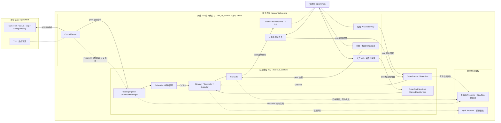
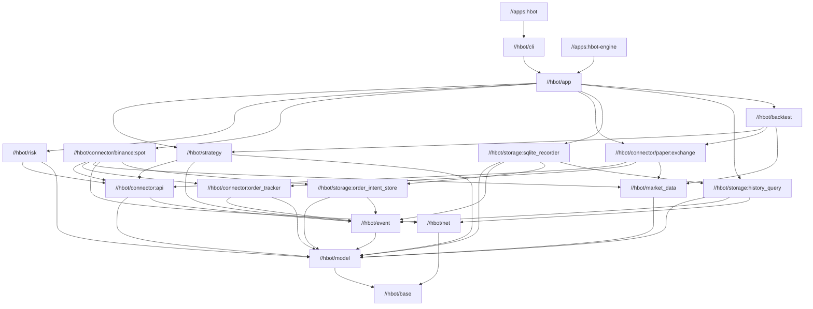
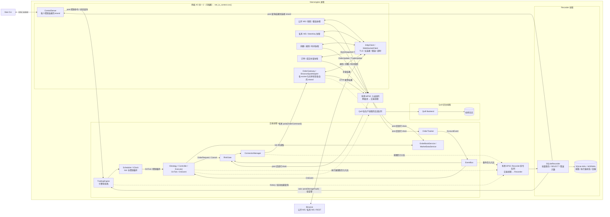
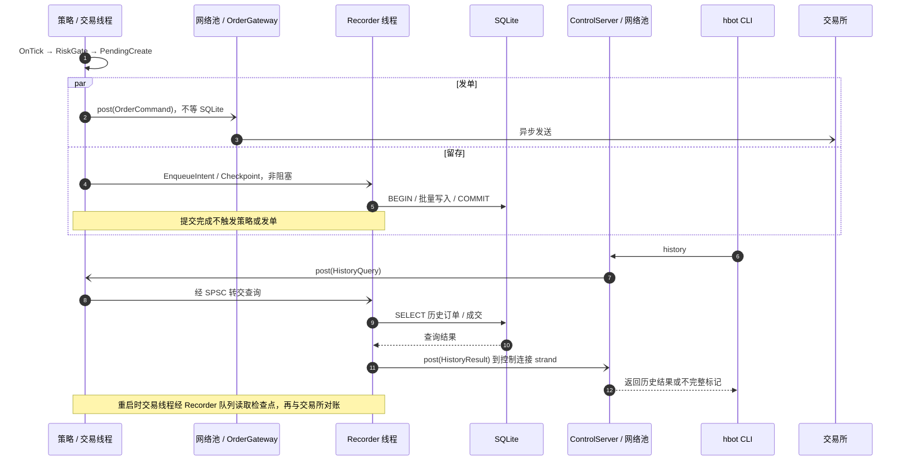
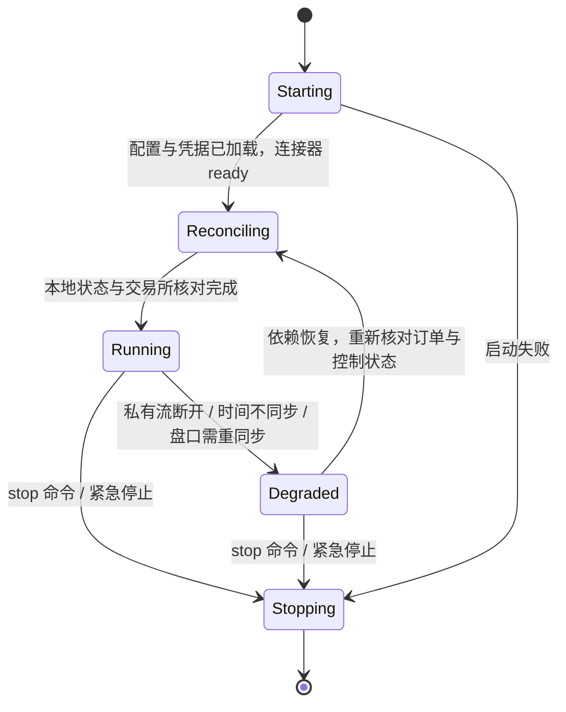
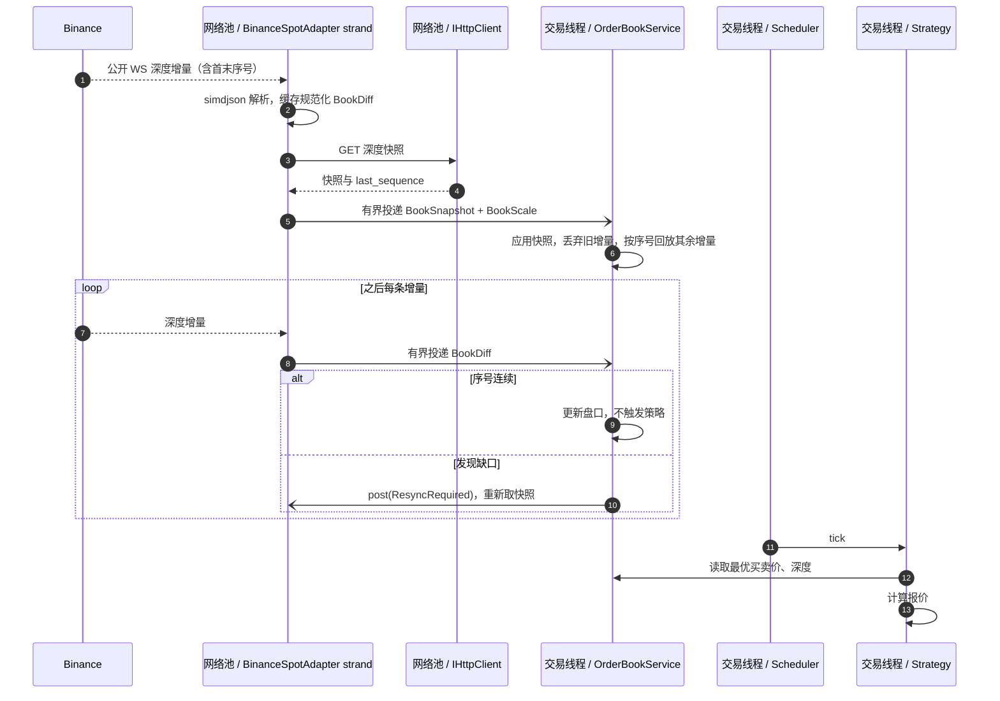
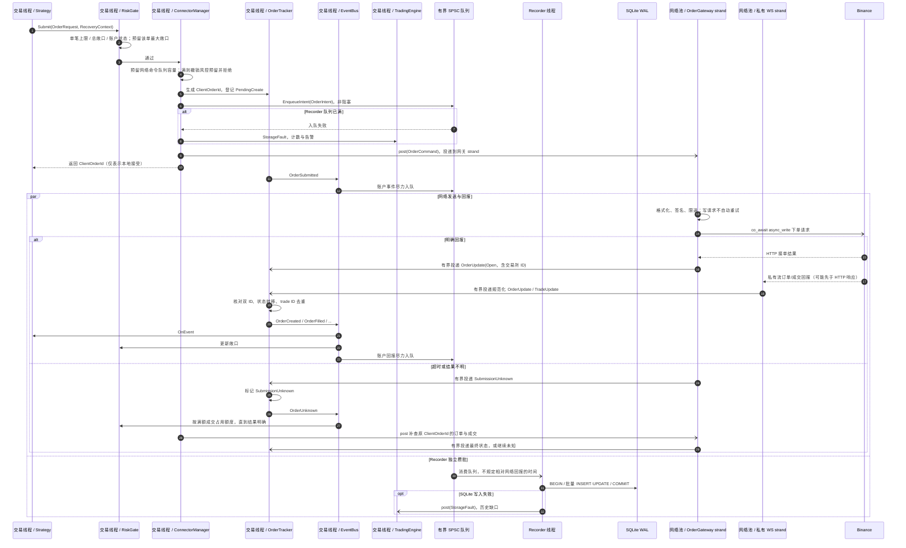
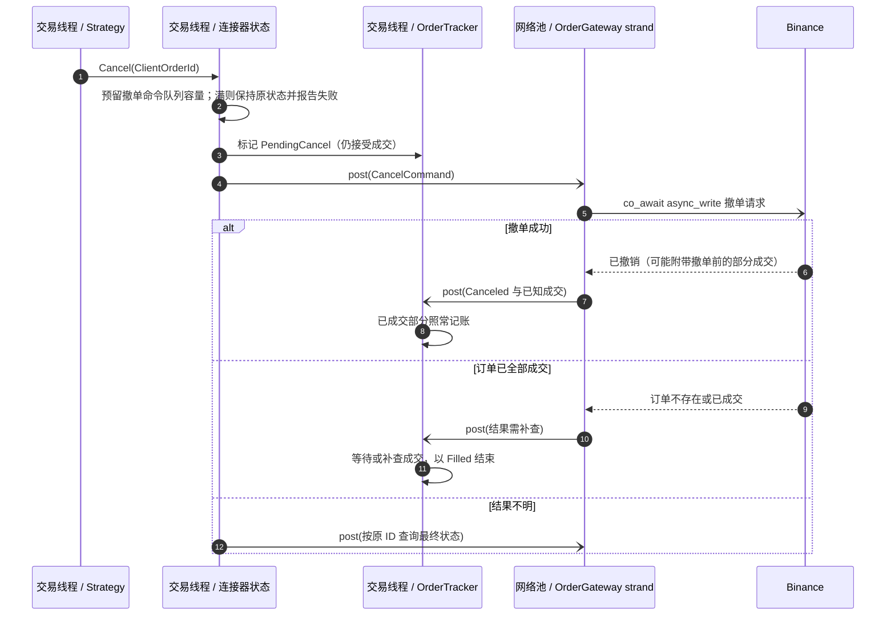

# Hummingbot C++ 目标架构图

状态：实施前设计图；图中的 `hbot/` 与 `apps/` 模块尚待开发。Python 对照基线为 `../../hummingbot` 的 `9af100d6822da7d2d0291a906c730ef172284ee2`。模块字段和接口见 [CORE_DESIGN.md](CORE_DESIGN.md)，依赖约束见 [DEPENDENCIES.md](DEPENDENCIES.md)，实施顺序见 [PLAN.md](PLAN.md)。

## 0. 前台与后台总览

一句话：**前台 CLI 控制服务进程；专用交易线程执行策略、风控和订单状态机；网络 I/O 线程池运行 REST/WS 协程；Recorder 和 Quill 各有后台线程。新单不等 SQLite 写入。**

| 组件 | 职责 | 所在线程 |
| --- | --- | --- |
| `hbot` CLI | 启动服务、读取配置、查询状态与历史、发送停止命令 | 独立前台进程 |
| `TradingEngine` | 装配组件，管理启动、对账、运行、降级、停止 | 交易线程控制状态；网络协程独立运行 |
| `Scheduler` / `IClock` | 定时调用策略 `OnTick` 和 Controller/Executor 控制循环 | 交易线程 |
| `IStrategy` / Controller / Executor | 读取内存快照，决定下单、撤单；处理账户事件 | 交易线程 |
| `RiskGate` | 单笔上限、总敞口、紧急停止、未知订单额度 | 交易线程 |
| `ConnectorManager` | 路由交易命令；持有连接器的交易状态与网络端点 | 交易线程管理状态；网络连接各绑定 strand |
| `BinanceSpotAdapter` / `OrderGateway` | 在网络侧解析、签名、收发；把规范化消息投递给交易线程 | 网络 I/O 池的 socket/网关 strand |
| `PaperConnector` | 模拟撮合并生成规范化回报 | 交易线程 |
| `OrderBookService` / `MarketDataService` | 本地盘口（ticks/lots 整数）、K 线、最优价查询 | 交易线程 |
| `OrderTracker` | 本账户订单状态机、成交去重、ID 核对 | 交易线程，每个连接器一个 |
| `EventBus` | 把 `AccountEvent` 同步通知策略，再尽力交给 Recorder | 交易线程 |
| `IOrderIntentStore` | 意图、执行器快照和事件的非阻塞入队接口 | 交易线程调用，Recorder 消费 |
| `SQLiteRecorder` | 异步批量记录意图、执行器快照及账户回报；报告存储缺口 | Recorder |
| Quill Backend | 格式化并写诊断日志 | Quill |
| `ControlServer` | 接收 `status/stop/history` 等 CLI 请求并异步转发 | 网络 I/O 池的控制连接 strand |



`hbot start` 启动服务进程；`status/stop/history` 经 Unix socket 与 `ControlServer` 通信。前台进程只负责控制和展示。图中的 WS、REST、轮询与补查是运行在**网络 I/O 线程池**上的 Asio 协程；一个协程不是一个 OS 线程。它们只把不可变消息投递给交易线程，由交易线程串行修改交易状态。图中 `history` 的完整读取路径见第 2.3 节。

## 1. Bazel 包与依赖方向

箭头 `A → B` 表示 **A 的代码依赖 B**。`connector:api` 只放抽象接口；Binance 和模拟盘是独立实现 target，策略和风控都不能依赖具体交易所。



`//dev:dependency_smoke` 是阶段 1 要实现的开发 target；图中 target 名是拟定的 Bazel 边界，创建 `BUILD.bazel` 时以此划分 `visibility`。`base` 包装 libmpdec、Abseil 基础类型和 Quill；`net` 包装 Asio/Beast、OpenSSL、zlib；交易域只通过项目接口使用第三方库。

## 2. 线程模型与队列

实线是异步投递或线程内调用，虚线是写入后台队列。实盘默认由 **1 个交易线程 + 2 个网络 I/O 线程 + 1 个 Recorder 线程 + 1 个 Quill 后台线程**组成，即服务进程显式使用 5 个工作线程；网络池大小可配置。策略状态仍由一个专用交易线程串行修改，这使订单、风控和策略动作有确定的先后顺序。网络协程在独立线程池上运行，SQLite 只由 Recorder 线程访问。



**所有权：** `TradingEngine` 在交易线程拥有 ConnectorManager、RiskGate、策略、订单簿和 OrderTracker；ExecutorOrchestrator 拥有执行器。每个实盘连接器拆成交易侧状态与网络侧 adapter/gateway：交易侧只生成命令并消费规范化回报；公开 WS、私有 WS、REST 连接及共享限速器各有自己的 strand，网络侧对象只在所属 strand 上访问。这样同一交易所的公开流、私有流和下单 REST 也能由不同网络线程并行处理；共享限速状态由限速器 strand 串行更新。ControlServer 在网络池运行；Recorder 独占 SQLite 连接。跨线程传递按值消息，不共享可变交易对象。Recorder 故障只更新存储健康状态；发单继续依靠交易线程的内存状态。

**策略由谁执行：** `Scheduler` 的定时器完成后在交易线程调用 `IStrategy::OnTick`，并调度 Controller/Executor 控制循环；`EventBus` 在同一线程同步调用 `IStrategy::OnEvent`。行情和私有回报经入站队列到达后先更新盘口或 OrderTracker，本身不自动触发一次策略 tick；账户事件会立即调用 `OnEvent`。策略回调不执行阻塞网络/SQLite I/O，也不在网络协程或 Recorder 线程中运行。若回调耗时过长，先记录超时和排队指标，再把纯计算拆成基于不可变快照的工作任务，结果仍须回交易线程验证后应用。

| OS 线程 | 执行内容 | 跨线程通信 |
| --- | --- | --- |
| 交易线程（1 个） | `trade_io_context.run()`；tick、Controller/Executor、风控、盘口、OrderTracker、EventBus、引擎状态 | 网络入站有界 MPSC；向网络 strand 投递命令；独自生产 Recorder SPSC 队列 |
| 网络 I/O 池（默认 2 个） | 多个线程运行同一个 `net_io_context.run()`；ControlServer、REST/WS/TLS、轮询、重连、补查 | 各 socket、共享限速器和控制连接分别绑定 strand；向交易线程投递不可变事件，不能修改交易状态 |
| Recorder 线程（1 个） | SQLite 批量写入、异步 `SELECT`、故障及缺口统计 | 消费交易线程的 SPSC 队列；用 `asio::post` 投递故障/查询结果 |
| Quill 后台线程（1 个） | 日志格式化、文件写入及轮转 | 接收各生产线程的 Quill 前端队列；丢弃计数告警 |

这里列的是应用显式创建的线程；库可能另有内部辅助线程，但不能在其中修改交易状态。网络入站队列由多个生产者写入，交易线程单消费者处理；市场数据满时丢弃旧增量、暂停该盘口并重新取快照。私有账户事件不能静默丢弃：停止读取或标记连接器降级，随后 REST 补查并对账。`StorageFault` 直接 `post` 回交易线程更新健康状态，避免 Recorder 队列满时故障通知又依赖该队列。

### 2.1 协程在哪运行

`trade_io_context` 仅由交易线程调用 `run()`；`net_io_context` 由默认两个网络线程共同调用 `run()`。在网络侧，`co_spawn(public_ws_strand, PublicWsLoop(), ...)`、`co_spawn(user_ws_strand, UserStreamLoop(), ...)`、`co_spawn(order_gateway_strand, SendOrderLoop(), ...)` 分别绑定自己的 strand；REST 池的每条连接和控制连接也各有 strand，跨连接共享的限速器另设 strand。`co_await` 需要等待 socket、定时器或限速令牌时，**挂起当前协程并释放网络线程**；完成后在相同 executor/strand 上继续，可能由池中的另一个 OS 线程执行，不能用线程 ID 作为对象所有权依据。交易侧 `SchedulerLoop()` 在 `trade_io_context` 上 `co_spawn`，等定时器后同步调用 `OnTick`；`OnEvent` 由交易线程处理事件时直接调用，均不需要给每个策略开线程。

启动关系示意（`ReportCompletion` 把协程失败投递给引擎状态机）：

```cpp
asio::co_spawn(trade_io, SchedulerLoop(), ReportCompletion);
asio::co_spawn(public_ws_strand, PublicWsLoop(), ReportCompletion);
asio::co_spawn(user_ws_strand, UserStreamLoop(), ReportCompletion);
asio::co_spawn(order_gateway_strand, SendOrderLoop(), ReportCompletion);

std::jthread trade_worker([&] { trade_io.run(); });
std::jthread net_worker_1([&] { net_io.run(); });
std::jthread net_worker_2([&] { net_io.run(); });
// Recorder 和 Quill backend 分别有自己的工作线程。
```

实际启动代码还要先建立两个 `io_context` 的 work guard，并在关闭时取消协程、释放 guard、等待线程结束。`SchedulerLoop` 的每次 timer 完成后依次调用已注册策略的 `OnTick`；账户事件经 EventBus 调用 `OnEvent`。策略回调都是同步、短时的交易决策，不在其中 `co_await` 网络或 SQLite。

跨线程只能经过两个明确的方向：网络结果通过有界入站队列并 `asio::post(trade_io_context, ...)` 唤醒交易线程；交易命令通过有界投递进入网关 strand。`post` 返回只表示本地排队，绝不表示 socket 已发送、交易所已接单。`co_await` 的挂起不是并行执行 CPU 计算；多个待处理网络请求可并发等待，各 strand 只保护自己拥有的可变网络对象。[Boost.Asio 协程与 `co_spawn` 文档](https://www.boost.org/latest/doc/html/boost_asio/overview/composition/cpp20_coroutines.html)、[strand 文档](https://www.boost.org/doc/libs/1_85_0/doc/html/boost_asio/overview/core/strands.html)。

| 后台任务 | 触发方式 | 所在线程 | 失败后的动作 |
| --- | --- | --- | --- |
| 策略 tick 与 Controller/Executor 控制循环 | `SchedulerLoop` 的定时器 | 交易线程 | 回调失败或耗时超限则告警并停止该策略新动作 |
| 公开 WS 读取、重连和盘口快照重同步 | 长驻协程；断线或序号缺口时重启同步 | 网络池中的公开流 strand | 暂停使用旧盘口，重新取快照 |
| 私有 WS、listenKey 续期 | 长驻协程与定时器 | 网络池中的私有流 strand | 受影响连接器暂停新单，REST 补查后恢复 |
| 余额、交易规则和服务器时间刷新 | 定时器与连接器启动 | 网络池中的 REST/轮询 strand | 把新快照投递给交易线程；风控不使用过期状态 |
| 订单结果未知和启动对账 | HTTP 超时、重连或进程启动 | 网络池中的 REST/对账 strand 查询；交易线程应用结果 | 按原 ID 和市场补查，不盲目重发 |
| CLI 控制连接与 `history` 响应 | Unix socket 请求 | 网络池中的控制连接 strand | `status` 读取交易内存快照；`history` 异步等 Recorder 查询 |
| Recorder 批量写入、重试与缺口统计 | 队列条数或定时批次 | Recorder | 写失败告警并计数，当前进程继续交易 |
| Quill 日志写入与轮转 | 日志队列 | Quill | 队列满时丢诊断日志并计数 |

### 2.2 SQLite 写完以后做什么

SQLite 是**后台历史库和重启检查点**，不是策略的执行器。交易线程在内存中维护最新盘口、订单、余额、风险额度和执行器状态；`Submit` 通过风控后投递网络发单，同时把 `OrderIntent`、归属与检查点尽力交给 Recorder。Recorder 批量 `COMMIT` 后不回调策略，也不批准/触发订单发送。持久化的数据只在以下路径被消费：

| SQLite 记录 | 谁读取 | 具体用途 |
| --- | --- | --- |
| `OrderIntent`、策略/执行器 ID、配置版本 | 重启对账器、`history` | 找回本地发单意图和归属，匹配交易所订单；展示订单历史 |
| 执行器检查点 | 重启对账器 | 验证止盈止损、DCA 档位等本地状态后再恢复执行器 |
| 已接收的订单/成交/费用回报 | `history`/报告、重启对账器 | 历史查询与费用统计；按事件位置决定交易所补查范围 |
| 存储缺口与补查结果 | `status` 内存态、`history`/报告、下次重启 | 提醒哪些时段的历史或执行器状态无法保证完整；缺口标记也可能因故障未落盘 |

1. `hbot history`、成交/费用报告和审计查询：ControlServer 异步请求 Recorder 执行 `SELECT`，结果返回 CLI；`hbot status` 则读交易线程的内存快照。
2. 进程重启：Recorder 读取本地意图、策略/执行器归属、配置版本、检查点和最后事件位置；交易线程再结合交易所挂单、历史订单、成交、余额做对账，决定哪些策略/执行器可恢复。
3. 交易所历史窗口之外的本地记录：保留已收到的账户事实和执行过程，供追踪与报表。若记录缺口无法补齐，报表明确显示不完整。

写入的价值是保存**交易所不知道的本地控制状态**，以及便于历史查询；当前进程发单依赖内存，不依赖 SQLite。若只运行一次无状态 `simple_pmm` 且不需要历史，SQLite 不是发单必需组件；本项目保留它，是因为目标包含 `history` 和 V2 状态型执行器的重启恢复。客户端订单 ID 可以辅助找回归属，但不能还原配置版本、止盈止损和 DCA 档位。数据库坏掉时继续发单并告警，是本设计已选的风险取舍；重启后的状态型执行器只有检查点与账户事实都核实后才恢复。

### 2.3 SQLite 读写路径



Recorder 的有界 SPSC 队列只有交易线程一个生产者，因此网络线程不能直接调用 `EnqueueIntent` 或数据库查询；`history` 请求先投递到交易线程，再进入队列。写请求队列满标记历史缺口；只读查询排队失败则向 CLI 返回 `Busy`，不影响发单。Recorder 处理查询时采用分页和行数上限，避免大查询长期占用写入线程；必要时可在后续版本加专用只读连接。

## 3. 引擎状态机



| 状态 | 允许新单 | 允许撤单 | 说明 |
| --- | --- | --- | --- |
| Starting | 否 | 否 | 加载配置、解密凭据、建立连接、拉取交易规则和余额 |
| Reconciling | 否 | 是 | 读取可用的本地记录，按市场分页查询订单、成交和余额；缺失检查点的状态型执行器暂停（见第 6 节） |
| Running | 是 | 是 | 正常交易；Recorder 故障只改变存储健康状态，不阻止发单 |
| Degraded | 受影响连接器：否 | 是 | 看不到成交或盘口失效时暂停该连接器的新单；恢复后先对账 |
| Stopping | 否 | 是 | 停止新动作 → 按配置撤挂单 → 关闭网络 → Recorder 尝试写完队列；失败则报告缺口并关闭 |

网络和行情故障按连接器降级。Recorder 故障单独记为 `StorageHealth::Incomplete`，告警、累计丢失计数和待补查区间；数据库恢复可写后再保存缺口标记与对账结果，不能假定故障期间的标记已经落盘。运行中的策略仍由内存状态和 RiskGate 管理。停止程序只撤挂单，不自动平仓。

## 4. 行情链路：盘口更新与策略读取分离

Binance adapter 负责交易所字段和序号规则；`OrderBookService` 只处理规范化消息。JSON 数字的原始文本先交给 `Decimal`，进入盘口前按该行情流的 `BookScale` 精确转换为 ticks/lots。



公开成交是 `PublicTrade`，只更新市场数据，**绝不**变为本账户成交。模拟盘用同一盘口和公开成交做撮合输入，只有满足自己的撮合规则时才生成 `TradeUpdate`。MVP 的 `simple_pmm` 在 tick 中按参考价计算双边报价，撤旧单、提交新单；Python 对照是 [`scripts/simple_pmm.py`](../../hummingbot/scripts/simple_pmm.py)。

## 5. 下单与撤单链路

### 5.1 下单

**发单路径不访问 SQLite，也不等待 Recorder。** `OrderRequest` 保留 Decimal 价格/数量；adapter 按交易规则格式化最终请求。本地订单 ID 可带紧凑、稳定的归属编码，例如 `HB1-<strategy_code>-<executor_code>-<unique>`；策略/执行器编码必须来自稳定配置，不能是 SQLite 行号。adapter 校验交易所的长度、字符和改写规则。`unique` 用密码学随机 `run_id` 加进程内单调序号生成，不依赖数据库；长度不足时先保留唯一性。ID 可辅助恢复归属，不能还原配置和执行器状态。



- **结果不明**只冻结这笔单的额度，其他市场照常交易；查询得到最终状态后释放或转为实际敞口。绝不换新 ID 重发。
- **等待网络回报**期间 `PendingCreate` 已占用最坏情况额度。Recorder 故障不释放额度，仍按交易所结果更新风险状态。
- **限速：** 下单被限速（HTTP 429）时不重试，直接给策略返回失败事件；交易所的下单频率上限（如 Binance 的 10 秒和每日下单数）由网关单独计数，接近上限时由 RiskGate 拒绝新单。
- **订单网关：** 首版走 REST，保持长连接与 `TCP_NODELAY`；后续按交易所支持增加 WebSocket 下单实现，策略与 OrderTracker 无感知。
- **热路径边界：** `RecoveryContext` 在执行器决策时准备；`EnqueueIntent` 只把预制的记录移入有界内存队列，SQL 语句绑定与写入在 Recorder 线程进行。队列满立即返回，不等待空间。网络命令先取得有界队列容量，`post` 成功后才返回本地订单 ID；网络池中的协程完成签名和 socket 写入。
- **恢复记录：** 新单的 `OrderIntent` 含原始请求、归属、配置版本和执行器状态快照；风险相关状态变更也尽力异步记录。Recorder 队列满或 SQLite 写失败不阻止发送，但使本次运行的历史不完整，重启后可能无法自动恢复状态型执行器。

### 5.2 撤单与"撤单/成交竞态"



规则：进入 `PendingCancel` 后仍接受成交回报；终态以交易所最终状态为准，已到达的成交不因撤单而回滚；终态之后不再回退。Recorder 故障时可对已知订单继续撤单；主动平仓只有在交易所规则和当前敞口均已核实、能证明只减风险时才走应急路径。

## 6. 持久化分级与重启对账

| 数据或故障 | 从交易所补回的能力 | 处理方式 |
| --- | --- | --- |
| Quill 诊断日志 | 不需要补回 | 可丢弃并计数告警 |
| 公开盘口增量 | 可重新取快照 | 有缺口时暂停使用旧盘口，重新同步 |
| 本账户订单状态、成交、余额 | 受市场、时间窗口、分页、历史保留和限速约束，不能保证完整 | 账户回报在后台批量记录；缺口必须对账，无法核实的历史保持不完整 |
| 下单意图、策略/执行器归属、配置版本、止盈止损和 DCA 状态 | 交易所不提供；订单 ID 只能辅助归属 | 运行时保留在内存并尽力异步记录；缺失的检查点会限制重启后的自动恢复 |
| Recorder 队列满或写入失败 | 已接收的交易所事实可能补查，本地控制状态无法保证补回 | 告警、累计丢失计数、标记历史不完整；当前进程继续交易，重启时暂停无法恢复的状态型执行器 |

写库失败可能来自磁盘满、文件权限或 I/O 错误、数据库损坏，也可能是写入长期慢于事件产生导致队列满。它不会让当前进程的内存订单状态立即消失；主要后果是历史与执行器快照留下缺口，若随后崩溃或重启，不能保证自动恢复原执行器。

- **写入时序：** Recorder 独占 SQLite 连接，使用 WAL + `synchronous=NORMAL`，对意图、检查点和账户回报按条数或时间攒批。交易线程只进行一次非阻塞队列入队，不等提交回执；SQLite 提交后也不驱动策略或发送订单。入队或写入失败时内存中立刻记录告警、计数和待补查区间；数据库恢复可写后再持久化缺口标记，不能假定故障期间已保存标记。`NORMAL` 对进程崩溃后已提交的事务有保护，但断电/系统崩溃后可能回滚最近已提交事务，丢失范围不承诺固定为“几毫秒”。
- **重启对账（Reconciling 状态）：**
  1. 读取可用的意图、配置版本、执行器检查点和最后已落盘的账户事件位置；缺口标记可能因数据库故障而缺失。
  2. 从最后已落盘位置加安全回看区间开始，按交易所支持的市场和时间窗口分页查询挂单、历史订单、成交及余额；不能只查当前挂单，因为订单可能已全部成交或取消。
  3. 本地有意图的订单按状态机核对，补录可验证的缺失成交。数据库中有意图但交易所暂时查不到的订单保持待核对，绝不直接重发。
  4. 交易所有订单但本地没有完整意图时，用客户端 ID 辅助识别归属。无状态策略在挂单、余额和风险额度核实后可重建；状态型执行器只有配置及内部状态均可验证时才能自动恢复，否则暂停该执行器，由配置或人工决定撤单、接管或关闭。
  5. 对账完成后，已核实的策略可进入 Running；无法补齐的历史保持不完整，未核实的订单或执行器不得自动运行。数据库仍不可写时可按相同规则启动无状态策略，继续显示存储告警。

客户端订单 ID 由 adapter 按交易所规则编码和验证，唯一部分不依赖数据库，跨重启重新生成随机 `run_id`。部分交易所只要求其在未完成订单中唯一，所以即使用原 ID 重发也可能在前单成交后产生第二笔订单；写请求超时后只能查询和对账。

依据：[Binance Spot 新单的 `newClientOrderId` 规则](https://github.com/binance/binance-spot-api-docs/blob/master/rest-api.md#new-order-trade)、[订单和成交历史查询参数](https://github.com/binance/binance-spot-api-docs/blob/master/rest-api.md#account-endpoints)、[SQLite WAL 的 `synchronous` 持久化语义](https://www.sqlite.org/pragma.html#pragma_synchronous)。

## 7. 回测

回测复用 `model`、策略、`RiskGate`、事件类型与可注入时钟，下单交给 `ExecutorSimulator` 或 `PaperConnector`，不启动任何网络组件。全程单线程、由 `ReplayClock` 推进，相同数据与配置必须得到相同结果。


## 8. 延迟测量点

具体目标值在阶段 1 基准测试后填写；从第一版起就在以下位置打单调时钟时间戳，记入延迟直方图：

| 编号 | 测量点 | 用途 |
| --- | --- | --- |
| T0 | 网络线程的 socket 收到行情字节 | 起点 |
| T0a | 网络侧解析完成并放入有界入站队列 | 解析与排队开销 |
| T1 | 交易线程应用增量、盘口更新完成 | 跨线程等待与盘口开销 |
| T2 | 策略 tick 开始读取 | 调度等待 |
| T3 | 策略提交 `OrderRequest` | 策略计算 |
| T4 | 通过 RiskGate，生成订单意图 | 风控与本地排队 |
| T4a | 尝试把意图放入 Recorder 队列 | 非阻塞内存入队开销；失败仍继续发单 |
| T4b | 网络命令进入网关 strand | 交易线程到网络池的排队开销 |
| T4c | 网络线程签名完成 | 组包与签名 |
| T5 | 请求字节写入 socket | 发单路径总开销（T3→T5 为关键指标） |
| T6 | 收到交易所接单回报 | 网络往返与交易所处理 |
| T7 | Recorder 批量事务提交 | 异步存储延迟；可以晚于 T6 |

已知风险：网络池中公开行情解析与实盘发单共享工作线程，且交易线程要串行应用盘口和账户事件；行情突发可能在两个队列造成排队。阶段 4 分别测 T0a→T1 的交易入站等待、T3→T5 的发单 p99、T4→T4a 的入队 p99、T4a→T7 的 Recorder 积压和丢失计数。若网络池发单排队超标，先调网络线程数及网关命令优先级；若交易线程应用盘口超标，再将纯盘口计算拆出，但订单状态与策略决策仍回交易线程串行处理。
