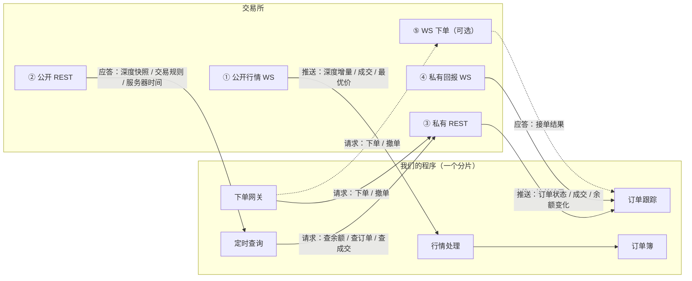
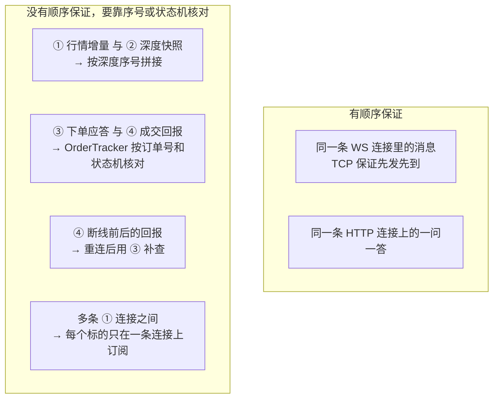

# 连接与通道

状态：草案。以 Binance 现货为例说明；其他交易所和券商的通道种类大致相同，名字和细节不同。具体数字（有效期、上限）以交易所官方文档为准，接入时逐项核对。

## 1. 先看全貌：程序和交易所之间有几条路

一共五种通道，按两个问题就能分清：

| | 谁都能看（公开） | 只有自己的账户（私有，要签名） |
| --- | --- | --- |
| **交易所主动推送**（WebSocket） | ① 公开行情 WS | ④ 私有回报 WS |
| **我们问、交易所答**（请求/应答） | ② 公开 REST | ③ 私有 REST、⑤ WS 下单 |

- **推送：** 连接建好后，交易所有新消息就发过来，我们不用问。
- **请求/应答：** 我们发一个请求，交易所回一个结果，一问一答。
- **私有：** 涉及自己的账户，每个请求都要用 API 密钥签名。

另外还有一条和交易所无关的内部连接：⑥ `hquant_bench` 与 `hquant_server` 之间的 Unix socket。

当前可运行的 Binance 公开行情模拟盘使用下列连接；私有通道仍是后续目标：

| 连接 | 当前实现 | 地址来源 |
| --- | --- | --- |
| ① 公开行情 WS | 每个活跃单分片一条 `WebSocketClient` | `exchange_endpoints.binance.websocket`，默认 `data-stream.binance.vision:443`、TLS |
| ② 深度快照 REST | `HttpClient`，与 WS 独立；请求失败后按行情流状态机重试 | `exchange_endpoints.binance.rest`，默认 `data-api.binance.vision:443`、TLS |
| ⑥ 管理 Unix socket | `<state_dir>/control.sock`；每个请求一条 JSON 行，最多 16 个并发会话 | 本机 state dir |
| 本地压测 feed | `hquant_bench feed` 在一个 TCP 端口上提供 REST 快照和 WS 推送 | `--listen`；server 配置为同一地址，见 [BENCH.md](BENCH.md) |

## 2. 每条通道逐一说明

### ① 公开行情 WS：盘口和成交从这里来

| 项目 | 说明 |
| --- | --- |
| 方向 | 交易所 → 我们，持续推送 |
| 内容 | 深度增量（某价位的新数量）、逐笔公开成交、最优买卖价；可选 K 线 |
| 订阅方式 | 连上后告诉交易所要哪些股票/币对的哪些频道；一条连接可订阅多个（Binance 单连接上限约 1024 个频道） |
| 有序吗 | 同一条连接里有序（TCP 保证）；深度消息自带序号 |
| 断开 | 网络故障会断；Binance 还会在连接满 24 小时时主动断开。断了就重连、重新订阅，订单簿重新同步 |
| 保活 | 交易所定期发 ping，我们必须回 pong，否则会被断开 |
| 归属 | 每个分片自己开，只订阅本分片的标的 |

### ② 公开 REST：一次性查询公开信息

| 项目 | 说明 |
| --- | --- |
| 方向 | 我们问，交易所答 |
| 内容 | 深度快照（订单簿启动或重新同步时要一份完整盘口）、交易规则（最小价格单位、最小下单量）、服务器时间 |
| 频率 | 低：启动时、重新同步时、定时刷新（规则几分钟一次） |
| 限速 | 占用按 IP 计算的请求权重，见 `ARCHITECTURE.md` 第 5.5 节 |
| 归属 | 每个分片自己发；共享同一 IP 的限速额度 |

### ③ 私有 REST：下单、撤单、查账户

| 项目 | 说明 |
| --- | --- |
| 方向 | 我们问，交易所答 |
| 内容 | **下单、撤单**；查询某笔订单、全部挂单、历史成交、账户余额 |
| 签名 | 每个请求都带时间戳并用 API 密钥签名；本地时间和交易所时间差太大会被拒绝，所以要定时同步服务器时间 |
| 连接 | 用 HTTPS 长连接（keep-alive），提前建好，避免每次下单都重新握手 |
| 注意 | 同一条 HTTP/1.1 连接上，前一个请求没写完不能写下一个；需要同时发多个请求时，就开几条连接组成一个小连接池 |
| 限速 | 下单次数按账户计（每 10 秒、每天），请求权重按 IP 计 |
| 归属 | 每个分片自己的连接池 |

### ④ 私有回报 WS：自己的订单状态和成交从这里来

| 项目 | 说明 |
| --- | --- |
| 方向 | 交易所 → 我们，持续推送 |
| 内容 | 订单被接受、部分成交、全部成交、被撤销、被拒绝；账户余额变化 |
| 建立方式 | Binance 传统做法：先用私有 REST 申请一个 `listenKey`，再用它连 WS；`listenKey` 约 60 分钟过期，需要大约每 30 分钟续期一次。新的做法是通过 ⑤ WS 下单连接订阅回报。以官方文档为准 |
| 有序吗 | 同一条连接里有序；但和 ③ 的下单应答是两条路，**谁先到不一定** |
| 断开 | 断开期间的回报会丢，所以重连后必须用 ③ 补查订单和成交 |
| 归属 | 通常一个账户一条。若不能每个分片各开一条，就由一个指定分片读取，按订单号转发给所属分片（`ARCHITECTURE.md` 第 5.3 节） |

### ⑤ WS 下单（可选）：用 WebSocket 代替 REST 下单

| 项目 | 说明 |
| --- | --- |
| 方向 | 我们问，交易所答，但走的是一直连着的 WebSocket |
| 好处 | 连接一直开着，每次下单不用发完整的 HTTP 请求，延迟更低；同一条连接上可以连续发多个请求，不用等前一个 |
| 首版 | 先用 ③ REST 下单；接口设计成可替换，后续按交易所支持情况加上 |

### ⑥ hquant_bench ↔ hquant_server：内部控制连接

| 项目 | 说明 |
| --- | --- |
| 方式 | 本机 Unix socket |
| 内容 | `status`、`stop`、`history` 等命令；一条 JSON 请求和响应各占一行 |
| 归属 | `ControlServer` 管理线程；实时状态经分片 executor 异步获取，历史查询由 Reader 异步返回 |

## 3. 一个分片需要开多少条连接

以一个账户、8 个分片为例（数量为估算，按实际交易所规则调整）：

| 通道 | 每个分片 | 8 个分片合计 | 说明 |
| --- | --- | --- | --- |
| ① 公开行情 WS | 1～2 条 | 8～16 条 | 标的多时按单连接频道上限拆分 |
| ② 公开 REST | 与 ③ 共用连接池 | — | 同一个域名可以复用 HTTPS 连接 |
| ③ 私有 REST | 2～4 条长连接 | 16～32 条 | 数量决定能同时在途的下单数 |
| ④ 私有回报 WS | 0～1 条 | 1～8 条 | 取决于交易所是否允许一个账户多条 |
| ⑤ WS 下单 | 0～1 条 | 0～8 条 | 首版不用 |

启动时 8 个分片不要同时建连：交易所对"每个 IP 单位时间内新建连接数"也有限制，按分片错开几百毫秒建立。

## 4. 顺序：哪些有保证，哪些没有

规则：

1. **一个标的的行情只在一条连接上订阅**，这样它的消息天然有序。
2. **快照和增量**来自两条路，用深度序号拼接：丢掉比快照旧的增量，从接得上的那条开始应用；接不上就重新拿快照。
3. **下单应答和成交回报**来自两条路，"已成交"可能比"接单成功"先到；OrderTracker 用订单号和状态机处理，任意顺序都能得到正确结果。
4. **私有流断过线**，断开期间的回报就丢了；重连后必须用私有 REST 补查订单和成交，补查完成前这个连接器不下新单。

## 5. 每条通道断了怎么办

| 通道 | 断开后的影响 | 处理 |
| --- | --- | --- |
| ① 公开行情 WS | 订单簿不再更新 | 相关标的标记不可用、禁止新单；重连、重新订阅、重新同步订单簿 |
| ②③ REST 连接 | 暂时发不了请求 | 自动重连；下单请求如果已经发出但没收到应答，**不重发**，改为按原订单号查询 |
| ④ 私有回报 WS | 看不到成交 | 该连接器进入降级，禁止新单、允许撤单；重连后补查，完成后恢复 |
| ⑤ WS 下单 | 暂时发不了单 | 同 ③ |
| ⑥ 管理连接 | 只影响命令行查询 | 重连即可，不影响交易 |

## 6. 美股券商或交易所有什么不同

接入具体券商时再补充，常见差异：

- **行情可能走 UDP 组播**（交易所直连行情）：没有 TCP 的顺序保证，交易所一般发 A、B 两路相同数据互相补漏；两路都缺时申请重传或重新拿快照。
- **下单可能走 FIX 协议**：一条长期 TCP 会话，下单和回报在同一条会话里，天然有序；会话有自己的序号和断线重连补发机制。
- **券商 API**（如 Interactive Brokers）：行情和下单常通过券商提供的网关程序中转，连接数和频率限制由券商规定。
