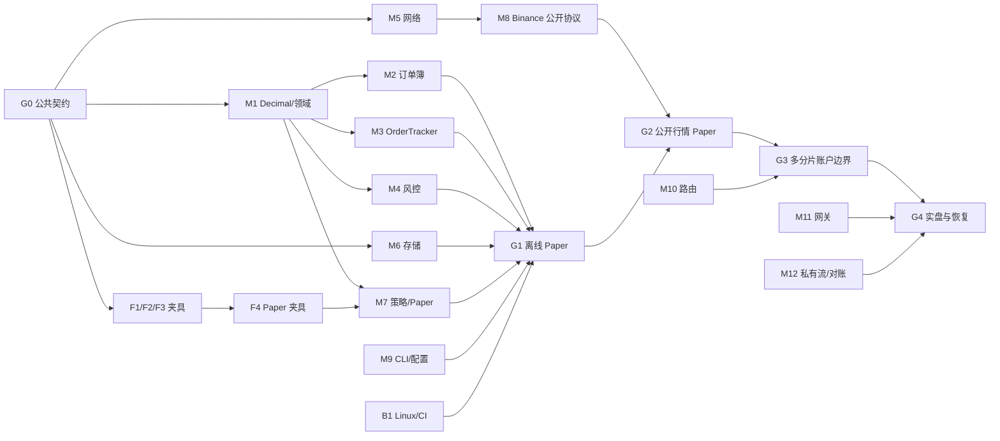

# 开发指南：写法、协作与任务

本文说明怎么写代码、怎么分工与集成。关口和进度见 [ROADMAP.md](ROADMAP.md)；运行时语义以 [ARCHITECTURE.md](ARCHITECTURE.md) 为准；逐文件目录、Bazel target 与字段以 [STRUCTURE_AND_TYPES.md](STRUCTURE_AND_TYPES.md) 为准；订单簿以 [ORDER_BOOK.md](ORDER_BOOK.md) 为准。实现中发现冲突，先更新文档和对应测试，再改代码。

## 1. C++ 语言与实现约束

**全项目以 `-std=c++20` 编译。** 普通领域代码优先用简明的 C++17/20 写法；网络协程需要 C++20，不承诺能用 `-std=c++17` 编译；不得引入 C++23 作为构建要求。

| 场景 | 首选写法 |
| --- | --- |
| 领域值与所有权 | `enum class`、强类型 ID、RAII、`std::unique_ptr`、`std::optional`、`std::variant`、`std::vector`；避免共享可变对象和拥有所有权的裸指针 |
| 参数、时间与只读视图 | `std::string_view`、`std::span`、`std::chrono`；返回视图时明确生命周期，策略不能把 `BookView` 保存到回调之后 |
| 异步网络 | C++20 `co_await` 与 Asio `awaitable`/`co_spawn`；每个协程绑定所属分片执行器，定义取消、超时与退出等待；订单簿、OrderTracker、策略和风控保持普通同步函数 |
| 线程与跨分片 | 分片内独占可变状态；跨分片只用有界消息或明确同步语义的不可变快照 |
| 错误与容器 | 按 [ERRORS.md](ERRORS.md) 用 `ErrorCode` 表达业务原因、`Recovery` 决定处理方式，`absl::Status/StatusOr` 承载跨边界错误；热路径拒单直接返回 `ErrorCode`。索引用 `absl::flat_hash_map`，有序价位用 `absl::btree_map`；哈希遍历次序不能决定交易动作顺序 |
| 格式与兼容性 | 资金域用 libmpdec `Decimal`，JSON/SQLite 用十进制字符串；`std::format`、C++20 模块和较新的 chrono 时区 API 不作为基础能力，先在 macOS/Linux 工具链验证再用 |

第三方异常只在 adapter、YAML 或网络边界转换为 `Status`；业务状态机不靠异常表达正常分支。优先写可读的显式状态转移，不为使用模板、ranges 或协程而抽象。每个模块只直接依赖自己用到的库。格式化用 `./op.sh fmt`（LLVM 20 的 clang-format）。

### 1.1 包职责

`hquant/src/` 下每个模块是一个 Bazel package；文件与 target 清单见 [STRUCTURE_AND_TYPES.md](STRUCTURE_AND_TYPES.md) 第 2 节。`hquant/test/` 统一拥有单元、协议、夹具和端到端测试。

| 包 / target | 负责什么 | 不负责什么 |
| --- | --- | --- |
| `//hquant/src/base:{error,types,market,order}` | 业务错误码与恢复方式、Decimal、强 ID/时间、行情与订单拥有值、网关端口 | socket 操作、SQLite、策略逻辑 |
| `//hquant/src/base:{net,rate_limit}` | HTTP、WS、TLS、本地限速与全局熔断 | 策略决策、订单归属 |
| `//hquant/src/market:{order_book,replay_feed,binance_spot_feed}` | L2 簿和只读视图、固定行情回放、Binance 公开行情 | 下单与账户私有回报 |
| `//hquant/src/order:{order_tracker,risk,paper}` | 双 ID 跟踪、成交去重、风险租约、模拟盘 | 分片线程调度 |
| `//hquant/src/order:{binance_spot_gateway,binance_spot_account}` | Binance 签名/下撤单与私有回报/对账 | 跨交易所通用状态机 |
| `//hquant/src/strategy:{strategy,simple_pmm}` | `TriggerPolicy`、`ActionBatch`、`simple_pmm` | 修改订单簿或执行 SQL |
| `//hquant/src/service:{shard,dispatcher,routing}` | 分片 `io_context`、动作执行、账户级回报路由 | 全局 SQLite 连接与具体组件装配 |
| `//hquant/src/offline:{storage,record_codec,recorder,history}` | 入队端口、WAL 写入、分页查询、恢复与 schema | 决定策略何时发单 |
| `//hquant/src/application:{config,control,launcher}` | YAML 配置、控制协议/服务、线程启动与组件装配 | 策略算法 |
| `//hquant/src/cli:cli`、`//apps:{hquant,hquant_engine}` | 前台命令和进程入口 | 交易状态 |
| `//hquant/test/...`、`//dev/...` | 单元、协议、夹具、端到端和契约编译 | 正式运行链路 |

`strategy` 只读取市场的 `BookView` 和基础值类型；`market` 与 `order` 互不依赖。`service` 通过端口运行分片，`application` 装配具体实现。用 Bazel `visibility` 约束反向依赖。

## 2. 线程、协程与关闭

| 执行位置 | 数量 | 唯一可变状态与任务 |
| --- | --- | --- |
| 分片线程 | 配置最多 8；只启动分到市场的分片 | 一个 `io_context`，独占其 socket、盘口、OrderTracker、策略、RiskGate 和本地限速桶 |
| 控制线程 | 1 | Unix socket、启动/停止命令、账户额度与健康汇总；通过有界命令队列控制分片 |
| Recorder 线程 | 1 | SQLite WAL 写连接，轮转消费各分片 SPSC，批量写入 |
| HistoryReader 线程 | 1 | 独立只读连接，有界分页查询；结果投回控制线程 |
| Quill 后台线程 | 1 | 诊断日志格式化和落盘 |
| 计算工作线程 | 0..M | 后续 V2 长耗时指标；只读不可变带版本快照，结果回分片复核 |

- 每个分片在自己的 `io_context` 上 `co_spawn` 公开 WS、私有 WS、REST 请求、快照加载、重连、余额/规则刷新、对账及策略定时器。相同 socket 的读写、连接池槽位和超时取消由该分片串行管理。策略回调同步、短时，禁止同步 DNS/HTTP、读 SQLite 或等待未来结果。
- 忙轮询循环调用 `poll()` 并有工作保活，每轮检查有界命令队列；阻塞模式调用 `run()`，生产者使队列从空变非空时 `asio::post` 唤醒。两种模式都限制单次 drain 数量。**先实现并测通阻塞模式，再实现忙轮询和 Linux 绑核**；macOS 上用阻塞模式做正确性测试。
- 协程必须有明确的所有者、取消信号、总期限和退出等待。**关闭顺序：** 禁止新策略动作 → 继续处理必要撤单和回报 → 取消连接/定时器并等待分片协程结束 → drain 或标记 Recorder 余量 → 停 HistoryReader 与控制连接 → flush Quill。强制退出后的恢复路径单独测试；优雅退出不能假装所有订单已成交或持仓已清零。

### 2.1 三条实现路径的要点

**行情到动作：** adapter 用 simdjson 解析原始十进制文本和序号，按 `BookScale` 转整数事件 → 订单簿缓存增量、异步取快照、按序号回放，缺口/交叉/溢出进入重同步 → 一个输入批次内先完成全部盘口更新，再按各策略 `TriggerPolicy` 通知一次 → 策略返回 `ActionBatch`，dispatcher 检查依赖就绪、最小动作间隔、规则、分片额度和限速，拒绝要有原因和统计。

**动作到实盘订单：** 风险门预留最坏敞口 → 网关取得有界连接槽、生成 client ID、登记 `PendingCreate`，按最终字节签名；发起写入前的同步失败撤销预留并产生本地失败事件 → `try_push(OrderIntent)`，失败只标记缺口 → 发起 `async_write`；写完成、HTTP 响应、私有 WS 回报是后续可能乱序的事件；无法证明请求未送达则 `SubmissionUnknown` → OrderTracker 去重并先更新订单与风险，再回调 `OnFill/OnOrderUpdate`。Paper 用相同接口，只把网关换成可重放撮合。

**启动与多分片：** 校验配置和分片分配 → 建立 `RunId` 与归属索引 → 读取可用意图与检查点 → 连接交易所补查挂单/成交/余额 → 对账后才打开新单门（详见 [ARCHITECTURE.md](ARCHITECTURE.md) 第 11.3 节）。同账户跨分片前，控制线程按账户/币种分配互不重叠的静态资金租约，账户级私有流由指定分片按 owner 转发，限速按分片静态分配并保留撤单余量，429/418 触发全局熔断。

## 3. 多 Agent 协作规则

1. **按模块独占写入：** `hquant/src/{base,market,order,strategy,service,application,offline,cli}/` 各有一个 `BUILD.bazel`；并行任务须指定文件所有者，避免两个 Agent 同时修改同一文件。
2. **测试集中管理：** 单元和端到端测试平铺在 `hquant/test/`，夹具分在 `hquant/test/fixtures/{order_book,order_tracker,simple_pmm,paper,v1}/`。集成负责人统一维护 `hquant/test/BUILD.bazel` 和 fixture loader；并行实现任务写各自的新测试文件。
3. **公共接口先同步：** 发现头文件或 target 依赖问题时，先说明字段、调用方和测试场景，再由该模块负责人修改。`apps/`、`dev/`、根 Bazel 文件和跨模块文档由集成负责人统一检查。
4. **交付完整模块：** 实现、BUILD、对外 API 说明、离线单元/协议测试、运行命令和未解决问题。局部测试运行 `bazel test //hquant/test:<name>`；集成后跑 `bazel test //...`、端到端回放和相关 sanitizer。
5. **按依赖顺序集成：** `base → market/order/offline → strategy → service → application/cli → apps`。共享 Bazel 输出目录可能串行化并发构建；重构按 [refactor/PLAN.md](refactor/PLAN.md) 的阶段检查。

仓库已有 Git 基线。并行开发使用互不冲突的文件所有权或独立 worktree，并以小批次合并与验证。

### 3.1 提交与集成门槛

每个任务包写明：公共契约版本、修改路径、Bazel target、局部测试结果、夹具来源、已知差异。集成时检查依赖方向和 `visibility`：`strategy` 不依赖具体交易所；`net` 不碰策略/资金；SQLite 实现只在装配边界注入；共享夹具只读。

| 范围 | 必跑的最小验证 |
| --- | --- |
| 每个包 | `bazel test //hquant/test:<相关测试 target>` 或对应 fixture runner；无外网；告警和内存错误消除 |
| 每次集成 | `bazel build //...`、`bazel test //...`（`./op.sh ci`）、可见性检查；macOS 与 Linux 均留结果 |
| G1 | 虚拟时钟差分回放；Decimal、动作顺序、订单状态、余额和手续费逐步断言；Recorder 故障仍能推进模拟盘 |
| G2 | 本地 REST/WS mock 注入重复、乱序、断线、超时、429、盘口缺口；不就绪市场停止新单、撤单继续 |
| G3 | 两个以上活跃分片与同账户/币种；租约总量、未知单占用、路由/队列满、忙轮询与阻塞模式；Linux TSan 与 8 分片压力 |
| G4 | 隔离账户中的接单、部分成交、撤单、写超时、`SubmissionUnknown`、进程中断与重启对账 |

Sanitizer：`bazel test --config=asan //...`、`bazel test --config=tsan //...`（smoke 用 `./op.sh asan|tsan`）。性能结果附机器、核数、分片数、输入流与事件循环模式。

## 4. 任务包与排程

### 4.1 G0 冻结的公共契约

| 契约组 | 冻结内容 | 并行实现所需的判断 |
| --- | --- | --- |
| 数值/身份 | `Decimal` 精度与舍入、`MarketId`、`OwnerId`、`RunId`、三种订单/成交 ID、时间类型 | 盘口步长与下单规则分开；client ID 的归属和唯一性不依赖 SQLite |
| 行情 | `BookScale`、Snapshot/Diff 的序号与 ticks/lots、`BookView` 生命周期、同步状态 | adapter 负责原始序号，订单簿负责连续性和状态 |
| 订单与策略 | `OrderRequest/Command/Update/TradeUpdate`、`TrackedOrder`、`ActionBatch`、`TriggerPolicy`、`AwaitingFills` | 回报乱序/去重、动作顺序和本账户成交边界清楚 |
| 存储与恢复 | `OrderIntent`、`RecoveryContext`、`StorageHealth`、每分片记录序号、schema 版本、`HistoryQuery` | 非阻塞入队；提交不触发发单；缺口与不可恢复状态可见 |
| 多分片 | 静态资金/限速租约、`ShardReport`、`OrderOwnershipIndex`、私有回报转发与队列满语义 | ID 生成到索引更新之间可能先到回报：能从 ID 判定 owner，或隔离补查，不能投错分片 |
| 构建与夹具 | target 名/`visibility`、`hquant/test/fixtures/v1` 格式、输入时钟与同时间序号、差异标记 | 独立包可编译；夹具可由 C++ 离线 runner 读取 |

**夹具格式：** 每例记录 `schema_version=1`、`case_id`、`baseline_commit`、`source_files`、`expectation_kind`、按 `at_us` 与 `ordinal` 排序的 `inputs`、逐步 `expected`，以及 `parity` 或 `intentional_divergence` 标记。价格、数量、余额和费用用十进制字符串；随机订单 ID 归一化为稳定符号；不含真实密钥或账户数据。Python 盘口的浮点表示与 C++ 的缺口重同步不同：有效流用 Python 输出对照，新约束按本套文档验收，差异汇总到 `hquant/test/fixtures/DIFFERENCES.md`。格式细节见 [`hquant/test/fixtures/v1/README.md`](../hquant/test/fixtures/v1/README.md)。

### 4.2 任务包

下表保留 G0–G4 的任务来源；重构后写入所有权按具体 target 文件分配。Agent 可以读取其他代码，共享 `BUILD.bazel` 由集成负责人修改。

| ID | 独占写入目录 | 前置条件 | 局部验收 |
| --- | --- | --- | --- |
| F1 订单簿夹具 | `hquant/test/fixtures/order_book/**` | 夹具 v1 格式 | 快照前缓存、首条接续、连续更新/删档、重复/旧消息、跳号、交叉/无效精度；逐步 BBO、前 N 档、序号、状态 |
| F2 订单追踪夹具 | `hquant/test/fixtures/order_tracker/**` | 夹具 v1 格式 | 接单、部分/全成交、trade ID 重复、成交先于接单、完成先于明细、撤单竞态；事件序、累计金额、费用、敞口 |
| F3 `simple_pmm` 夹具 | `hquant/test/fixtures/simple_pmm/**` | 夹具 v1 格式 | 只以 `scripts/simple_pmm.py` 为基线：就绪门、15 秒刷新、撤旧单后报价、余额不足、量化；有序 `ActionBatch` |
| F4 Paper 夹具 | `hquant/test/fixtures/simulated_exchange/**` | F1–F3 的类型与时钟约定 | 限价触价、公开成交驱动撮合、撤单、余额和费用 |
| B1 构建/CI | `dev/**`、`.github/workflows/**` | D0 smoke 已过 macOS | Linux x86_64 构建、离线测试、ASan/UBSan 与 TSan 实测 |
| M1 Decimal/领域 | `hquant/src/base/{types,market,order}.*` | 数值/身份契约 | libmpdec RAII、强类型 ID/规则/费用；与 Python Decimal 差分 |
| M2 订单簿 | `hquant/src/market/order_book.*` | 行情契约、M1 | L2 数组 + 溢出、快照/增量状态机、缺口与 Stale/Resyncing；F1 全部回放 |
| M3 OrderTracker | `hquant/src/order/order_tracker.*` | 订单契约、M1 | 双 ID、trade ID 去重、`AwaitingFills`、`SubmissionUnknown`；F2 全部回放 |
| M4 风控/租约 | `hquant/src/order/risk.*` | 订单/租约契约、M1 | 单笔/总敞口、静态租约、未知结果占额、紧急停止 |
| M5 网络 | `hquant/src/base/{net,rate_limit}.*` | transport 端口 | REST 复用、期限/取消、WS 重连、本地限速与熔断；本地 mock，无公网 |
| M6 SQLite | `hquant/src/offline/{storage,record_codec,recorder,history}.*`、`schema.sql` | 意图/schema 契约 | 每分片 SPSC、WAL 批量写、HistoryReader 分页、缺口、RunManifest、恢复 |
| M7 策略/Paper | `hquant/src/strategy/{strategy,simple_pmm}.*`、`hquant/src/order/paper.*` | 动作/视图契约、M1、F3/F4 | `simple_pmm` 定时动作、可重放撮合与费用；F3/F4 全部回放 |
| M8 Binance 公开协议 | `hquant/src/market/binance_spot_feed.*` | 行情事件契约、M5 | 原始报文解析、序号规范化、异步快照/WS；F1 与协议 mock |
| M9 CLI/配置 | `hquant/src/cli/cli.*`、`hquant/src/application/config.*` | 控制消息与配置版本 | `start` 配置校验，`status/history/stop` 离线测试；拒绝重复 owner key、错误分片依赖、隐式实盘 |
| M10 归属与路由 | `hquant/src/service/routing.*` | 多分片契约 | 稳定 owner → 当前分片、有界转发、未知归属隔离 |
| M11 签名/网关 | `hquant/src/order/binance_spot_gateway.*` | M5、M3 | client ID 编解码、签名、异步下/撤单、未知结果 |
| M12 私有流/对账 | `hquant/src/order/binance_spot_account.*` | M5、M3 | 接单/成交回报、查单/成交/余额并核对 |

### 4.3 依赖图与波次



任务满足前置条件即可占用空闲槽位，不必等整波结束；交付以测试通过为准，不按日历天数宣称完成。

| 波次 | 集成 Agent | Worker 1 | Worker 2 | Worker 3 | 汇合点 |
| --- | --- | --- | --- | --- | --- |
| W0a | 公共字段/API、夹具 v1 格式、`//dev:contract_compile` | 只读抽取 Python 订单簿行为 | 只读抽取 Tracker 行为 | 只读抽取 `simple_pmm.py` | 头文件编译、schema 定稿 |
| W0b | M1、统一 fixture loader | F1 | F2 | F3 | G0 |
| W1 | 单分片 runtime 骨架与回放 runner | F4 | M6 | M5 | 各包通过；B1 在空槽位补上 |
| W2 | dispatcher、风控、Paper/SQLite 闭环 | M2 | M3 | M7 | M4、M9 补位；G1 |
| W3 | `hquant/app` 装配与 G2 集成 | M8 | 公开协议 mock/夹具 | 断线、缺口、429 故障注入 | G2 |
| W4 | 控制线程与 8 分片验收 | M10 | M4 租约扩展 | M5 限速/熔断扩展 | G3 |
| W5 | 实盘准入、恢复与最终集成 | M11 | M12 | M6 存储恢复与崩溃故障注入 | G4 |

## 5. 各关口的工作单与完成命令

G0–G4 的本地 target 已建立；以下保留为各关口的交付定义，继续用于回归与剩余联机验收。

**G0：** 集成 Agent（C00）建立 `hquant/src/base/{types,market,order,net}.h`、`hquant/src/market/order_book.h`、`hquant/src/strategy/strategy.h`、`hquant/src/offline/storage.h`、`hquant/src/service/shard.h`、`hquant/src/application/control.h`、`dev/contract_compile_test.cc` 与 `hquant/test/{BUILD.bazel,fixture_loader.*,fixture_schema_test.cc,fixtures/v1/README.md}`；F1 至少 6 例、F2 至少 7 例、F3 至少 5 例。

```bash
bazel test //dev:dependency_smoke //dev:contract_compile //hquant/test:schema_test //hquant/test:types_test //hquant/test:order_book_test
```

**G1：** C01 Decimal 与领域类型；M2/M3/M4/M6/M7/M9 各自交付；集成 Agent 写 `hquant/src/service/{shard,dispatcher}`、`hquant/src/application/{launcher,control}`、`apps/{hquant,hquant_engine}.cc`、`examples/simulated_replay.yaml` 与 `hquant/test/simulated_replay_test.cc`。回放测试断言盘口、两侧报价（mid=100、价差各 0.1%、数量 0.01 时为 99.9/100.1）、15 秒刷新撤旧单重报、成交、费用、余额、SQLite 历史与缺口，重复运行结果一致。`simulated_replay.yaml` 写明 `schema_version`、`mode: paper`、固定行情、`BTC-USDT`、Paper 初始余额、`refresh_interval: 15s`、价差 `0.001`、数量 `0.01`、阻塞事件循环。

```bash
bazel test //hquant/test:simulated_replay && bazel test //...
```

**G2：** M5 传输端口运行在分片 `io_context`，不建网络线程池；M8 解析原始价格/数量文本并规范化序号；集成 Agent 添加 `examples/simulated_binance_pmm.yaml` 与 `hquant/test/simulated_binance_test.cc`，`status` 显示盘口 Live/Stale、挂单、余额和存储健康。

```bash
bazel test //hquant/src/base:net //hquant/src/base:rate_limit //hquant/src/market:binance_spot_feed //hquant/test:simulated_binance
```

**G3：** M4 补齐同账户/币种静态租约与版本核验；M10 建 `order_ownership_index` 与 `private_report_router`；M5 补本地限速与全局熔断；集成 Agent 建 `hquant/test/multi_shard_test.cc`，用两个以上活跃分片与 8 分片压力输入验证额度不重复授予、未知结果继续占额、未知归属/队列满暂停并补查。

```bash
bazel test //hquant/src/order:risk //hquant/src/service:routing //hquant/src/base:net //hquant/src/base:rate_limit //hquant/test:multi_shard
```

**G4：** M11 做 client ID、签名、异步下/撤单与未知结果；M12 做私有回报、查单/成交与 REST 对账；M6 扩展 RunManifest、缺口与检查点恢复；集成 Agent 建 `hquant/test/recovery_test.cc`，覆盖写超时、HTTP/私有流乱序、重复成交、进程中断和 SQLite 故障。之后按 [ROADMAP.md](ROADMAP.md) 第 5 节做隔离账户验收；XEMM、V2、回测从 G5 继续，不混进首条实盘交付。

```bash
bazel test //hquant/src/order:binance_spot_gateway //hquant/src/order:binance_spot_account //hquant/test:recovery && bazel test //...
```
