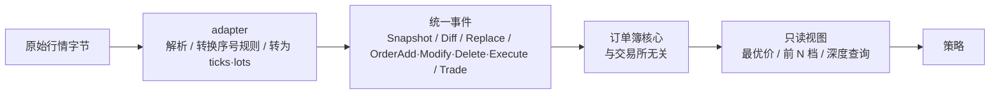
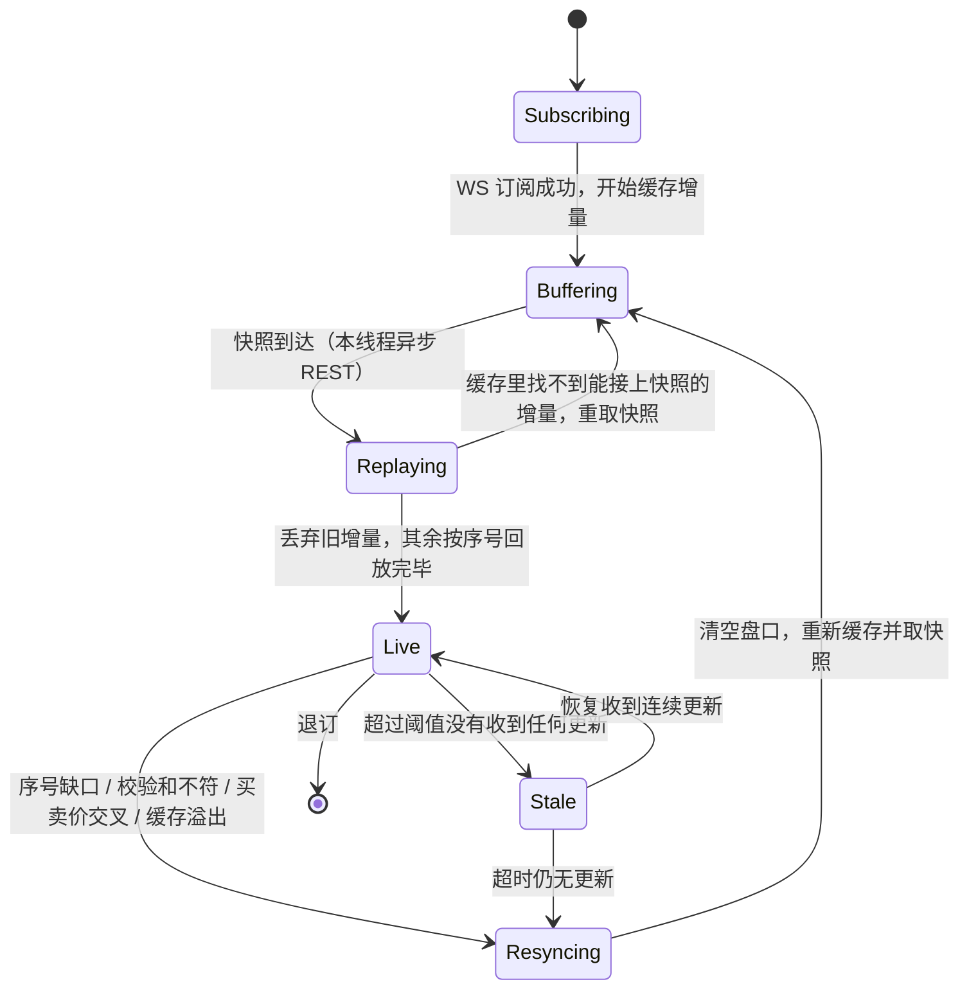
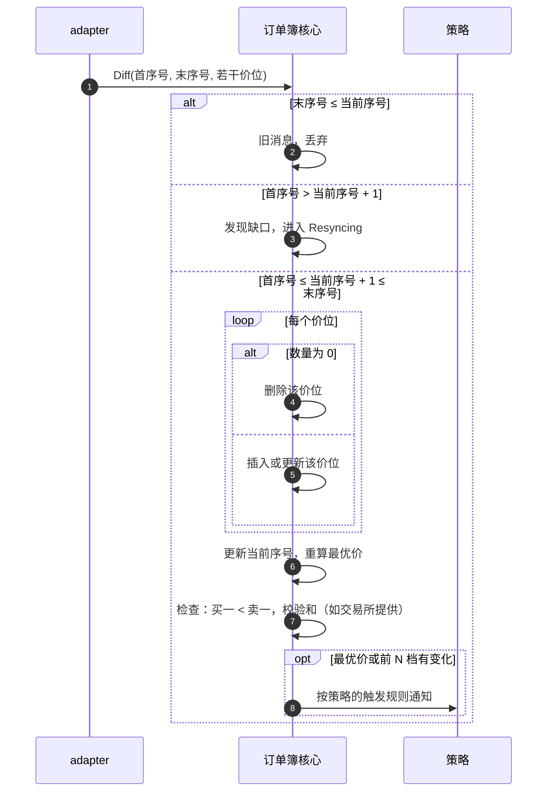
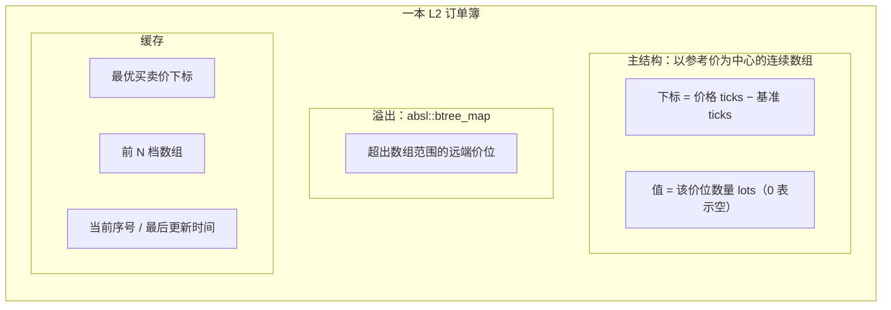
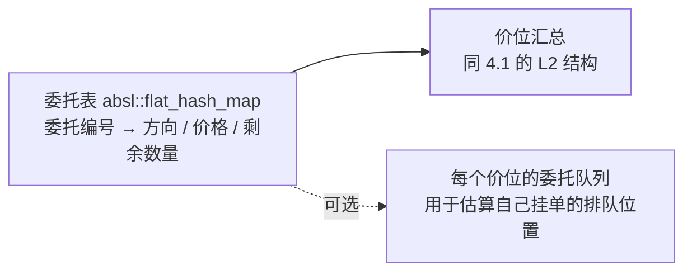

# 订单簿：接收、同步与更新

状态：草案。线程与分片前提见 [ARCHITECTURE.md](ARCHITECTURE.md)，字段与单位见 [STRUCTURE_AND_TYPES.md](STRUCTURE_AND_TYPES.md)：每本订单簿只属于一个分片线程，由该线程独占读写，不加锁。

## 1. 行情从哪里来

不同交易所和数据源给的盘口格式不同，adapter 负责把它们转换成统一的内部事件，订单簿核心只处理统一格式。

| 数据类型 | 内容 | 典型来源 | 本地要做的事 |
| --- | --- | --- | --- |
| L1 | 只有最优买卖价和数量 | 简单行情接口、部分券商 | 直接覆盖最优价 |
| L2 增量 | 某价位的新数量，带序号；需先取快照 | 加密交易所 WS（如 Binance `@depth`） | 快照 + 按序号应用增量 |
| L2 全量 | 每条消息都是前 N 档完整盘口 | 部分交易所的 `depth5/20` 频道 | 整体替换前 N 档 |
| L3 逐笔委托 | 每一笔委托的新增、修改、撤销、成交 | 股票交易所直连行情（ITCH 类协议） | 按委托编号维护，再汇总成价位 |

- **交易所序号字段由 adapter 规范化。** 例如 Binance 的首条增量必须覆盖 `lastUpdateId + 1`；adapter 给核心完整的“首序号 / 末序号”区间，核心按区间覆盖关系检查连续性。价位数量是绝对覆盖值，重叠区间可重放。
- **价格和数量在 adapter 里就转成整数。** 价格按该行情流的最小价格单位（`BookScale`）换算成 ticks，数量换算成 lots；不能整除的报价是协议错误，触发重新同步。
- **公开成交**只更新"最近成交价"并产生 `PublicTrade` 事件，绝不当作本账户成交。

## 2. 同步状态机：每本订单簿一个

| 状态 | 盘口能否使用 | 策略是否被触发 | 该市场能否下新单 |
| --- | --- | --- | --- |
| Subscribing / Buffering / Replaying | 否 | 否 | 否 |
| Live | 是 | 是 | 是 |
| Stale | 可读，但标记过期 | 否 | 按配置，默认否 |
| Resyncing | 否 | 否 | 否，撤单照常 |

- 盘口不可用时，风控对**该市场**拒绝新单，撤单不受影响；同一分片的其他市场照常交易。
- 取快照是本线程的异步 REST 请求，等待期间线程照常处理其他市场的消息，不阻塞。
- 增量缓存有上限；超过上限就清空重来，不无限占用内存。

## 3. 一条增量怎么应用

- **一次读取收到多条消息时**，先全部应用，再按策略的触发规则通知一次，避免策略对中间状态反复决策。
- `last_sequence ≤ current_sequence` 的旧 Diff 直接丢弃；其余 Diff 必须覆盖 `current_sequence + 1`。这个条件同时适用于快照后的第一条和 Live 时的后续增量。不同 `stream_epoch` 的序号不可比较；相对数量增减消息不能直接使用重叠区间规则。
- **买一 ≥ 卖一**（交叉）在连续交易时段视为数据错误，触发重新同步；集合竞价时段允许交叉（见第 6 节）。
- 提供校验和的交易所（如 OKX、Kraken），应用后按交易所规则校验，不符就重新同步。

## 4. 内存结构

### 4.1 L2 价位簿

| 方案 | 更新开销 | 适用场景 |
| --- | --- | --- |
| 连续数组（价格阶梯） | O(1)，按下标直接写 | 最小价格单位固定、价格集中在一个区间，例如股票常见的 0.01 |
| `absl::btree_map` | O(log n) | 价位稀疏、价格跨度大，或作为数组的溢出区 |

- 默认用"连续数组 + 远端溢出到 `btree_map`"。价格漂出数组范围时，按新的参考价重新居中；这个操作只能由所属分片执行，需限制单次回调耗时。
- 最优价的下标随每次更新维护；最优价所在价位被删除时，向外找下一个非空价位。
- 启动时按配置预留容量并测量后续分配；低分配是性能目标，不是正确性前提。

### 4.2 L3 逐笔委托簿

- 新增、修改、撤销、成交都先改委托表，再同步修改对应价位的汇总数量。
- 只有需要估算排队位置的策略才维护每个价位的委托队列，默认关闭。
- 委托表按标的的活跃委托数预留容量。

## 5. 策略怎么读盘口

- 策略拿到的是**只读视图**：最优价、前 N 档、按数量或金额累计的深度、中间价、状态（Live/Stale）、最后更新时间。
- 读取不复制数据：视图直接引用本线程的盘口，只在回调期间有效，不能保存到回调之外。
- 价格以 ticks 返回，需要显示或记账时再转换成 Decimal。
- 其他分片的策略不能直接读这本盘口，只能读发布出去的快照，见 [ARCHITECTURE.md](ARCHITECTURE.md) 第 5.4 节。

## 6. 股票行情的特殊情况

以下取决于最终接入的数据源，接入时逐项确认：

| 情况 | 处理 |
| --- | --- |
| 交易时段（盘前、连续竞价、盘后） | 盘口带时段标记，策略和风控按时段决定是否交易 |
| 集合竞价 | 允许买卖价交叉，此时不触发重新同步；不按连续竞价的逻辑报价 |
| 停牌、熔断 | 盘口标记为暂停，该标的拒绝新单 |
| 多个交易场所 | 每个场所一本订单簿；需要全市场最优价（NBBO）时，由汇总视图从各场所订单簿计算 |
| 碎股、不同最小价格单位 | 最小价格单位随价格区间变化时，由 adapter 提供按价格区间的换算规则 |

## 7. 模拟盘和回测

模拟盘和回测使用同一套订单簿核心，只是输入来自历史数据或录制的行情，由 `ReplayClock` 推进时间。相同输入必须得到相同盘口和相同的策略触发序列，这也是订单簿的回归测试方式：用录制的脱敏行情（包含乱序、重复、缺口、交叉）重放，逐条比对最优价与前 N 档。

## 8. 性能测量

| 测量点 | 含义 |
| --- | --- |
| T0 | socket 收到行情字节 |
| T0→T1 | 解析 + 应用到订单簿 |
| 每条消息的价位数、每秒消息数 | 用来判断该标的是否需要单独分片 |
| 重新同步次数与持续时间 | 衡量行情质量和网络稳定性 |
| 增量缓存最大占用 | 用来设置缓存上限 |
