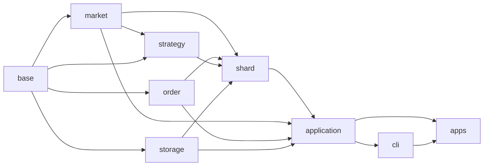

# 目标目录、Bazel 包与关键数据契约

状态（2026-10-01）：目录重构已落到 `hquant/src/` 与 `hquant/test/`。G0 契约和夹具已落地；G1 macOS 离线链路、G2 本地 mock 与真实公开行情模拟盘短跑、G3 本地额度/路由组件测试和 G4 本地恢复 mock 已通过。Linux、G3 多活跃分片装配与压力、G4 隔离账户仍待验收。本文固定**首条 Binance 现货 + `simple_pmm` + 模拟盘，随后多分片实盘**所需的目录、文件、类型和依赖方向。运行与线程语义见 [ARCHITECTURE.md](ARCHITECTURE.md)，订单簿算法见 [ORDER_BOOK.md](ORDER_BOOK.md)，依赖选型见 [DEPENDENCIES.md](DEPENDENCIES.md)，交付顺序见 [ROADMAP.md](ROADMAP.md) 与 [DEVELOPMENT.md](DEVELOPMENT.md)。

## 1. 范围与约定

- 全项目用 Bazel 编译为 C++20；普通业务代码优先用清楚的 C++17/20 写法，Asio 网络协程使用 C++20。一个含 `BUILD.bazel` 的目录就是一个 Bazel package；头文件和实现放同目录，引用写 `#include "base/types.h"` 等从 `hquant/src` 起算的路径。
- `//hquant/src/base:{types,market,order}` 不接触 socket、SQLite、YAML；网络操作集中在 `//hquant/src/base:net`。所有公共值类型拥有自己的字符串/数组，不能保存 simdjson、Beast 缓冲区的 `string_view`。跨线程队列只传拥有值或明确不可变共享快照。
- 业务错误码、恢复方式与 `absl::Status/StatusOr` 的关系见 [ERRORS.md](ERRORS.md)；`absl::flat_hash_map` 做身份索引，`absl::btree_map` 做有序远端盘口价位。哈希遍历顺序不能决定发单顺序。资金、手续费和下单规则使用 libmpdec `Decimal`；原始 JSON 十进制文本不经过 `double`。
- 可变盘口、Tracker、策略、RiskGate、网关及 socket 只由所属分片线程访问。`OrderBookView` 与其他借用视图仅在同步策略回调期间有效。Asio 协程在分片执行器上挂起和恢复；策略、订单簿、Tracker、风控是短时同步状态机。
- 首版同账户多分片使用**静态资金/限速额度、账户级私有回报路由、本地令牌桶和全局熔断**。动态额度再平衡、全局原子令牌池、跨分片行情快照及 L3 留后续；不为它们在 G0 建空包。

## 2. 当前目录与文件

`hquant/` 只保留 `src/` 与 `test/`；每个 `src` 模块各有一个 `BUILD.bazel`，测试与夹具集中在 `hquant/test/BUILD.bazel`。G0–G4 的本地实现已建立；G4 隔离账户联机验收仍按交付关口执行。

```text
hummingbot-cpp/
├── hquant/
│   ├── src/
│   │   ├── base/                 # 值类型、网络、限速
│   │   ├── market/               # 订单簿、回放行情、Binance 公开行情
│   │   ├── order/                # Tracker、风险、模拟盘、Binance 下单与账户
│   │   ├── strategy/             # 策略接口与 simple_pmm
│   │   ├── shard/              # 分片循环、动作分发、回报路由
│   │   ├── application/          # 配置、控制服务、进程启动
│   │   ├── storage/              # SQLite 记录、历史、恢复
│   │   └── cli/                  # 前台命令
│   └── test/
│       ├── *_test.cc             # 单元、协议和端到端测试
│       ├── fixture_loader.h/.cc
│       └── fixtures/             # v1、order_book、order_tracker、simple_pmm、paper
├── apps/                           # 两个进程入口
├── examples/                       # 可运行配置
├── dev/                            # 契约编译与构建检查
├── third_party/
├── docs/
└── MODULE.bazel
```

公开头文件统一设置 `strip_include_prefix = "/hquant/src"`，例如 `#include "base/order.h"`、`#include "market/order_book.h"`。实现与对应测试的 Bazel target 如下；交易规则与事件仍是原来的值类型，只合并了文件。

| Bazel package / target | 主要文件 | 责任 |
| --- | --- | --- |
| `//hquant/src/base:{error,types,market,order}` | `error.h/.cc`、`types.h/.cc`、`market.h`、`order.h` | 业务错误码、恢复方式、Decimal、强 ID/时间、行情/订单/账户拥有值和订单网关端口 |
| `//hquant/src/base:{net,rate_limit}` | `net.h/.cc`、`rate_limit.h/.cc` | HTTP、WebSocket、TLS、本地限速和全局熔断 |
| `//hquant/src/market:{order_book,replay_feed,market_data_stream}` | 各 target 同名 `.h/.cc` | L2 簿与同步/只读视图、固定行情回放、Binance 公开行情 |
| `//hquant/src/order:{order_tracker,risk,simulated_exchange}` | 各 target 同名 `.h/.cc` | 双 ID 和成交去重、额度/准入/资金冻结、模拟盘 |
| `//hquant/src/order:{order_gateway,account_reports}` | 各 target 同名 `.h/.cc` | Binance ID/签名/下撤单与私有回报/对账 |
| `//hquant/src/strategy:{strategy,simple_pmm}` | `strategy.h`、`simple_pmm.h/.cc` | 同步策略回调、触发规则、有序动作和 15 秒刷新策略 |
| `//hquant/src/shard:{shard,action_executor,routing}` | 各 target 同名 `.h/.cc` | 分片状态和时钟、动作顺序、跨分片账户回报路由 |
| `//hquant/src/storage:{storage,record_codec,recorder,history}` | `storage.h`、各实现同名 `.h/.cc`、`schema.sql` | 有界入队、WAL 写入、只读分页、恢复和持久化格式 |
| `//hquant/src/application:{config,control_server,quant_server,launcher}` | 各 target 同名 `.h/.cc` | YAML 校验、管理消息/服务、交易链组件装配与启动 |
| `//hquant/src/cli:cli`、`//apps:{hquant,hquant_engine}` | `cli.h/.cc`、`apps/hquant.cc`、`apps/hquant_engine.cc` | 前台 `start/status/history/stop` 与引擎入口 |
| `//hquant/test:{fixture_loader,schema_test,simulated_exchange_schema_test}` | `fixture_loader.h/.cc`、`fixture_schema_test.cc`、`fixtures/` | Python 对照夹具的读取与校验 |
| `//hquant/test:{simulated_replay,simulated_binance,multi_shard,recovery}` | 对应 `*_test.cc` | 离线/本地 mock 端到端链路 |
| `//dev:contract_compile` | `dev/contract_compile_test.cc` | 编译检查全部公开头文件 |

所有单元测试也位于 `hquant/test/`，文件按被测模块命名；原先分散在实现包内的 原有用例已合并，错误码与协议迁移新增了回归用例。夹具数据在 `hquant/test/fixtures/`，其 JSON、schema 和差异说明仍按各主题维护。隔离环境联机试单另记测试记录。

### 2.1 编译依赖和写入边界



`market` 与 `order` 互不依赖；策略只读取 `market/order_book.h` 的 `OrderBookView`。`shard` 使用订单网关和存储端口，不直接装配 Binance、模拟盘 或 SQLite 实现；`application` 负责选择具体实现。`base/net` 不依赖交易业务类型。Bazel target 的 `visibility` 用于约束实际调用方，测试经对应 target 访问公开接口。

## 3. 数值、身份和时间

下列是头文件应表达的**字段语义**；代码可以采用等价的封装方法，不允许改变单位、所有权或状态含义。

| 类型 / 位置 | 字段与不变量 |
| --- | --- |
| `Decimal` / `base/types.h` | libmpdec RAII 值；解析、运算、量化返回 `StatusOr` 或明确错误；不隐式转 `double`；拒绝 NaN/Inf/溢出。JSON/SQLite 用规范化十进制字符串，舍入模式由调用处显式选定。 |
| `ExchangeId`、`AccountId`、`AssetId`、`StrategyName` / `base/types.h` | 互不混用的拥有字符串 ID。`AccountId` 在进程内唯一指向一个交易所账户，日志和持久化用脱敏表示。 |
| `StrategyId` / `base/types.h` | `{value, name}`。`strategy_id` 是配置中显式、稳定、唯一的 48 位正整数；名称用于展示，订单归属由数字 ID 判定，不能靠名称哈希临时生成。重配时旧 key 仍保留在恢复映射中。 |
| `RunId`、`ShardId`、`HoldId`、`ActionBatchId` / `base/types.h` | `RunId` 是每次引擎启动的加密随机 64 位非零值；client ID 的 32 位尾段中高 3 位是本次运行的 shard 槽位，低 29 位是该 shard 的本地递增序号，溢出停止创建新 ID，不在热路径争用全局计数器。启动对账时若发现与历史 client ID 冲突则重新生成。`ShardId` 是进程内 `0..7` 路由号，可因重启分配改变，ID 中的槽位只用于唯一性/路由提示，不能充当持久归属；资金冻结/动作批次 ID 也不可互用。 |
| `ClientOrderId`、`ExchangeOrderId`、`ExchangeTradeId` / `base/types.h` | 三个不同强类型；client ID 在新单发送前确定。交易所 ID 可晚到；成交 ID 的唯一范围由 adapter 明确，去重键至少包括账户、市场和 trade ID。 |
| `UtcTime`、`MonoTime`、`EventTime` / `base/types.h` | UTC 为微秒 `sys_time`，本地期限用 `steady_clock`。`EventTime={optional exchange_utc, receive_utc, receive_mono}`；前两者可持久化，mono 只在本次 run 比较。`ReplayClock` 同时推进两种时间，夹具用 `at_us` 加 `ordinal` 定相同时间输入顺序。 |

首个 Binance ID codec 可用一个不含分隔符的 31 字符候选编码：1 字符版本前缀 + 48 位 strategy_id 的固定 10 位 base32 + 64 位 run 的固定 13 位 base32 + 32 位“shard 槽位 + 本地序号”的固定 7 位 base32。该长度低于当前 Python Binance 适配器的 `MAX_ORDER_ID_LEN=32`；**具体字符和长度是交易所适配器约束，不是领域层常量**，G4 必须按目标环境验证接受、原样回传、往返解码与碰撞处理。随机 RunId 的唯一性也要通过启动对账检查，不能把概率值当绝对保证。不能编码时拒绝启用实盘，而非回退到只存 SQLite 的归属。Router 先从 client ID 解稳定 strategy_id，再用索引核对 exchange ID；身份不明或冲突一律隔离并补查。

## 4. 行情值与订单簿视图

| 类型 / 位置 | 必有字段、单位和规则 |
| --- | --- |
| `MarketId` / `base/market.h` | `{exchange, instrument_kind, native_symbol}`；首版 `instrument_kind=Spot`。`MarketSpec` 另给 `{market, base_asset, quote_asset}`，不能从交易所符号任意切字符串猜资产。 |
| `TickLotSize` / `base/market.h` | `{price_per_tick: Decimal, amount_per_lot: Decimal, tick_lot_version}`，两个步长都大于零。adapter 检查原始十进制可整除及 64 位范围，转为强类型 `PriceTicks{int64}`、`QuantityLots{uint64}`。行情 scale 可以比下单精度细，不能拿它代替 `TradingRule`。 |
| `BookLevel` / `base/market.h` | `{price_ticks, quantity_lots}`，价格正、数量非负；Diff 中 0 表示删除该价位。bids/asks 分侧存储，不用正负价格表示方向。 |
| `BookSnapshot` / `base/market.h` | `{market, tick_lot_version, connection_id, last_sequence, bids, asks, time}`；深度为拥有 `vector<BookLevel>`，`last_sequence` 只与同 market/connection_id 可比。 |
| `BookDiff` / `base/market.h` | `{market, tick_lot_version, connection_id, first_sequence, last_sequence, bids, asks, time}`；价位是**绝对数量覆盖**，`first<=last`。adapter 保留一个报文覆盖的完整序号区间，不因网络 read 分包改变语义。 |
| `PublicTrade` / `base/market.h` | `{market, public_trade_id?, price_ticks, quantity_lots, side?, time}`；是市场成交，不是本账户 `TradeUpdate`。 |
| `BookSyncState`、`BookApplyResult` / `market/order_book.h` | `Subscribing/WaitingSnapshot/CatchingUp/Live/Stale/Resyncing`；结果含 `{state, applied, last_sequence?, top_changed, reason}`，由 shard 按 `TriggerPolicy` 决定回调，订单簿不调用策略。 |
| `OrderBookView` / `market/order_book.h` | 借用所属分片盘口，提供状态、序号、BBO、`CopyTopN(side, span<BookLevel>)`；不假装数组和 `btree_map` 合成一段连续 `span`。不可跨 callback、线程或协程挂起保存。 |

首个 L2 深度流只支持**固定 `TickLotSize`、有序区间、绝对价位数量**。收到快照后，丢弃 `last_sequence <= snapshot.last_sequence` 的旧 Diff；第一条及后续可应用 Diff 都必须满足 `first_sequence <= current_sequence + 1 <= last_sequence`，`first_sequence > current+1` 是缺口。序号到达 `uint64_t` 上限时直接重同步，不能让 `current+1` 回绕。允许覆盖区间相交，因为价位数量是绝对覆盖；若某交易所给相对增减量，adapter 必须先转换或提供另一套校验规则。每次重新订阅递增 `connection_id`，不同连接的序号不能直接比较。无序号 L1/前 N 档全量 Replace 以后用独立事件，不塞 `0` 假序号。

数组价阶重新居中只能由所属分片执行；远端用 `absl::btree_map`。安静市场是否 Stale 结合连接保活、交易时段与策略新鲜度规则，不仅靠“最近一条深度变动”的时间。动态 tick size 的股票行情需先设计分段 `PriceGrid`，不在首版固定网格内。scale 配错与单条报文损坏要给不同错误原因，防止无限重同步。

## 5. 下单、回报和策略动作

| 类型 / 位置 | 必有字段、状态或约束 |
| --- | --- |
| `TradingRule` / `base/market.h` | `{market, price_increment, base_increment, min_base_amount, min_notional, max_base_amount?, revision, observed_at}`，金额是 `Decimal`，规则有效期由风险门检查。限价单价格和数量按下单规则量化。 |
| `OrderRequest` / `base/order.h` | `{account, market, side, type, base_amount: Decimal, limit_price?: Decimal, time_in_force?}`；首版只接受现货 Limit/LimitMaker，`type` 与 price/TIF 的组合严格校验。显式 account 使后续 XEMM 两账户动作无歧义；衍生品杠杆/仓位另扩展。 |
| `SubmitOrder`、`CancelOrder`、`ActionBatch` / `strategy/strategy.h` | `SubmitOrder={strategy_id, request}`，`CancelOrder={strategy_id, client_id}`；`ActionBatch={ordered vector<variant<SubmitOrder,CancelOrder>>}`。策略短同步回调返回批次；`ActionExecutor` **按 vector 顺序**验证/执行，并生成可观测拒绝事件。 |
| `TriggerPolicy` / `strategy/strategy.h` | `{book_mode: None/BboChanged/EveryAppliedBatch, on_public_trade, on_order_update, on_fill, timer_period?, coalesce_window?, min_action_interval}`；`simple_pmm` 首版靠 15 秒 Timer 刷新，盘口只更新可读状态。 |
| `ApprovedOrder` / `base/order.h` | `{strategy_id, request, hold_id, action_batch_id, expires_at_mono}`，只表示风控通过且占额；不表示写 socket 或交易所接单。网关获取带期限发送槽、生成 ID 并注册 Tracker 后，才形成拥有值的 `PreparedOrder`。 |
| `PreparedOrder` / `base/order.h` | `{client_id, strategy_id, request, config_revision, created_at_utc, optional executor_checkpoint}`；account 已在 request 中，checkpoint 含 `{schema_version, strategy_id, config_revision, payload}`。发起网络写前 `try_push` Recorder；队列/SQLite 失败不等提交、继续发送，并标记历史缺口。 |
| `OrderUpdate` / `base/order.h` | `{account, market, client_id?, exchange_order_id?, exchange_status, cumulative_base?, cumulative_quote?, time}`；至少有一个订单 ID；双 ID 同时存在须指向同一订单。它只是输入事实，不直接等于 Tracker 内部状态。 |
| `TradeUpdate` / `base/order.h` | `{account, market, client_id?, exchange_order_id?, exchange_trade_id, price, base_amount, quote_amount, fees: vector<TradeFee>, maker?, time}`；至少有一个订单 ID，trade ID 必有，价格/数量/费用全为 Decimal。成交去重键是 `{account, market, exchange_trade_id}`（若交易所范围更窄，adapter 扩展键）。 |
| `TradeFee`、`Balance` / `base/order.h` | `TradeFee={asset, signed_amount}`，正数为收费、负数为返佣；`Balance={account, asset, total, available, time}`。交易所 `available` 可能已扣本系统挂单，不直接再减一次本地预留。 |

`StrategyInput` 在 `strategy/strategy.h` 中只借用当前分片的 `OrderBookView`、订单/余额只读快照、触发输入序号及注入时钟；不能保存、跨线程传递或在 `co_await` 后使用。每次回调由 `Shard` 分配 `ActionBatchId`，其 `ActionBatch` 与拒绝原因按确定顺序记录。`AccountEvent` 只包装私有 `OrderUpdate/TradeUpdate/BalanceUpdate`；`MarketEvent` 只包装公开 `BookSnapshot/BookDiff/PublicTrade`，两类事件不能通过一个未标来源的“成交”类型混用。

`TrackedOrder` 放在 `order/order_tracker.h`，只允许 Tracker 修改；对策略/控制线程输出拥有值的 `OrderSnapshot={client_id, exchange_id?, strategy_id, request, display_state, cumulative_base, cumulative_quote, fees, last_update_time}` 定义于中立的 `base/order.h`，避免策略依赖 Tracker 实现。类型化事件 `OrderOpened/OrderTraded/OrderFullyTraded/OrderCanceled/OrderFailed` 定义于 `base/order.h`。内部状态拆成正交事实：

| 字段 | 含义 |
| --- | --- |
| `lifecycle` | `PendingCreate/Open/PartiallyTraded/Filled/Canceled/Failed/Expired`，保存最新已核实的交易所生命周期。 |
| `cancel_pending` | 撤单请求在途；可与 `PartiallyTraded` 同时为真，不因发起撤单就释放额度。 |
| `reconciliation` | `Confirmed/SubmissionUnknown/ResyncRequired`；网络写结果未知不抹掉已知成交，保留最坏敞口，用**同一个** client ID 补查，不换 ID 自动重发。 |
| `completion_pending_fills` | 交易所报告 Filled 但成交明细未齐；对外显示 `AwaitingTrades`，由分片 timer/REST 补查，handler 不阻塞。 |
| `cumulative_base/quote`、`seen_trade_ids` | 累计值和去重索引；先更新 Tracker 与 FundsHold，再发策略 `OnFill/OnOrderUpdate`。 |

`PendingCancel`、`SubmissionUnknown`、`AwaitingTrades` 是从以上字段派生的**展示/恢复状态**，不互相覆盖。`OrderOpened` 只在交易所/模拟盘 确认接单后产生；本地注册 `PendingCreate` 不是接单。`OrderFullyTraded` 要在所需成交明细与费用核实后产生；公开成交只能作为 模拟盘 撮合输入，绝不生成实盘账户 `OnFill`。HTTP 响应与私有流回报可乱序，先到成交也要以双 ID/原 client ID 关联，不凭收到时间猜身份。

### 5.1 分片、配置与控制消息

| 类型 / 位置 | 必有字段和线程边界 |
| --- | --- |
| `AppConfig`、`ShardAssignment` / `application/config.h` | `AppConfig={schema_version, mode: Simulated/Live, loop_mode, market_data_source, assignments, accounts, market_specs, strategy_configs, risk_budgets, rate_budgets, storage_path, replay_fixture?}`；`ShardAssignment={shard, markets, strategy_ids, accounts}`。解析 YAML 后验证 strategy_id 唯一、一个策略的全部依赖市场在同一分片、活跃槽位不超过 8、同账户/资产额度总和不超上限；凭据引用不能进入 status/日志。 |
| `Shard` / `shard/shard.h` | 非可复制的线程私有聚合：`OrderBookSync`、Tracker、策略、`RiskGate`、网关和输入时钟；所属线程独占可变成员。 |
| `ShardCommand` / `shard/shard.h` | `{command_id, target_shard, payload: variant<StopNewOrders,CancelOwnedOrders,RequestShardReport,...>, issued_at, deadline}`；控制线程向分片发拥有值消息，分片按本地输入顺序处理。 |
| `ControlRequest/ControlResponse` / `application/control_server.h` | 前台到已运行引擎的 `status/history/stop` 消息，带 `{schema_version, request_id, payload}`；`start` 由 CLI 解析配置并启动引擎进程，不依赖已有服务 socket。wire codec 显式编码字段，不直接序列化 C++ variant 布局，也不暴露内部 `Shard`。 |
| `ShardReport` / `shard/shard.h` | `{shard, report_version, observed_at, budget_usage_by_asset, market_readiness, account_freshness, queue_watermarks, storage_health}`；由拥有线程生成拥有值消息给控制线程，控制线程不读 shard 可变对象。 |

## 6. 风控、跨分片、存储与恢复

| 类型 / 位置 | 必有字段和处理 |
| --- | --- |
| `RiskBudget` / `order/risk.h` | `{account, asset, shard, budget_version, hard_limit: Decimal, valid_until_utc}`；控制线程按账户/资产静态授予，所有活跃 shard 的上限合计不得超出保守账户额度。首版运行中不跨分片转移或提高 hard limit；账户事实重新核验后可续有效期，过期则拒新单。 |
| `FundsHold` / `order/risk.h` | `{hold_id, client_id?, account, strategy_id, budget_version, per_asset_worst_case: absl::flat_hash_map<AssetId,Decimal>, state: HoldState}`；包括手续费缓冲；新单、挂单、`SubmissionUnknown` 持续占用，成交/取消/确认失败后按事实调整。 |
| `RateBudget`、`GlobalRateBreaker` / `base/rate_limit.h` | 按账户/IP/端点/窗口的静态本地额度与全局原子熔断；撤单保留配额。429/418 立即置位，不能从其他 shard 借尚未设计的原子池。 |
| `OrderStrategyIndex` / `shard/routing.h` | `client_id → strategy_id/current_shard`、`{account, market, exchange_id} → strategy_id/current_shard`。分片号只由本次配置映射；从 client ID 解出 strategy_id 后与索引核对。未知/冲突报告进入隔离补查，转发队列满则暂停受影响账户新单。 |
| `HistoryRecord` / `storage/storage.h` | `{schema_version, run_id, shard, shard_sequence, strategy_id?, received_at_utc, exchange_at_utc?, payload: HistoryRecordPayload（含 PreparedOrder、OrderUpdate、TradeUpdate、RecordedCheckpoint、HistoryGap、ActionRecord）}`；每分片序号在 `try_push` 前分配，Recorder 保持分片内顺序，不宣称跨分片全序。 |
| `RunManifest` / `storage/storage.h` | `{run_id, started_at_utc, clean_stopped_at_utc?, history_complete, last_committed_seq_by_shard}`；由 Recorder 独立维护，不假装它属于某个交易分片。优雅退出时所有此前接受的记录处理完并提交 manifest 后，才算 clean；有缺口时 `history_complete=false`，即使进程优雅退出也要对账。缺失结束标记同样需要对账。 |
| `StorageHealth`、`HistoryGap` / `storage/storage.h` | `{dropped_count, last_committed_seq_by_shard, gap_ranges, last_error, queue_watermark}`；gap 是 `{run_id, shard, first_seq, last_seq, reason}`。队列满或写失败在内存累计并尝试随后写入；进程立刻崩溃时尾部 gap 也可能不在 SQLite。 |
| `HistoryQuery` / `storage/storage.h` | `{request_id, account?, strategy_id?, market?, from_utc?, through_utc?, cursor?, page_size, deadline}`，只经 HistoryReader 的有界队列执行，分页/行数/耗时均有限；结果投回控制线程，`stop` 不被 SQL 阻塞。 |
| `RecoveryContext` / `storage/storage.h` | `{run_id, recovered_prepared_orders, checkpoints, exchange_orders, exchange_trades, balances, unresolved_ids, confidence}`；启动先读可用 SQLite，再按交易所支持窗口查挂单/成交/余额。缺状态型执行器 checkpoint 或无法核实归属时暂停该执行器/账户的新单。 |

SQLite 是历史、归属和重启恢复的辅助记录，**不是当前运行的订单真相或发单前置提交**。Recorder `try_push` 在热路径上非阻塞，提交完成不触发策略或网关。存储故障后继续运行时会显示历史缺口；若崩溃恰好丢了 gap 记录，不能因 SQLite 没写 gap 就断言历史完整。启动还需核对上次运行是否清洁关闭、client ID 与交易所状态及执行器检查点；交易所窗口外的缺失成交无法保证补齐，应显示不可恢复区间。

## 7. 数值与协议的实现规则

### 7.1 Decimal

`Decimal` 封装 libmpdec 的 C API（CPython `decimal` 的底层实现，不使用会抛异常的 `libmpdec++`）；Impl 持有 `mpd_t`，只有实现文件包含 `mpdecimal.h`。状态标志转换为 `absl::Status`。

- 默认上下文对齐 Python：28 位有效数字、`ROUND_HALF_EVEN`、`Emax=999999`/`Emin=-999999`；连接器显式指定的舍入规则优先。无效运算、除零、溢出返回错误；拒绝 NaN/Infinity，Python 用 `Decimal("NaN")` 表示缺失价格的地方改用 `std::optional<Decimal>`。
- **按位数取整与按步长取整是两种操作**：`Rescale(scale, mode)` 保留若干位小数，`RoundToIncrement(increment, mode)` 按交易所步长量化；`0.05` 是步长，不等于保留两位小数。
- 规范化 `Decimal` 比较时忽略末尾零；JSON/SQLite 一律保存十进制字符串。限制输入位数与 scale。
- 与 Python `Decimal` 用同一批输入逐位比较，以 Python 基线所用 CPython 内置的 libmpdec 版本为准。

### 7.2 入站与出站数值

- 交易所 JSON 的价格、数量、费用可能是字符串也可能是原生数字。adapter 用 simdjson On-Demand 解析：原生数字取 `raw_json_token()` 的原始文本，字符串取其值，再 `Decimal::Parse`。**禁止先解析为 `double` 再转 `Decimal`。**
- 序列号和时间戳解析为带范围检查的整数；无法表示的报文返回协议错误。交易所毫秒时间戳转换为 `UtcTime`，领域对象不保存 `double` 秒数。
- YAML 数值同样先读标量文本再转换为强类型配置。
- 出站请求由 `JsonWriter` 按交易所要求把 `Decimal` 写成字符串或原文数字；adapter 按交易规则格式化，签名覆盖最终发送的原始字节。
- 枚举与状态持久化使用显式字符串映射，不依赖 C++ 枚举序号。

### 7.3 HTTP 客户端契约

`net` 对连接器暴露 `IHttpClient`/`IWebSocketClient`，连接器不直接持有 Beast socket。请求保留签名后的原始 `target`、头与 body；`origin` 是规范化的 scheme/host/port，作为连接复用键。`RequestOptions` 由 adapter 按端点填写，`net` 统一执行连接池、期限与重试。

```cpp
enum class HttpRetryClass { Never, IdempotentRead };
struct RequestOptions {
  std::chrono::milliseconds connect_timeout, tls_timeout, write_timeout, read_timeout, total_timeout;
  std::size_t max_response_bytes;
  HttpRetryClass retry_class = HttpRetryClass::Never;
  std::string rate_limit_bucket;
  std::uint32_t weight = 1;
};
```

- `total_timeout` 使用单调时钟，覆盖排队、限速等待、DNS/连接/TLS 和收发；阶段超时不能延长总期限。超时取消底层操作并使连接失效；响应体有大小上限。
- 同一 HTTP/1.1 连接同一时间只执行一个请求；响应体必须读完或废弃该连接；DNS/TLS 失败的连接不放回池。
- 只有 `IdempotentRead` 允许有次数上限的指数退避加随机扰动，并服从 `Retry-After`；需要新时间戳的私有读取由 adapter 重新签名，不复用过期签名字节。签名写请求默认 `Never`。
- 写请求超时只表示结果未知，订单由 `OrderTracker` 按同一 client ID 对账，不自动创建第二个订单。

## 8. Python 与 C++：保留的行为和改变的实现

需要保持的外部语义：配置中的交易对和策略参数、客户端订单 ID 与交易所订单 ID 的区分、创建/部分成交/完成/取消/失败事件、手续费资产、订单恢复、不重复下单、CLI 状态/历史的数据含义。可以改变的内部实现：对象所有权、事件队列、数据库访问方式、线程模型、插件加载方式。

| 主题 | 当前 Python/Cython | C++ 决定 | 验收方式 |
| --- | --- | --- | --- |
| 运行调度 | `asyncio` 任务 + Cython `Clock` 每秒 tick | 分片 `io_context` 上的协程；策略按 `TriggerPolicy` 由定时器或事件触发 | 同一输入下比较 tick、事件和动作的因果顺序；调度窗口差异单独列出 |
| 精度 | 下单/费用用 `Decimal`；订单簿行内部为 `float` | 交易域用 libmpdec `Decimal`；订单簿按 `TickLotSize` 转整数 ticks/lots，整除与溢出显式检查 | 金额精确一致；盘口按行情步长比较，记录 Python float 差异 |
| 协议数值 | adapter 可从字符串构造 `Decimal` | 原始文本直接进入 `Decimal`，任何 `double` 都不能进入资金域 | 长小数和原生 JSON 数字解析后无精度损失 |
| 状态与错误 | 可变 `dict`、`None`、异常；Pydantic 校验配置 | 强类型结构体、`optional`、`variant`、`absl::StatusOr`；入口显式校验 | 无效配置、非法状态转移和溢出均有确定错误 |
| 订单提交 | `buy/sell` 先返回 client ID，`safe_ensure_future` 再发请求 | 风控与发送资格通过后生成 ID、登记 `PendingCreate`，在本分片发起异步写；意图非阻塞入队 | 本地 ID 不等于交易所确认；注入 Recorder 故障时发送延迟不增加 |
| 完成判定 | `InFlightOrder` 用 `math.isclose`，另有按 `1e-8` 量化的完成信号 | 显式容差与交易所终态优先级；`AwaitingTrades` 等待成交明细，不经 `double` | 边界成交量逐例对比；改变判定的用例写入差异清单 |
| 回报校验 | 可凭任一 ID 接受回报并直接改写状态 | 双 ID 同时出现必须都匹配；乱序/冲突进入对账，终态不静默回退 | 重放冲突 ID、晚到 `OPEN`、部分成交与撤单竞态 |
| 事件监听 | PubSub/弱引用回调 | 类型化事件 + 分片内同步回调 + 有界跨线程队列 | 停止后无悬空回调；慢消费者不无限占内存 |
| 动态扩展 | `importlib` 按名称载入 | 首版静态工厂注册；后续版本化 C ABI 插件 | 未知类型在启动前失败 |
| 数据库存储 | SQLAlchemy + SQLite；`SqliteDecimal(6)` 乘 10⁶ 后截断存整数 | SQLite C API + RAII；十进制字符串；后台批量写 | 故障时标记历史缺口；只提供一次性导入工具并报告旧记录精度损失 |
| 并发内存 | GIL/事件循环管理生命周期 | 分片独占可变状态、跨线程只传拥有值、RAII | ASan/UBSan、TSan、关闭测试通过 |
| 回测 | DataFrame 按 K 线推进，独立执行器模拟器 | `ReplayClock` + 历史流 + 类型化模拟器（G5） | 同数据重复运行一致；记录撮合模型差异 |

C++ 版不直接读写 Python 数据库。

## 9. 首批契约测试

1. `Decimal`：字符串往返、负数、极值、除法上下文、位数与步长取整的区别、超限位数/scale 报错；与 Python 同输入比较。
2. 入站数值：JSON 字符串与原生数字 `0.123456789012345678901`、科学记数法、YAML 标量直接从原始文本构造；越界整数为协议错误。
3. `OrderTracker`：接单前成交、重复 trade ID、部分成交、撤单与成交竞态、HTTP/WS 乱序、完成先于成交明细、结果未知；每个成交只记账一次。
4. 订单簿：快照 + 增量、旧增量丢弃、区间覆盖规则、序号缺口重同步、数量为零删档、交叉与无效精度；公开成交只更新市场事件。
5. 分片运行时：依赖市场就绪后策略才放新单；`ActionBatch` 按序执行；停止时先停新动作、再处理挂单、最后关闭网络与 Recorder。
6. 存储：Recorder 队列满或 SQLite 写失败时仍能下单撤单，内存风控继续生效，缺口可见；`history` 大查询不阻塞 `stop`。
7. 崩溃恢复：发单后、落盘前强制终止；重启后按 client ID、市场、历史订单和成交对账；缺失检查点的状态型执行器不自动恢复，client ID 跨重启不复用。
8. HTTP 客户端：同源复用、阶段与总超时、429/`Retry-After`、幂等读取有界重试、写请求超时后对账，全部用本地 mock 服务器。
9. 多分片：同账户/币种额度总量不超上限、未知单持续占额、未知归属/路由队列满降级补查。
