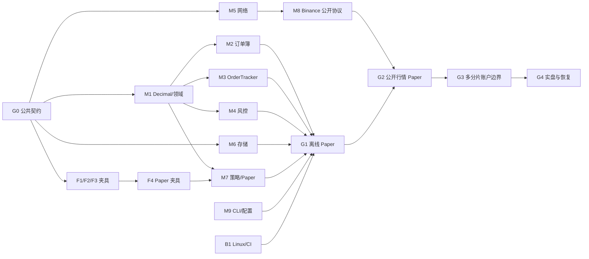

# Hummingbot C++ 多 Agent 开发计划

状态（2026-09-27）：**G0 已通过；G1 的 macOS 离线链路和 CLI 已通过，Linux x86_64 待 CI 实测；G2 的本地公开行情 mock 与真实公开行情 Paper 短跑已通过；G3 静态租约、限速和路由组件的两分片/八路由测试已通过，多活跃分片装配、压力和 Linux 结果待验证；G4 网关、私有回报与恢复的本地 mock 测试已通过，隔离账户联机试单尚未进行**。本机结果见 [验收记录](../../dev/VALIDATION_2026-09-27.md)。具体模块与运行路径见 [DEVELOPMENT.md](DEVELOPMENT.md)，逐文件目录、Bazel target 与关键结构体以 [STRUCTURE_AND_TYPES.md](STRUCTURE_AND_TYPES.md) 为准，线程、发单和风险语义以 [ARCHITECTURE.md](ARCHITECTURE.md) 为准，订单簿以 [ORDER_BOOK.md](ORDER_BOOK.md) 为准。旧的 [`docs/PLAN.md`](../PLAN.md) 采用单交易线程加网络线程池，相关调度内容已经过时。

目标是让 Agent 在**独立目录并行产出可编译、可测试的模块**，由一个集成 Agent 缩短公共契约和端到端链路的串行路径。并行开发不能改变架构约定：一个活跃分片的行情、订单、策略、风控和 socket 都由同一个分片线程拥有；默认配置最多 8 个活跃分片，实盘前验证同账户跨分片资源隔离。

**开发顺序：**先把设计落成可编译的公共头文件和夹具 schema（G0），再用固定行情跑通一笔 Paper 订单及 SQLite/CLI（G1），随后接 Binance 公开行情（G2），完成同账户多分片的额度与回报路由（G3），最后接隔离环境实盘网关与恢复（G4）。任何任务包都要以“文件 + Bazel target + 离线测试结果”交付；只有对应关口测试通过才算完成。

## 1. 要交付的程序

仓库已有 Bazel 依赖声明、锁文件、新架构文档、公共 `hbot/` 类型、夹具和 G1–G4 的本地测试。macOS 上全仓构建和 35 个测试 target 已通过；Linux 编译尚未验证，CI 待验证项见 [LINUX_VALIDATION.md](../../dev/LINUX_VALIDATION.md)。当前目录也没有 `.git`，不能假设已有分支或 worktree。首轮按目录独占规则在共享工作区协作；需要独立合并历史之前，先建立 Git 基线，再给各 Agent 独立 worktree。

**最终目标**是一个不依赖 Python 运行时的 C++ 交易引擎：能接行情、运行策略、控制资金与订单、记录历史、断线和重启后对账，并通过 CLI 管理。先做 Binance 现货与 `simple_pmm` 的一条完整链路；策略收益不是工程验收指标。交付按三个可运行版本推进：

| 版本 | 用户实际能做什么 | 明确的完成结果 |
| --- | --- | --- |
| V0 离线模拟盘（G1） | 用仓库里的固定行情和虚拟时间运行 `simple_pmm`，查看 Paper 订单、成交、余额、费用与 SQLite 历史 | 同一夹具重复运行，动作、订单 ID 归一化结果、余额、费用完全相同；异常退出/存储故障用例有明确状态 |
| V1 在线行情模拟盘（G2） | 启动 `hbot`，订阅 Binance 现货公开盘口，在本地 Paper 账户报价、成交，执行 `status/history/stop` | 公共行情断线、缺口、过期时停止相关新单；恢复同步后继续；全程不发送实盘订单 |
| V2 隔离环境实盘（G4） | 用隔离账户发送和撤销真实测试订单，查看私有回报与重启对账 | 多分片资金/限速/路由先通过 G3；HTTP 与私有流乱序、写超时、SQLite 故障和重启仍不重复下单 |

当前固定行情 Paper 示例已可按下列命令运行；`start` 在前台运行，在另一个终端执行其余命令：

```bash
bazel run //apps:hbot -- start --config examples/paper_replay.yaml --state-dir /tmp/hbot-paper-demo
bazel run //apps:hbot -- status --state-dir /tmp/hbot-paper-demo
bazel run //apps:hbot -- history --state-dir /tmp/hbot-paper-demo --limit 20
bazel run //apps:hbot -- stop --state-dir /tmp/hbot-paper-demo
```

真实公开行情驱动的 Paper 示例使用 Binance 的公开数据专用 [WS](https://github.com/binance/binance-spot-api-docs/blob/master/web-socket-streams.md) 和 [REST](https://github.com/binance/binance-spot-api-docs/blob/master/faqs/market_data_only.md) 端点；仍只在本地模拟账户下单：

```bash
bazel run //apps:hbot -- start --config examples/paper_simple_pmm.yaml --state-dir /tmp/hbot-public-paper
bazel run //apps:hbot -- status --state-dir /tmp/hbot-public-paper
bazel run //apps:hbot -- history --state-dir /tmp/hbot-public-paper --limit 20
bazel run //apps:hbot -- stop --state-dir /tmp/hbot-public-paper
```

2026-09-27 本机短跑中，盘口从 `Buffering`、`Replaying` 到 `Live`，Paper 挂出两侧模拟单；运行超过 15 秒刷新周期后，历史记录了撤销旧两单及重新报价两单，`stop` 正常退出。生产域名对当前网络位置返回 HTTP 451，公开数据专用域名可用；这不构成长期运行、其他网络位置或实盘验收。

`status` 至少显示 `mode=paper`、连接器/盘口状态、活跃分片数、策略状态、挂单数、Recorder 健康与历史缺口；`history` 能分页显示订单、成交与手续费，并标注不完整区间。V0 的离线入口至少有 `bazel test //tests/integration:paper_replay`：固定输入包含 mid=100、价差各 0.1%、下单量 0.01 的样本，在第一次允许交易的触发时得到买价 99.9、卖价 100.1，后续按 15 秒刷新周期撤旧单并重报。样本同时覆盖余额不足、成交与费用；实际动作时刻以虚拟时钟和夹具中的触发序号为准。

V2 只在隔离环境验收后开放显式 `mode=live`；不能因为 V1 能收真实行情就默认允许实盘下单。V1 到 V2 之间必须先完成同账户多分片的静态额度与限速切分、账户级私有流归属和故障测试。

**第一批已落地：** 集成 Agent 先创建公共 C++ 头文件、`//dev:contract_compile` 和夹具 v1 格式；三个 Worker 在此期间只读抽取 Python 行为，schema 发布后才各自写订单簿、订单追踪、`simple_pmm` 夹具。随后实现 Decimal、订单簿、OrderTracker、风控、Paper、SQLite 和单分片运行时，直到 `//tests/integration:paper_replay` 可以离线运行。具体文件与完成标准在第 9 节。

## 2. 开发关口

| 关口 | 对应现有阶段 | 可交付结果 | 允许进入下一关的证据 |
| --- | --- | --- | --- |
| G0 契约与基线 | D0–D1 起点 | 公共类型、模块 API、统一夹具 loader/schema、Bazel 可见性和构建基线 | `//dev:contract_compile`、`//tests/fixtures:schema_test` 通过；固定 Python 版本；现有 macOS 依赖 smoke 通过 |
| G1 单分片离线 Paper | D1–D3 | 录制行情/虚拟时钟 → 策略 → 风控 → Paper → 订单/成交 → SQLite/CLI | 同一输入得到确定的动作顺序、余额和费用；无公网可运行；Linux 依赖构建与 CLI 通过 |
| G2 公开行情 Paper | D4 | Binance 公开 WS/REST 通过本地 mock 与真实公开行情驱动 Paper | `//tests/integration:public_paper` 通过快照/增量、缺口重同步、重连、超时和暂停新单 |
| G3 多分片账户边界 | D5 | 多活跃分片、静态资金与限速额度、私有回报路由、全局熔断 | `//tests/integration:multi_shard` 证明额度不重复授予、未知归属/队列满降级；8 分片故障与延迟数据齐全 |
| G4 首个实盘连接器 | D6 | 只读核对后，隔离环境中异步下单/撤单、私有流、重启对账 | `//tests/integration:recovery` 与隔离环境试单通过；结果未知不盲重发，崩溃与 SQLite 故障有明确结果 |
| G5 扩展 | D7 | XEMM、V2、回测与其他连接器按优先级迁移 | 每个新增能力有独立 Python 对照、契约测试和故障测试 |

不要把“代码已经写出”当作通过关口；表中的完整链路必须运行并保留测试结果。G3 必须先于 G4，即使 G1 的单分片 Paper 可以更早交付。

## 3. C++ 语言和实现约束

**全项目以 `-std=c++20` 编译。** 普通领域代码优先使用简明的 C++17/20 标准语法；这不承诺核心程序可用 `-std=c++17` 编译，因为网络协程需要 C++20。不得引入 C++23 作为构建要求。

| 场景 | 首选写法 |
| --- | --- |
| 领域值与所有权 | `enum class`、强类型 ID、RAII、`std::unique_ptr`、`std::optional`、`std::variant`、`std::vector`；避免共享可变对象和拥有所有权的裸指针 |
| 参数、时间与只读视图 | `std::string_view`、`std::span`、`std::chrono`；返回视图时明确其生命周期，策略不能保存 `BookView` 到回调之后 |
| 异步网络 | C++20 `co_await` 与 Asio `awaitable`/`co_spawn`；每个协程绑定所属分片执行器，定义取消、超时与退出等待；纯计算的订单簿、OrderTracker、策略和风控保持普通同步函数 |
| 线程与跨分片 | 分片内独占可变状态；跨分片使用有界消息或明确同步语义的不可变快照。需要跨分片只读发布时才评估 C++20 `std::atomic<std::shared_ptr<const Snapshot>>` |
| 错误与容器 | 可恢复错误用 `absl::Status/StatusOr`；索引用 `absl::flat_hash_map`，有序价位用 `absl::btree_map`；哈希遍历次序不能决定交易动作顺序 |
| 格式与兼容性 | 资金域用 libmpdec `Decimal`，JSON/SQLite 用十进制字符串；`std::format`、C++20 模块和较新的 chrono 时区 API 不作为基础能力，先在 macOS/Linux 工具链验证再使用 |

第三方抛出的异常只在 adapter、YAML 或网络边界转换为 `Status`；业务状态机不靠异常表达正常分支。优先写可读的显式状态转移，不为使用模板、ranges 或协程而抽象。每个模块只直接依赖自己使用的库；Quill 负责日志，Asio/Beast 负责网络，Abseil 用于已选的数据结构和错误类型。

## 4. 多 Agent 协作规则

1. **一个集成 Agent 单写公共契约。** 它负责 `hbot/base/**`、`hbot/model/**`、`hbot/event/**`、各模块共享的 `:api`/`:ports` 与 `market_data:book_view` 头文件、`hbot/runtime/**`、`hbot/app/` 根 package（不含 `hbot/app/config/`）、`apps/**`、根 Bazel 文件和架构文档。C00 建立这些接口所在 package 的初始 `BUILD.bazel` 后，把整个 package 的后续写入权交给相应实现 Agent；集成 Agent 不同时编辑该 BUILD。其他 Agent 发现公共接口问题，提交字段、调用方和测试场景，不直接同时修改公共文件。
2. **实现 Agent 独占目录。** 每个任务卡只允许写指定 package、该 package 的 `BUILD.bazel` 和专属测试目录。`tests/fixtures/` 按 `order_book/`、`order_tracker/`、`simple_pmm/`、`paper/` 分目录；不让两个 Agent 写同一个 `BUILD.bazel`。
3. **持续占满安全的并行槽位。** 当前执行环境可同时运行主 Agent 和 3 个子 Agent；主 Agent 做契约、审查和集成，另外 3 个槽位按第 7 节任务队列补位。若以后允许更多并发，从不同目录的任务队列增加 Agent，不在同一文件上堆人数。
4. **每个 Agent 交完整包。** 交付内容包括实现、BUILD、对外 API 说明、离线单元/协议测试、运行命令和未解决问题。先运行自己的 `bazel test //hbot/<package>/...`，集成 Agent 合入后运行 `bazel test //...`、端到端回放和相关 sanitizer。
5. **集成按依赖顺序进行。** 公共头文件与 schema 变更先合，再合实现；每次集成只处理一个公共接口版本。未通过关口的功能保持未启用，尤其不能提前启用实盘新单。共享 Bazel 输出目录可能串行化并发构建；独立 worktree/输出目录建好后再并行跑重构建。

当前没有 Git 元数据。若首轮直接在共享目录并行，集成 Agent 记录任务号、目录所有者与交付文件，禁止其他 Agent 越界编辑；建立 Git 基线后改用每 Agent 独立 worktree/分支与小批次合并。不要为了等待 Git 建立而推迟只读 Python 行为抽取或独占目录的开发。

## 5. G0：先冻结公共契约

G0 是最短的串行关键路径；冻结的是调用关系和语义，不要求一次写完所有实现。G0 的可编译头文件覆盖 G1 所需的 `base/model/event`、`market_data:book_view`、`strategy:api`、`connector:api`、`net:api`、`storage:ports`、`runtime:shard_command` 和 `control:protocol`。G3 的租约/路由细节此时固定语义，`risk/lease.h`、`net/rate_limit.h` 与 `routing/order_ownership_index.h` 在对应实现任务创建；`contract_compile` 不声称已经编译这些尚未建立的头文件。后续改变公共类型必须同时更新夹具和所有消费者的编译测试。

| 契约组 | 冻结内容 | 并行实现所需的判断 |
| --- | --- | --- |
| 数值/身份 | `Decimal` 的精度与舍入、`MarketId`、稳定 `OwnerId`、`RunId`、三种订单/成交 ID、时间类型 | 盘口步长与下单规则分开；客户端 ID 的归属和唯一性不依赖 SQLite |
| 行情 | `BookScale`、Snapshot/Diff 的规范化序号与 ticks/lots、`BookView` 生命周期、Live/Stale/Resyncing | adapter 负责交易所原始序号，订单簿负责连续性和状态 |
| 订单与策略 | `OrderRequest/Command/Update/TradeUpdate`、`TrackedOrder`、`ActionBatch`、`TriggerPolicy`、`AwaitingFills` | 回报乱序/去重、动作顺序和本账户成交边界清楚 |
| 存储与恢复 | `OrderIntent`、`RecoveryContext`、`StorageHealth`、每分片记录序号、schema 版本、HistoryQuery 端口 | 非阻塞入队；提交不触发发单；缺口与不可恢复状态显式可见 |
| 多分片 | 静态资金/限速租约、`ShardReport`、`OrderOwnershipIndex`、私有报告转发消息及队列满语义 | ID 生成到中心索引更新之间可能先到回报：能从 ID 判定稳定 owner，或隔离并补查，不能投给错误分片 |
| 构建与夹具 | Bazel target 名/`visibility`、`tests/fixtures/v1` 格式、输入时钟与同时间序号、差异标记 | 独立包可编译；脱敏夹具可由 C++ 离线 runner 读取 |

首批夹具每例记录 `schema_version`、Python commit、源码路径、输入虚拟时间及同时间序号、十进制字符串、固定/归一化 ID、逐步期望输出和 `parity` 或 `intentional_divergence` 标记。Python 版本固定为 `9af100d6822da7d2d0291a906c730ef172284ee2`。Python 盘口的浮点表示与新架构的缺口重同步不同；有效流可用 Python 输出作对照，缺口/交叉等新约束按 C++ 架构规范验收。差异集中记录到待建的 `tests/fixtures/DIFFERENCES.md`。

G0 同时修正文档中的首版/未来歧义：首版必须有账户级私有流路由与静态额度，动态再平衡和全局原子借令牌后做；订单簿重新居中只能在所属分片修改，稳定运行零分配是优化目标而非正确性承诺。先把这些决议落到接口与测试，不让不同 Agent 各自解读。

## 6. 并行任务包

下表中的目录是**写入所有权**；Agent 可以读取其他代码。每包的首次交付必须可被目标 package 的测试单独检验，合并顺序由先决契约决定。

| ID / Agent 职责 | 独占写入目录 | 可开始的条件 | 首次交付与局部验收 |
| --- | --- | --- | --- |
| F1 Python 订单簿夹具 | `tests/fixtures/order_book/**` | 夹具 v1 格式 | 快照前缓存、首条增量接续、连续更新、重复、跳号、交叉；逐步比对 BBO、前 N 档和状态 |
| F2 Python 订单追踪夹具 | `tests/fixtures/order_tracker/**` | 夹具 v1 格式 | 接单、部分/全成交、trade ID 去重、成交先到、撤单竞态、待补成交；比对事件、累计金额/费用及敞口 |
| F3 `simple_pmm` 夹具 | `tests/fixtures/simple_pmm/**` | 夹具 v1 格式 | 仅以 `scripts/simple_pmm.py` 为该策略基线；验证就绪门、15 秒刷新、撤旧单后报价、预算与量化；输出有序动作 |
| F4 Paper 夹具 | `tests/fixtures/paper/**` | F1–F3 的类型与时钟约定 | 限价单触价、公开成交驱动撮合、撤单、余额和费用；随机 ID 归一化、费用配置固定 |
| B1 构建/CI | `dev/**`、独立 CI 配置；根 Bazel 文件交集成 Agent | D0 smoke 已通过 macOS | Linux x86_64 构建、离线测试命令、ASan/UBSan 与 TSan 配置实测；保留平台结果 |
| M1 Decimal/领域类型 | `hbot/base/**`、`hbot/model/**`；由集成 Agent 或交接后的专属 Agent | G0 数值/身份契约 | libmpdec RAII、强类型 ID/规则/费用；Python Decimal 边界差分和溢出检查 |
| M2 订单簿 | `hbot/market_data/**` | G0 行情契约、M1 最小可链接版本 | L2 数组+溢出、缓存快照/增量、缺口和 Stale/Resyncing 状态；F1 全部回放通过 |
| M3 OrderTracker | `hbot/connector` 通用实现文件；不碰具体 adapter | G0 订单契约、M1 最小可链接版本 | 双 ID 核对、trade ID 去重、`AwaitingFills`、`SubmissionUnknown`；F2 全部回放通过 |
| M4 风控/账户额度 | `hbot/risk/**` | G0 订单/租约契约、M1 | 单笔/总敞口、静态租约、结果未知保留额度、紧急停止；并发额度故障用例 |
| M5 网络传输 | `hbot/net/**`、其包内 mock 测试 | G0 transport 端口 | Asio/Beast REST 复用、期限/取消、WS 重连、本地限速；本地 HTTP/WS mock，无公网 |
| M6 SQLite | `hbot/storage/**` | G0 意图/schema 契约 | Recorder 每分片 SPSC、WAL 批量写、HistoryReader 只读分页、缺口状态；队列满与磁盘失败测试 |
| M7 策略/Paper | `hbot/strategy/**`、`hbot/connector/paper/**` | G0 动作/视图契约、M1、F3/F4 夹具 | `simple_pmm` 定时动作、可重放限价撮合/费用；F3/F4 全部回放通过 |
| M8 Binance 公开协议 | `hbot/connector/binance_spot/public/**` | G0 行情事件契约；M5 接线时完成 | 原始报文解析、序号规范化、异步快照/WS；F1 和本地协议 mock 通过 |
| M9 CLI/配置 | `hbot/cli/**`、`hbot/app/config/**`；`hbot/control/**` 公共协议由集成 Agent 单写，`hbot/app/**`/`apps/**` 由集成 Agent 装配 | G0 控制消息和配置版本 | `start` 配置校验/启动流程，`status/history/stop` 控制协议的离线测试；`history` 不阻塞 `stop` |

实盘后半程继续拆成三个互不碰撞的包：`M10` 账户级私有流归属与转发（`hbot/routing/**`）、`M11` Binance 签名/OrderGateway（`hbot/connector/binance_spot/order_gateway/**`）、`M12` 私有流与 REST 对账（`hbot/connector/binance_spot/private/**`）；集成 Agent 负责连接它们并完成 G3/G4。包名按目录契约固定，避免 M11/M12 同时改一个 adapter 文件。

## 7. 并行排程与依赖图



任务一旦满足自己的先决条件即可占用空闲槽位，不必等整行“阶段”结束。按当前主 Agent + 3 Worker 的容量，建议首轮这样排：

| 波次 | 集成 Agent | Worker 1 | Worker 2 | Worker 3 | 汇合点 |
| --- | --- | --- | --- | --- | --- |
| W0a | 写公共字段/API、夹具 v1 格式和 `//dev:contract_compile`；先发布 schema | 只读抽取 Python 订单簿行为 | 只读抽取 Python Tracker 行为 | 只读抽取 `simple_pmm.py` 行为 | 公共头文件编译、schema 定稿；三个 Worker 尚不写 JSON |
| W0b | 完成 M1 Decimal/领域类型、统一 fixture loader | F1 订单簿夹具 | F2 订单追踪夹具 | F3 策略夹具 | G0：schema_test、contract_compile、F1/F2/F3 通过 |
| W1 | 建立单分片 runtime 骨架与回放 runner | F4 Paper 夹具 | M6 SQLite | M5 网络与本地 mock | F4/M6/M5 各自包通过；B1 Linux 工程在首个空槽位补上 |
| W2 | 接 dispatcher、风控和 Paper/SQLite 闭环 | M2 订单簿 | M3 OrderTracker | M7 策略/Paper | M4 风控、M9 CLI/配置依次在空槽位补上；G1 离线 Paper 全链路通过 |
| W3 | `hbot/app` 装配及 G2 集成 | M8 Binance 公开协议 | 公开行情协议 mock/夹具 | 断线、缺口、429 故障注入 | G2 公开行情 Paper |
| W4 | 控制线程与 8 分片验收 | M10 归属/私有回报路由 | M4 静态租约扩展 | M5 限速/熔断扩展 | G3 多分片故障/压力夹具由空闲 Worker 补上；通过后才接实盘发送 |
| W5 | 实盘准入、恢复与最终集成 | M11 签名/OrderGateway | M12 私有流/REST 对账 | M6 存储恢复与崩溃故障注入 | G4 隔离环境验收 |

W0a–W5 是槽位安排，不是所有任务必须整波等待；schema 发布前 F1/F2/F3 只读抽取，发布后各写独立目录。M4/M9/B1 不等整波结束，任一 Worker 交付后立即补位；集成 Agent 不同时修改 Worker 独占的 `BUILD.bazel`。若更多 Agent 可用，同时启动所有满足前置条件且目录独立的任务。各波的交付以测试通过为准，不按日历天数宣称完成。

## 8. 集成和测试门槛

每个任务包提交时写明：公共契约版本、修改路径、Bazel target、局部测试结果、输入夹具来源、已知差异。集成 Agent 合入时检查依赖方向和 `visibility`：`strategy` 不依赖具体交易所；`net` 不碰策略/资金；SQLite 实现只在装配边界注入；共享 `tests/fixtures` 只读。跨包集成测试放在 `tests/integration/`，由集成 Agent 维护其 `BUILD.bazel`。

| 关口 | 必跑的最小验证 |
| --- | --- |
| 每个包 | `bazel test //hbot/<package>/...` 或对应 fixture runner；无外网；相关告警和内存错误消除 |
| 每次集成 | `bazel build //...`、`bazel test //...`、依赖可见性检查；macOS 与 Linux 均留结果 |
| G1 | 虚拟时钟差分回放；Decimal、动作顺序、订单状态、余额和手续费逐步断言；Recorder 故障仍能推进模拟盘 |
| G2 | 本地 REST/WS mock 注入重复、乱序、断线、超时、429、盘口缺口；不就绪市场停止新单、撤单可继续 |
| G3 | 两个以上活跃分片与同账户/币种；额度租约总量、未知单占用、路由/队列满、忙轮询与阻塞模式；Linux TSan 和 8 分片压力记录 |
| G4 | 隔离账户中的接单、部分成交、撤单、写超时、`SubmissionUnknown`、进程中断与重启对账；历史缺口和状态型执行器暂停可见 |

优先测量 T0→T2、T2→T3、T3→T4、回调最长耗时、队列水位和 p99；性能结果附机器、核数、分片数、输入流与事件循环模式。速度不能替代正确性关口。G4 的新单发送无需等待 SQLite 提交，但无法核实的订单、归属或执行器状态不能在重启后自动恢复交易。

## 9. 接下来具体做什么

下面是按依赖顺序排列的**工作单**。实际文件名与 Bazel target 以 [STRUCTURE_AND_TYPES.md](STRUCTURE_AND_TYPES.md) 为准；需要改名时，由集成 Agent 同时修改调用方、目录契约和验收命令。G0–G4 的本地 target 已建立，仍需按各关口的联机与平台条件继续验收。

### 9.1 第一批：公共契约和 Python 对照，可同时占满 4 个 Agent

| 负责人 | 立即创建的文件 | 交付时必须证明 |
| --- | --- | --- |
| 集成 Agent：C00 | `hbot/base/{decimal.h,ids.h,clock.h}`，`hbot/model/{market.h,book_event.h,trading_rule.h,order.h,fee.h,balance.h}`，`hbot/event/events.h`，`hbot/market_data/book_view.h`，`hbot/strategy/api.h`，`hbot/connector/api.h`，`hbot/net/api.h`，`hbot/storage/ports.h`，`hbot/runtime/shard_command.h`，`hbot/control/protocol.h`，对应 `BUILD.bazel`；`dev/contract_compile_test.cc`、`tests/fixtures/{BUILD.bazel,fixture_loader.h,fixture_loader.cc,fixture_schema_test.cc,v1/README.md}` | `Decimal`/ID/事件/动作/意图的字段、状态和所有权明确；公共头文件被 `//dev:contract_compile` 引用；发布夹具 schema 后通知三个 Agent 写 JSON，最终 `//tests/fixtures:schema_test` 通过 |
| Agent F1：订单簿行为 | `tests/fixtures/order_book/*.json` 和来源说明 | 至少 6 例：快照前增量、首条接续、连续更新/删档、重复/旧消息、跳号、交叉/无效精度；逐步给出 BBO、前 N 档、序号、Live/Resyncing。Python 没有的重同步行为标 `intentional_divergence` |
| Agent F2：订单追踪行为 | `tests/fixtures/order_tracker/*.json` 和来源说明 | 至少 7 例：接单、部分成交、全成交、trade ID 重复、成交先于接单、完成先于成交明细、撤单与成交竞态；逐步给出事件序、累计 base/quote、费用和敞口 |
| Agent F3：策略行为 | `tests/fixtures/simple_pmm/*.json` 和来源说明 | 至少 5 例：初次就绪、15 秒刷新、撤单后重报、余额不足、价格/数量量化；逐步给出有序 `ActionBatch`。只用 `scripts/simple_pmm.py`，不用 V1 `pure_market_making` 测试冒充 |

`tests/fixtures/v1/README.md` 先固定每例的外层字段：`schema_version=1`、`case_id`、`baseline_commit`、`source_files`、`expectation_kind`、按 `at_us` 与 `ordinal` 排序的 `inputs`、逐步 `expected`。价格、数量、余额和费用用十进制字符串；随机订单 ID 归一化成稳定符号。三名夹具 Agent 各自只写自己的目录，源码不带真实密钥或账户数据。统一 loader/校验器由集成 Agent 维护，差异汇总到 `tests/fixtures/DIFFERENCES.md`。

**G0 完成命令：** `bazel test //dev:dependency_smoke //dev:contract_compile //tests/fixtures:schema_test //hbot/base/... //hbot/model/...`。F1/F2/F3 均由统一 loader 读取，每个 expected 能追溯到 Python 源码、受控运行或新架构决议；API 头文件从空实现目标可编译。这批交付的是实施基线，离线模拟盘在 G1 才可运行。

### 9.2 第二批：做出第一条离线交易链路

第一批 Agent 一交付就释放槽位，按下表的前置条件立即补位。集成 Agent 负责 `ShardRuntime` 和跨包接线，不让三个实现 Agent 同时改主循环。

| 顺序 / 可并行任务 | 具体实现文件与 target | 完成标准 |
| --- | --- | --- |
| C01 `Decimal` 与领域类型 | `hbot/base/decimal.cc`、`decimal_test.cc`，`hbot/model/*_test.cc`；`//hbot/base:decimal`、`//hbot/model:domain` | libmpdec RAII、解析/舍入/步长量化/溢出/NaN 拒绝；与 Python `Decimal` 夹具精确一致，`bazel test //hbot/base/... //hbot/model/...` 通过 |
| F4 Paper 行为夹具；B1 Linux 工程 | `tests/fixtures/paper/*.json`；`dev/` 与 CI 配置 | F4 在 M7 开始前给出限价触价、公开成交驱动撮合、撤单、余额/费用；B1 在 Linux x86_64 编译 smoke 并记录 sanitizer 可用结果 |
| M2 订单簿 Agent | 接收 C00 的 `book_view.h`/`BUILD.bazel`，再建 `hbot/market_data/{order_book.h,order_book.cc,book_sync.h,book_sync.cc,order_book_test.cc,book_sync_test.cc}`；`//hbot/market_data:{book_view,order_book}` | 用整数 ticks/lots 维护 L2 数组及远端溢出；快照/增量状态机通过 F1；缺口、过期时给风险门不可交易状态 |
| M3 OrderTracker Agent | `hbot/connector/{order_tracker.h,order_tracker.cc,order_tracker_test.cc,BUILD.bazel}`；`//hbot/connector:order_tracker` | 双 ID 关联、trade ID 去重；生命周期、撤单在途与对账状态分开；`AwaitingFills`、未知结果、乱序回报通过 F2；输出状态转移供 runtime 先更新风险、后回调策略 |
| M4 风控 Agent | `hbot/risk/{lease.h,risk_gate.h,risk_gate.cc,risk_gate_test.cc,BUILD.bazel}`；`//hbot/risk:{lease,risk_gate}` | 最小金额/数量、单笔与总敞口、未知订单保留额度、紧急停止；同一动作拒绝原因可观测。G3 时扩展静态多分片租约，不重复建风险门 |
| M6 SQLite Agent | `hbot/storage/{sqlite_recorder.h,sqlite_recorder.cc,history_reader.h,history_reader.cc,storage_test.cc,migrations/001_init.sql,BUILD.bazel}`；`//hbot/storage:{sqlite_recorder,history_reader}` | 每分片 SPSC 非阻塞入队，独立写/读连接；订单/成交可查；队列满与磁盘写失败标历史缺口；RunManifest 与提交回执不触发发单 |
| M7 策略/Paper Agent | `hbot/strategy/{simple_pmm.h,simple_pmm.cc,simple_pmm_test.cc}`，`hbot/connector/paper/{paper_connector.h,paper_connector.cc,paper_test.cc}`；各包 `BUILD.bazel` | `simple_pmm` 按 15 秒定时器输出有序撤单/报价；Paper 限价撮合和费用通过 F3/F4；公开成交不会成为实盘账户成交 |
| M9 CLI/配置 Agent | `hbot/cli/{cli.h,cli.cc,BUILD.bazel}`、`hbot/app/config/{config.h,config.cc,BUILD.bazel}`，按冻结的 `//hbot/control:protocol` 工作 | `start` 解析配置并启动服务，`status/history/stop` 用同一控制协议；配置拒绝重复 owner key、错误分片依赖和隐式实盘模式。`hbot/app/**` 根包及 `apps/**` 仍由集成 Agent 写 |
| 集成 Agent：主循环与 CLI | `hbot/runtime/{shard.h,shard.cc,dispatcher.h,dispatcher.cc,replay_clock.h}`，`hbot/app/{engine.h,engine.cc,control_server.h,control_server.cc}`，`apps/{hbot.cc,hbot_engine.cc}`，`examples/{BUILD.bazel,paper_replay.yaml}`，`tests/integration/{BUILD.bazel,paper_replay_test.cc}` | 一个活跃分片把 M2/M3/M4/M6/M7/M9 串起来；策略只在分片线程执行，SQLite 在 Recorder 线程；`start/status/history/stop` 无外网可用 |

同一时刻最多安排三个独占目录的实现 Agent；例如 M2、M3、M6 并行，完成一个就换 M4/M7/M9/B1。F4 必须在 M7 之前完成。它们用 C00 冻结的头文件编译，各自测试不等整个程序接好；`hbot/app/**` 根包和 `apps/**` 仍由集成 Agent 接线。

**G1 完成命令：** `bazel test //tests/integration:paper_replay` 和 `bazel test //...`。回放测试必须断言盘口、两侧报价、撤旧单、成交、费用、余额、SQLite 历史与缺口；同一输入重复运行结果一致。配置样本 `examples/paper_replay.yaml` 至少写明 `schema_version`、`mode: paper`、固定行情夹具、`BTC-USDT`、Paper 初始 BTC/USDT 余额、`simple_pmm` 的 `refresh_interval: 15s`、价差 `0.001`、数量 `0.01`、阻塞事件循环。Linux 构建通过也是 G1 条件。

### 9.3 第三批：用真实公开行情驱动 Paper

1. M5 网络 Agent 在 W1 已建 `hbot/net/{http_client,websocket_client,tls_config,rate_limit}.{h,cc}` 和本地 HTTP/WS mock。G2 使用已通过 `bazel test //hbot/net/...` 的传输端口接线；如发现缺少取消、TLS 校验、重连、429 或连接复用场景，由 M5 在自己的包补测试和实现。网络协程运行在目标分片的 `io_context`，不建第二个网络线程池。
2. M8 Binance 公开数据 Agent 建 `hbot/connector/binance_spot/public/{depth_parser,market_data_stream}.{h,cc}`：解析原始价格/数量文本，按 `BookScale` 变成 ticks/lots，规范化首末序号；使用 F1 和本地 REST/WS mock，常规测试不依赖公网。
3. 集成 Agent 添加 `examples/paper_simple_pmm.yaml` 和 `tests/integration/public_paper_test.cc`，接通公开 WS、异步 REST 快照、订单簿和 Paper；CLI 按第 1 节的四条命令运行。`status` 显示盘口 Live/Stale、挂单、余额和存储健康；断线/跳号测试先暂停新单，重新同步后恢复。G2 完成命令：`bazel test //hbot/net/... //hbot/connector/binance_spot/public/... //tests/integration:public_paper`。这就是 **V1/G2**，仍只在本地 Paper 账户成交。

### 9.4 第四批：多分片和隔离环境实盘

1. 先做 **G3**：M4 在 `hbot/risk/lease.h` 上补齐同账户/币种的静态租约与版本核验；M10 在 `hbot/routing/{order_ownership_index,private_report_router}.{h,cc}` 建稳定 owner → 当前分片路由与有界队列；M5 在 `hbot/net/rate_limit.*` 补本地限速与全局熔断。集成 Agent 建 `tests/integration/multi_shard_test.cc`，用两个以上活跃分片及 8 分片压力输入验证额度不重复授予、结果未知继续占额、未知归属/队列满时暂停并补查。完成命令：`bazel test //hbot/risk/... //hbot/routing/... //hbot/net/... //tests/integration:multi_shard`。
2. 再做 **G4**：M11 在 `hbot/connector/binance_spot/order_gateway/**` 做客户端 ID、签名、异步下单/撤单与未知结果；M12 在 `hbot/connector/binance_spot/private/**` 做接单/成交回报、查单/查成交和 REST 对账；M6 扩展 `hbot/storage/**` 的 RunManifest、缺口及检查点恢复。集成 Agent 建 `tests/integration/recovery_test.cc`，以本地协议 mock 覆盖写超时、HTTP/私有流乱序、重复成交、进程中断和 SQLite 故障。任何实盘请求写超时不换 ID 自动重发；SQLite 失败继续交易但显示历史缺口。
3. G4 离线完成命令：`bazel test //hbot/connector/binance_spot/order_gateway/... //hbot/connector/binance_spot/private/... //tests/integration:recovery`，再运行 `bazel test //...`。隔离账户中依次验证：只读余额/规则 → 小额创建 → 部分成交 → 撤单 → 私有流断线 → 进程在网络发送后、SQLite 提交前退出 → 重启对账；测试记录写明账户类型、订单 ID 脱敏映射、实际回报和未解决状态。只有这些测试和 G3 的多分片风险检查通过，才宣告显式 `mode=live` 可交付。XEMM、V2、回测从 G5 继续，不混进首条实盘交付。
