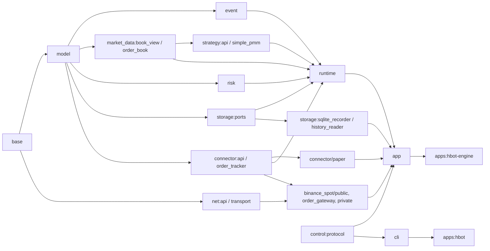

# 目标目录、Bazel 包与关键数据契约

状态（2026-09-27）：G0 契约和夹具已落地；G1 macOS 离线链路、G2 本地 mock 与真实公开行情 Paper 短跑、G3 本地租约/路由组件测试和 G4 本地恢复 mock 已通过。Linux、G3 多活跃分片装配与压力、G4 隔离账户仍待验收。本文固定**首条 Binance 现货 + `simple_pmm` + Paper，随后多分片实盘**所需的目录、文件、类型和依赖方向。运行与线程语义见 [ARCHITECTURE.md](ARCHITECTURE.md)，订单簿算法见 [ORDER_BOOK.md](ORDER_BOOK.md)，交付顺序见 [DEVELOPMENT_PLAN.md](DEVELOPMENT_PLAN.md)。

## 1. 范围与约定

- 全项目用 Bazel 编译为 C++20；普通业务代码优先用清楚的 C++17/20 写法，Asio 网络协程使用 C++20。一个含 `BUILD.bazel` 的目录就是一个 Bazel package；头文件和实现放同目录，引用写 `#include "hbot/..."`。
- `hbot/base` 和 `hbot/model` 不接触 socket、SQLite、YAML；所有公共值类型拥有自己的字符串/数组，不能保存 simdjson、Beast 缓冲区的 `string_view`。跨线程队列只传拥有值或明确不可变共享快照。
- `absl::Status/StatusOr` 表示可恢复错误，`absl::flat_hash_map` 做身份索引，`absl::btree_map` 做有序远端盘口价位。哈希遍历顺序不能决定发单顺序。资金、手续费和下单规则使用 libmpdec `Decimal`；原始 JSON 十进制文本不经过 `double`。
- 可变盘口、Tracker、策略、RiskGate、网关及 socket 只由所属分片线程访问。`BookView` 与其他借用视图仅在同步策略回调期间有效。Asio 协程在分片执行器上挂起和恢复；策略、订单簿、Tracker、风控是短时同步状态机。
- 首版同账户多分片使用**静态资金/限速租约、账户级私有回报路由、本地令牌桶和全局熔断**。动态额度再平衡、全局原子令牌池、跨分片行情快照及 L3 留后续；不为它们在 G0 建空包。

## 2. 要建立的目录与文件

下表是目标文件；G0–G4 的本地实现包已建立，G4 尚未接入可启用的实盘运行模式。每行的 `BUILD.bazel` 由该包的单一负责人维护。测试尽量与实现同包，跨包链路测试统一放 `tests/integration/`。

```text
hummingbot-cpp/
├── hbot/
│   ├── base/
│   ├── model/
│   ├── event/
│   ├── market_data/
│   ├── strategy/
│   ├── risk/
│   ├── net/
│   ├── storage/
│   ├── runtime/
│   ├── connector/
│   │   ├── paper/
│   │   └── binance_spot/
│   │       ├── public/          # G2
│   │       ├── order_gateway/   # G4
│   │       └── private/         # G4
│   ├── routing/                 # G3
│   ├── control/
│   ├── cli/
│   └── app/
│       └── config/
├── apps/                       # 两个进程入口
├── examples/                   # 可运行配置
├── tests/
│   ├── fixtures/
│   │   ├── v1/
│   │   ├── order_book/
│   │   ├── order_tracker/
│   │   ├── simple_pmm/
│   │   └── paper/
│   └── integration/
├── dev/
├── third_party/
├── docs/
└── MODULE.bazel
```

`public/`、`routing/`、`order_gateway/` 和 `private/` 均已创建。没有全局 `include/` 与 `src/` 双层目录。

| Bazel package / 对外 target | 首批文件（同目录还有 `BUILD.bazel`） | 责任与交付点 |
| --- | --- | --- |
| `//hbot/base:{decimal,ids,clock}` | `decimal.h/.cc`、`ids.h`、`clock.h` | Decimal RAII、强 ID/时间；无业务状态 |
| `//hbot/model:domain` | `market.h`、`book_event.h`、`trading_rule.h`、`order.h`、`fee.h`、`balance.h` | 跨模块拥有值，含策略可读的 `OrderSnapshot`；不含交易所原始报文 |
| `//hbot/event:events` | `events.h` | `MarketEvent`/`AccountEvent` 的类型化 `variant`；不再定义第二套 Snapshot/Update，也不是跨线程总线 |
| `//hbot/market_data:{book_view,order_book}` | `book_view.h`、`order_book.h/.cc`、`book_sync.h/.cc` | 只读视图、L2 价位和同步状态；快照获取由 runtime/adapter 异步执行 |
| `//hbot/strategy:{api,simple_pmm}` | `api.h`、`simple_pmm.h/.cc` | 同步回调、`TriggerPolicy`、有序 `ActionBatch`；首个 15 秒刷新策略 |
| `//hbot/risk:{lease,risk_gate}` | `lease.h`、`risk_gate.h/.cc` | 静态租约、持续在途预留、准入及拒绝原因 |
| `//hbot/connector:{api,order_tracker}` | `api.h`、`order_tracker.h/.cc` | 抽象连接器端口、双 ID/成交去重状态机 |
| `//hbot/connector/paper:paper` | `paper_connector.h/.cc` | 可重放模拟余额、撮合、费用与规范化账户回报 |
| `//hbot/net:{api,transport,rate_limit}` | `api.h`、`http_client.h/.cc`、`websocket_client.h/.cc`、`tls_config.h/.cc`、`rate_limit.h/.cc` | Asio/Beast 连接复用、期限、取消、重连、本地限速；不懂策略和订单归属 |
| `//hbot/storage:{ports,sqlite_recorder,history_reader,recovery}` | `ports.h`、`sqlite_recorder.h/.cc`、`history_reader.h/.cc`、`recovery.h/.cc`、`migrations/001_init.sql` | 每分片有界 SPSC、WAL 单写者、独立只读分页查询和重启快照；schema 明确版本 |
| `//hbot/runtime:{shard,dispatcher,replay_clock}` | `shard.h/.cc`、`shard_command.h`、`dispatcher.h/.cc`、`replay_clock.h` | 一个分片的 `io_context`/状态所有权、动作顺序、虚拟时钟；G0 `ShardReport` 在 `shard_command.h` |
| `//hbot/control:protocol` | `protocol.h`、`wire_codec.h/.cc` | Unix socket 请求/响应 schema；CLI 与 ControlServer 共用，CLI 不依赖 app |
| `//hbot/app/config:config` | `config.h/.cc` | YAML → 已校验配置：模式、owner key、分片、账户、额度、策略依赖 |
| `//hbot/app:{engine,control_server}` | `engine.h/.cc`、`control_server.h/.cc` | 组合具体模块、控制线程、启动/停止与健康汇总 |
| `//hbot/cli:cli`、`//apps:{hbot,hbot_engine}` | `cli.h/.cc`；`apps/hbot.cc`、`apps/hbot_engine.cc`、`apps/BUILD.bazel` | 前台 `start/status/history/stop` 和引擎入口 |
| `//tests/fixtures:{all_fixtures,schema_test}`、`//tests/integration:paper_replay` | `tests/fixtures/BUILD.bazel`、`fixture_loader.h/.cc`、`fixture_schema_test.cc`、`v1/README.md`、`order_book/`、`order_tracker/`、`simple_pmm/`、`paper/`、`DIFFERENCES.md`；`tests/integration/BUILD.bazel`、`paper_replay_test.cc` | Python 对照、统一夹具读取/校验及首条端到端链路 |
| `//examples:paper_replay.yaml`、`//examples:paper_simple_pmm.yaml`、`//examples:paper_market.json` | `examples/BUILD.bazel`、`paper_replay.yaml`、`paper_simple_pmm.yaml`、`paper_market.json` | 固定行情与真实公开行情 Paper 配置，不含密钥 |

按关口增加的独立包，不让两个 Agent 同改一个 `BUILD.bazel`：

| 关口 | 新增 package 与文件 | 边界 |
| --- | --- | --- |
| G2 | `//hbot/connector/binance_spot/public:public`：`BUILD.bazel`、`depth_parser.h/.cc`、`market_data_stream.h/.cc` | 原始深度文本、Binance 序号/重连 → 规范化行情 |
| G3 | `//hbot/routing:routing`：`BUILD.bazel`、`order_ownership_index.h/.cc`、`private_report_router.h/.cc` | 稳定 owner → 当前 shard，账户私有回报有界转发；不修改目标 Tracker |
| G4 | `//hbot/connector/binance_spot/order_gateway:order_gateway`：`BUILD.bazel`、`client_id_codec.h/.cc`、`signer.h/.cc`、`order_gateway.h/.cc` | ID 编解码、签名、异步下/撤单与未知结果 |
| G4 | `//hbot/connector/binance_spot/private:private`：`BUILD.bazel`、`user_data_stream.h/.cc`、`reconciliation.h/.cc` | 私有回报、查单/成交/余额并核对 |

后续 XEMM、Controller/Executor、回测和其他交易所各开包。G0 不建 `hbot/backtest/`。首版 Binance 也不建一个横跨 public/order_gateway/private 的 `binance_spot:adapter` 聚合包。

包内测试文件首批固定为 `base/decimal_test.cc`、`model/domain_test.cc`、`market_data/{order_book,book_sync}_test.cc`、`connector/order_tracker_test.cc`、`risk/risk_gate_test.cc`、`strategy/simple_pmm_test.cc`、`connector/paper/paper_test.cc`、`net/{http_client,websocket_client}_test.cc`、`storage/storage_test.cc`、`control/protocol_test.cc`。公开协议、路由、签名和恢复包在对应 G2–G4 创建各自的 `*_test.cc`。`tests/fixtures/BUILD.bazel` 仅由集成 Agent 维护，各夹具 Agent 只写自己的 JSON 子目录。

G0 另建 `dev/contract_compile_test.cc`，target 为 `//dev:contract_compile`，编译引用全部公共头文件；G2、G3、G4 分别在 `tests/integration/` 增加 `public_paper_test.cc`、`multi_shard_test.cc`、`recovery_test.cc`，target 为 `:public_paper`、`:multi_shard`、`:recovery`。这些是离线或本地 mock 测试，隔离环境联机试单另记测试记录。

### 2.1 编译依赖和写入边界



图省略重复的 `model/event` 直接依赖。`runtime` 只依赖 `connector:api` 中的 `SimulatedVenue`、`storage:ports` 等端口，不链接 Binance、Paper 或 SQLite 实现；`app` 是具体装配点。G3 的 `routing` 通过 `connector:api` 中的回报投递端口接进 runtime。`strategy` 不依赖 `connector`，`risk` 不依赖 Tracker，`net` 不依赖业务类型。公共 `:api`/`:ports` 给明确消费者，具体实现用 Bazel `visibility` 只开放给装配包及测试。首轮由集成 Agent 单写 `base/model/event`、公共 API、`runtime/app/apps`；实现 Agent 按上述 package 独占目录。

## 3. 数值、身份和时间

下列是头文件应表达的**字段语义**；代码可以采用等价的封装方法，不允许改变单位、所有权或状态含义。

| 类型 / 位置 | 字段与不变量 |
| --- | --- |
| `Decimal` / `base/decimal.h` | libmpdec RAII 值；解析、运算、量化返回 `StatusOr` 或明确错误；不隐式转 `double`；拒绝 NaN/Inf/溢出。JSON/SQLite 用规范化十进制字符串，舍入模式由调用处显式选定。 |
| `VenueId`、`AccountId`、`AssetId`、`StrategyId`、`ExecutorId` / `base/ids.h` | 互不混用的拥有字符串 ID。`AccountId` 在进程内唯一指向一个交易所账户，日志和持久化用脱敏表示。 |
| `OwnerId` / `base/ids.h` | `{owner_key, strategy_id, optional executor_id}`。`owner_key` 是配置中显式、稳定、唯一的 48 位正整数；名称用于展示，订单归属由 key 判定，不能靠名称哈希临时生成。重配时旧 key 仍保留在恢复映射中。 |
| `RunId`、`ShardId`、`ReservationId`、`DecisionId` / `base/ids.h` | `RunId` 是每次引擎启动的加密随机 64 位非零值；client ID 的 32 位尾段中高 3 位是本次运行的 shard 槽位，低 29 位是该 shard 的本地递增序号，溢出停止创建新 ID，不在热路径争用全局计数器。启动对账时若发现与历史 client ID 冲突则重新生成。`ShardId` 是进程内 `0..7` 路由号，可因重启分配改变，ID 中的槽位只用于唯一性/路由提示，不能充当持久归属；预留/决策 ID 也不可互用。 |
| `ClientOrderId`、`ExchangeOrderId`、`ExchangeTradeId` / `base/ids.h` | 三个不同强类型；client ID 在新单发送前确定。交易所 ID 可晚到；成交 ID 的唯一范围由 adapter 明确，去重键至少包括账户、市场和 trade ID。 |
| `UtcTime`、`MonoTime`、`EventTime` / `base/clock.h` | UTC 为微秒 `sys_time`，本地期限用 `steady_clock`。`EventTime={optional exchange_utc, receive_utc, receive_mono}`；前两者可持久化，mono 只在本次 run 比较。`ReplayClock` 同时推进两种时间，夹具用 `at_us` 加 `ordinal` 定相同时间输入顺序。 |

首个 Binance ID codec 可用一个不含分隔符的 31 字符候选编码：1 字符版本前缀 + 48 位 owner 的固定 10 位 base32 + 64 位 run 的固定 13 位 base32 + 32 位“shard 槽位 + 本地序号”的固定 7 位 base32。该长度低于当前 Python Binance 适配器的 `MAX_ORDER_ID_LEN=32`；**具体字符和长度是交易所适配器约束，不是领域层常量**，G4 必须按目标环境验证接受、原样回传、往返解码与碰撞处理。随机 RunId 的唯一性也要通过启动对账检查，不能把概率值当绝对保证。不能编码时拒绝启用实盘，而非回退到只存 SQLite 的归属。Router 先从 client ID 解稳定 owner，再用索引核对 exchange ID；身份不明或冲突一律隔离并补查。

## 4. 行情值与订单簿视图

| 类型 / 位置 | 必有字段、单位和规则 |
| --- | --- |
| `MarketId` / `model/market.h` | `{venue, instrument_kind, native_symbol}`；首版 `instrument_kind=Spot`。`MarketSpec` 另给 `{market, base_asset, quote_asset}`，不能从交易所符号任意切字符串猜资产。 |
| `BookScale` / `model/market.h` | `{quote_per_tick: Decimal, base_per_lot: Decimal, scale_version}`，两个步长都大于零。adapter 检查原始十进制可整除及 64 位范围，转为强类型 `PriceTicks{int64}`、`QuantityLots{uint64}`。行情 scale 可以比下单精度细，不能拿它代替 `TradingRule`。 |
| `BookLevel` / `model/book_event.h` | `{price_ticks, quantity_lots}`，价格正、数量非负；Diff 中 0 表示删除该价位。bids/asks 分侧存储，不用正负价格表示方向。 |
| `BookSnapshot` / `model/book_event.h` | `{market, scale_version, stream_epoch, last_sequence, bids, asks, time}`；深度为拥有 `vector<BookLevel>`，`last_sequence` 只与同 market/epoch 可比。 |
| `BookDiff` / `model/book_event.h` | `{market, scale_version, stream_epoch, first_sequence, last_sequence, bids, asks, time}`；价位是**绝对数量覆盖**，`first<=last`。adapter 保留一个报文覆盖的完整序号区间，不因网络 read 分包改变语义。 |
| `PublicTrade` / `model/book_event.h` | `{market, public_trade_id?, price_ticks, quantity_lots, side?, time}`；是市场成交，不是本账户 `TradeUpdate`。 |
| `BookSyncState`、`BookApplyResult` / `market_data/book_sync.h` | `Subscribing/Buffering/Replaying/Live/Stale/Resyncing`；结果含 `{state, applied, last_sequence?, top_changed, reason}`，由 runtime 按 `TriggerPolicy` 决定回调，订单簿不调用策略。 |
| `BookView` / `market_data/book_view.h` | 借用所属分片盘口，提供状态、序号、BBO、`copy_top_n(side, span<BookLevel>)`；不假装数组和 `btree_map` 合成一段连续 `span`。不可跨 callback、线程或协程挂起保存。 |

首个 L2 深度流只支持**固定 `BookScale`、有序区间、绝对价位数量**。收到快照后，丢弃 `last_sequence <= snapshot.last_sequence` 的旧 Diff；第一条及后续可应用 Diff 都必须满足 `first_sequence <= current_sequence + 1 <= last_sequence`，`first_sequence > current+1` 是缺口。序号到达 `uint64_t` 上限时直接重同步，不能让 `current+1` 回绕。允许覆盖区间相交，因为价位数量是绝对覆盖；若某交易所给相对增减量，adapter 必须先转换或提供另一套校验规则。每次重新订阅递增 `stream_epoch`，不同 epoch 的序号不能直接比较。无序号 L1/前 N 档全量 Replace 以后用独立事件，不塞 `0` 假序号。

数组价阶重新居中只能由所属分片执行；远端用 `absl::btree_map`。安静市场是否 Stale 结合连接保活、交易时段与策略新鲜度规则，不仅靠“最近一条深度变动”的时间。动态 tick size 的股票行情需先设计分段 `PriceGrid`，不在首版固定网格内。scale 配错与单条报文损坏要给不同错误原因，防止无限重同步。

## 5. 下单、回报和策略动作

| 类型 / 位置 | 必有字段、状态或约束 |
| --- | --- |
| `TradingRule` / `model/trading_rule.h` | `{market, price_increment, base_increment, min_base_amount, min_notional, max_base_amount?, revision, observed_at}`，金额是 `Decimal`，规则有效期由风险门检查。限价单价格和数量按下单规则量化。 |
| `OrderRequest` / `model/order.h` | `{account, market, side, type, base_amount: Decimal, limit_price?: Decimal, time_in_force?}`；首版只接受现货 Limit/LimitMaker，`type` 与 price/TIF 的组合严格校验。显式 account 使后续 XEMM 两账户动作无歧义；衍生品杠杆/仓位另扩展。 |
| `SubmitOrder`、`CancelOrder`、`ActionBatch` / `strategy/api.h` | `SubmitOrder={owner, request}`，`CancelOrder={owner, client_id}`；`ActionBatch={ordered vector<variant<SubmitOrder,CancelOrder>>}`。策略短同步回调返回批次；Dispatcher **按 vector 顺序**验证/执行，并生成可观测拒绝事件。 |
| `TriggerPolicy` / `strategy/api.h` | `{book_mode: None/BboChanged/EveryAppliedBatch, on_public_trade, on_order_update, on_fill, timer_period?, coalesce_window?, min_action_interval}`；`simple_pmm` 首版靠 15 秒 Timer 刷新，盘口只更新可读状态。 |
| `OrderCommand` / `model/order.h` | `{owner, request, reservation_id, decision_id, expires_at_mono}`，只表示风控通过且占额；不表示写 socket 或交易所接单。网关获取带期限发送槽、生成 ID 并注册 Tracker 后，才形成拥有值的 `OrderIntent`。 |
| `OrderIntent` / `model/order.h` | `{client_id, owner, request, config_revision, created_at_utc, optional executor_checkpoint}`；account 已在 request 中，checkpoint 含 `{schema_version, owner, config_revision, payload}`。发起网络写前 `try_push` Recorder；队列/SQLite 失败不等提交、继续发送，并标记历史缺口。 |
| `OrderUpdate` / `model/order.h` | `{account, market, client_id?, exchange_order_id?, exchange_status, cumulative_base?, cumulative_quote?, time}`；至少有一个订单 ID；双 ID 同时存在须指向同一订单。它只是输入事实，不直接等于 Tracker 内部状态。 |
| `TradeUpdate` / `model/order.h` | `{account, market, client_id?, exchange_order_id?, exchange_trade_id, price, base_amount, quote_amount, fees: vector<TradeFee>, maker?, time}`；至少有一个订单 ID，trade ID 必有，价格/数量/费用全为 Decimal。成交去重键是 `{account, market, exchange_trade_id}`（若交易所范围更窄，adapter 扩展键）。 |
| `TradeFee`、`Balance` / `model/fee.h`、`model/balance.h` | `TradeFee={asset, signed_amount}`，正数为收费、负数为返佣；`Balance={account, asset, total, venue_available, time}`。交易所 `venue_available` 可能已扣本系统挂单，不直接再减一次本地预留。 |

`StrategyContext` 在 `strategy/api.h` 中只借用当前分片的 `BookView`、订单/余额只读快照、触发输入序号及注入时钟；不能保存、跨线程传递或在 `co_await` 后使用。每次回调由 runtime 分配 `DecisionId`，其 `ActionBatch` 与拒绝原因按确定顺序记录。`AccountEvent` 只包装私有 `OrderUpdate/TradeUpdate/BalanceUpdate`；`MarketEvent` 只包装公开 `BookSnapshot/BookDiff/PublicTrade`，两类事件不能通过一个未标来源的“成交”类型混用。

`TrackedOrder` 放在 `connector/order_tracker.h`，只允许 Tracker 修改；对策略/控制线程输出拥有值的 `OrderSnapshot={client_id, exchange_id?, owner, request, display_state, cumulative_base, cumulative_quote, fees, last_update_time}` 定义于中立的 `model/order.h`，避免策略依赖 Tracker 实现。类型化事件 `OrderCreated/OrderFilled/OrderCompleted/OrderCanceled/OrderFailed` 定义于 `event/events.h`。内部状态拆成正交事实：

| 字段 | 含义 |
| --- | --- |
| `lifecycle` | `PendingCreate/Open/PartiallyFilled/Filled/Canceled/Failed/Expired`，保存最新已核实的交易所生命周期。 |
| `cancel_pending` | 撤单请求在途；可与 `PartiallyFilled` 同时为真，不因发起撤单就释放额度。 |
| `reconciliation` | `Confirmed/SubmissionUnknown/ResyncRequired`；网络写结果未知不抹掉已知成交，保留最坏敞口，用**同一个** client ID 补查，不换 ID 自动重发。 |
| `completion_pending_fills` | 交易所报告 Filled 但成交明细未齐；对外显示 `AwaitingFills`，由分片 timer/REST 补查，handler 不阻塞。 |
| `cumulative_base/quote`、`seen_trade_ids` | 累计值和去重索引；先更新 Tracker 与 RiskReservation，再发策略 `OnFill/OnOrderUpdate`。 |

`PendingCancel`、`SubmissionUnknown`、`AwaitingFills` 是从以上字段派生的**展示/恢复状态**，不互相覆盖。`OrderCreated` 只在交易所/Paper 确认接单后产生；本地注册 `PendingCreate` 不是接单。`OrderCompleted` 要在所需成交明细与费用核实后产生；公开成交只能作为 Paper 撮合输入，绝不生成实盘账户 `OnFill`。HTTP 响应与私有流回报可乱序，先到成交也要以双 ID/原 client ID 关联，不凭收到时间猜身份。

### 5.1 分片、配置与控制消息

| 类型 / 位置 | 必有字段和线程边界 |
| --- | --- |
| `EngineConfig`、`ShardAssignment` / `app/config/config.h` | `EngineConfig={schema_version, mode: Paper/Live, loop_mode, assignments, accounts, market_specs, strategy_configs, static_risk_leases, static_rate_leases, storage_path}`；`ShardAssignment={shard, markets, owners, accounts}`。解析 YAML 后验证 owner key 唯一、一个策略的全部依赖市场在同一分片、活跃槽位不超过 8、同账户/资产额度总和不超上限；凭据引用不能进入 status/日志。 |
| `ShardState` / `runtime/shard.h` | 非可复制的线程私有聚合：`io_context`、本分片 socket/协程所有者、`absl::flat_hash_map<MarketId,BookSync>`、Tracker、策略实例、RiskGate、限速桶、本地序号及入/出队列端点。构造时绑定 assignment，只有所属 OS 线程访问其可变成员。 |
| `ShardCommand` / `runtime/shard_command.h` | `{command_id, target_shard, payload: variant<StopNewOrders,CancelOwnedOrders,RequestShardReport,...>, issued_at, deadline}`；控制线程向分片发拥有值消息，分片按本地输入顺序处理。 |
| `ControlRequest/ControlResponse` / `control/protocol.h` | 前台到已运行引擎的 `status/history/stop` 消息，带 `{schema_version, request_id, payload}`；`start` 由 CLI 解析配置并启动引擎进程，不依赖已有控制 socket。wire codec 显式编码字段，不直接序列化 C++ variant 布局，也不暴露内部 `ShardState`。 |
| `ShardReport` / `runtime/shard_command.h` | `{shard, report_version, observed_at, lease_usage_by_asset, market_readiness, account_freshness, queue_watermarks, storage_health}`；由拥有线程生成拥有值消息给控制线程，控制线程不读 shard 可变对象。 |

## 6. 风控、跨分片、存储与恢复

| 类型 / 位置 | 必有字段和处理 |
| --- | --- |
| `RiskLease` / `risk/lease.h` | `{account, asset, shard, lease_version, hard_limit: Decimal, valid_until_utc}`；控制线程按账户/资产静态授予，所有活跃 shard 的上限合计不得超出保守账户额度。首版运行中不跨分片转移或提高 hard limit；账户事实重新核验后可续有效期，过期则拒新单。 |
| `RiskReservation` / `risk/lease.h` | `{reservation_id, client_id?, account, owner, lease_version, per_asset_worst_case: absl::flat_hash_map<AssetId,Decimal>, state}`；包括手续费缓冲；新单、挂单、`SubmissionUnknown` 持续占用，成交/取消/确认失败后按事实调整。 |
| `RateLease`、`GlobalRateBreaker` / `net/rate_limit.h` | 按账户/IP/端点/窗口的静态本地额度与全局原子熔断；撤单保留配额。429/418 立即置位，不能从其他 shard 借尚未设计的原子池。 |
| `OrderOwnershipIndex` / `routing/order_ownership_index.h` | `client_id → owner/current_shard`、`{account, market, exchange_id} → owner/current_shard`。分片号只由本次配置映射；从 client ID 解出 owner 后与索引核对。未知/冲突报告进入隔离补查，转发队列满则暂停受影响账户新单。 |
| `RecordEnvelope` / `storage/ports.h` | `{schema_version, run_id, shard, shard_sequence, owner?, received_at_utc, exchange_at_utc?, payload: variant<OrderIntent,OrderUpdate,TradeUpdate,Checkpoint,HistoryGap,...>}`；每分片序号在 `try_push` 前分配，Recorder 保持分片内顺序，不宣称跨分片全序。 |
| `RunManifest` / `storage/ports.h` | `{run_id, started_at_utc, clean_stopped_at_utc?, history_complete, last_committed_seq_by_shard}`；由 Recorder 独立维护，不假装它属于某个交易分片。优雅退出时所有此前接受的记录处理完并提交 manifest 后，才算 clean；有缺口时 `history_complete=false`，即使进程优雅退出也要对账。缺失结束标记同样需要对账。 |
| `StorageHealth`、`HistoryGap` / `storage/ports.h` | `{dropped_count, last_committed_seq_by_shard, gap_ranges, last_error, queue_watermark}`；gap 是 `{run_id, shard, first_seq, last_seq, reason}`。队列满或写失败在内存累计并尝试随后写入；进程立刻崩溃时尾部 gap 也可能不在 SQLite。 |
| `HistoryQuery` / `storage/ports.h` | `{account?, owner?, market?, time_range?, cursor?, page_size, deadline}`，只经 HistoryReader 的有界队列执行，分页/行数/耗时均有限；结果投回控制线程，`stop` 不被 SQL 阻塞。 |
| `RecoveryContext` / `storage/ports.h` | `{run_id, recovered_intents, checkpoints, exchange_orders, exchange_trades, balances, unresolved_ids, confidence}`；启动先读可用 SQLite，再按交易所支持窗口查挂单/成交/余额。缺状态型执行器 checkpoint 或无法核实归属时暂停该执行器/账户的新单。 |

SQLite 是历史、归属和重启恢复的辅助记录，**不是当前运行的订单真相或发单前置提交**。Recorder `try_push` 在热路径上非阻塞，提交完成不触发策略或网关。存储故障后继续运行时会显示历史缺口；若崩溃恰好丢了 gap 记录，不能因 SQLite 没写 gap 就断言历史完整。启动还需核对上次运行是否清洁关闭、client ID 与交易所状态及执行器检查点；交易所窗口外的缺失成交无法保证补齐，应显示不可恢复区间。

## 7. 这版明确替换的旧定义与落地顺序

1. `docs/CORE_DESIGN.md` 中的样例订单枚举、单交易线程和同步记录语义不作为接口依据；新订单状态采用第 5 节的正交字段。`docs/DEPENDENCIES.md` 的依赖版本仍以 `MODULE.bazel` 为准，但旧网络池/Recorder 查询职责由本目录契约覆盖。
2. [ARCHITECTURE.md](ARCHITECTURE.md) 原第 8 节曾把私有回报转发误标为“未来”，现已统一为 **G3 首版实盘前必须完成**。第 5.2 节的动态再平衡、第 5.5 节的全局原子池都是后续方案，首版只按本文件第 1 节落地。
3. [ORDER_BOOK.md](ORDER_BOOK.md) 原第 3 节的 `first_sequence == current+1` 已改为第 4 节的区间覆盖规则；这与快照后首条 Binance 增量的拼接条件一致。订单簿重新居中始终在所属分片，不由其他后台线程修改。
4. G0 先建 `base/model/event`、各 `:api`/`:ports`、夹具 schema 和头文件编译测试；再让 Agent 独占 `market_data`、`connector`、`storage`、`net` 等 package 并行。每个类型变更连同夹具、调用方和 Bazel 依赖一起审查。G1 完成离线 Paper，G2 接公开行情，G3 验证多分片边界，G4 才接隔离环境实盘。
